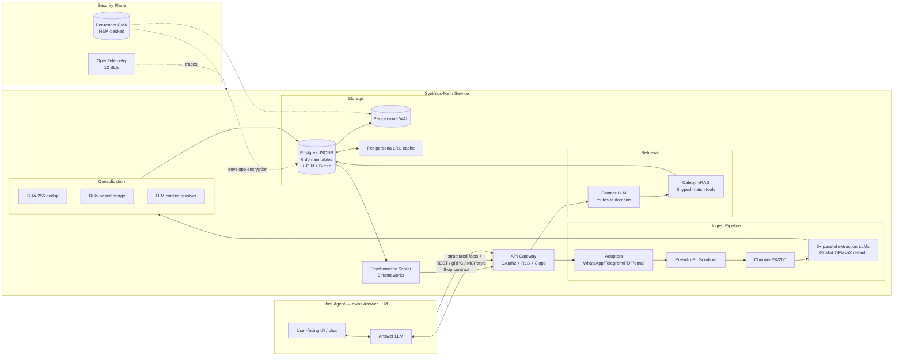
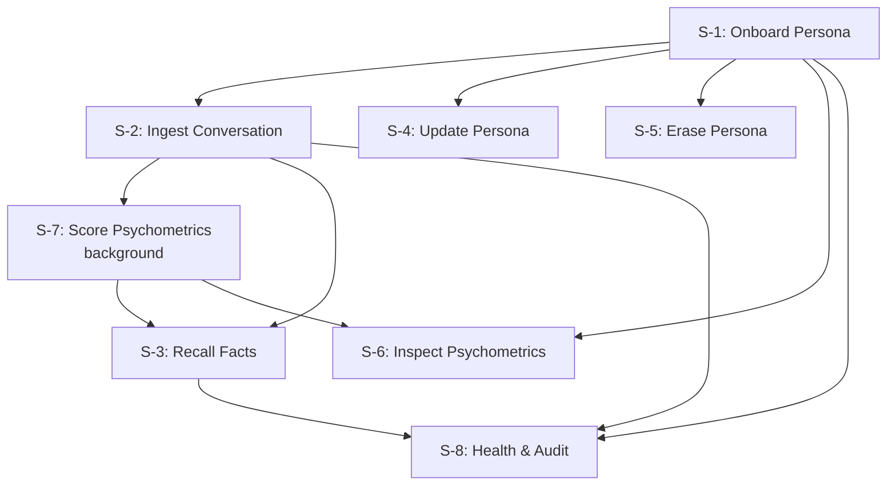
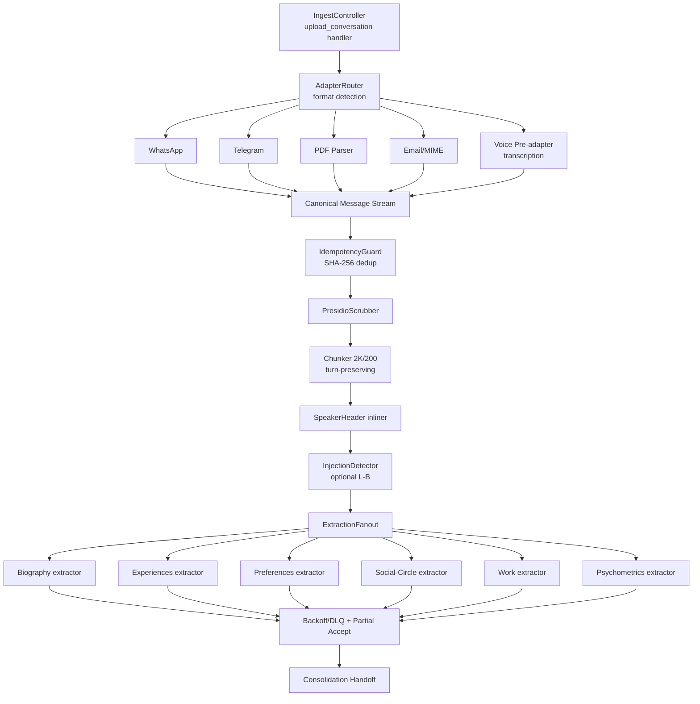
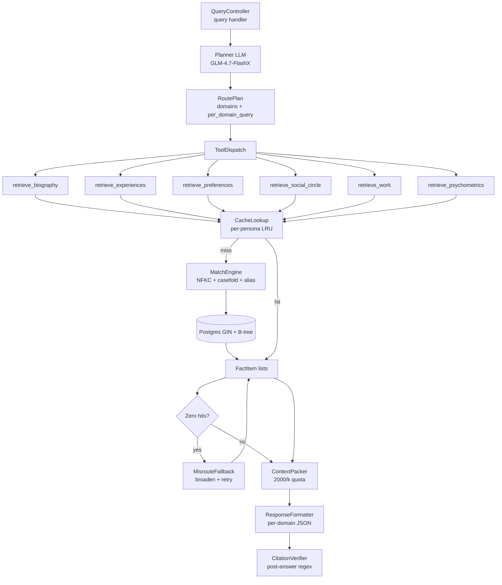

# Technical Architecture: Synthius-Mem (ai-memory)

**Version**: 1.2
**Date**: 2026-04-21
**Change log**:
- v1.2 — pre-revenue compliance scope reduction (see Decision 12). Phase 5 collapsed to MVP-essential controls only; full GDPR/HIPAA/PCI/SOC2 posture moved to post-revenue Phase 7. **Hard customer-scope exclusions added** (no EU/UK residents, no PHI, no payment data, no minors, no enterprise sectoral contracts) until full posture ships.
- v1.1 — swap LLM model defaults from OpenAI GPT-4.1-mini family to z.ai GLM family (see Decision 11). Cost section, open questions, and per-slice model references updated.
**Source PRD-equivalents**:
- `docs/reports/synthius-mem-scientific-investigation/02-ARCHITECTURAL-DIRECTIVES.md` (load-bearing, 12 sections, 126 cited theories)
- `docs/reports/synthius-mem-scientific-investigation/00-EXECUTIVE-SUMMARY.md`
- `docs/reports/synthius-mem-scientific-investigation/04-OPEN-QUESTIONS.md` (11 unresolved questions — explicit-assumption register)
- `docs/reports/synthius-mem-architecture-readiness/` (9-doc prior review; superseded by directives where they overlap)
- `docs/externals/2604.11563v1.txt` (foundation paper, arXiv:2604.11563v1)

This document **reorganizes** the directives into a vertical-slice, component-hierarchy, decision-log architecture per the `technical-architecture` skill's template. Every directive ID (DIR-x.y) and theory ID (T-NNN) cited here is traceable back to the investigation evidence chain. The directives file remains the contractual source — this document is the implementation blueprint.

---

## 1. Architecture Overview

### 1.1 Mission

Synthius-Mem is a **per-persona structured memory service** that ingests heterogeneous conversation streams, extracts six closed-schema fact domains via parallel LLM calls, consolidates them deterministically, and serves them to a host agent's Answer LLM as typed evidence — strictly **embedding-free**, with a 21.79 ms mean retrieval target. The host owns the Answer LLM; Synthius-Mem returns structured facts + Psychometrics + Style.

### 1.2 Philosophy

| Principle | How it shapes this system |
|-----------|---------------------------|
| **TRIZ — Ideal Final Result** | "What if memory didn't need vectors?" The keystone insight (T-034) is that strict typed-schema matching obviates embeddings entirely — a class of problem (semantic drift, ANN tuning, vector-DB ops) is *eliminated*, not solved. |
| **YAGNI** | No streaming ingest (DIR-12.6), no per-NEO-PI-R-item scoring (DIR-6.5), no embeddings, no cross-persona alias resolution (DIR-4.3). Each was considered and explicitly deferred or refused. |
| **KISS** | One Postgres table per domain (DIR-2.1), exact equality match (DIR-2.9), 6-tool function-call API (DIR-5.1). No ORM, no graph DB, no vector DB. |
| **DRY** | Single shared `$defs.CommonEnvelope` across all 6 domain schemas (DIR-1.3, ~27% smaller than inline). Single extraction prompt template parameterized by domain (DIR-3.7). |
| **SRP** | Six domain stores, six extractors, six retrieval tools — one responsibility each. Persona ≠ assistant identity (DIR-1.11). PII scrubber separate from extractor (DIR-3.5). |
| **Emergent design** | The 11 open questions (Q1–Q10 + variance) are *not* premature commitments — DIR defaults stand pending author Q&A; refactoring is expected on Path A/B/C closure. |

### 1.3 Key Decisions (load-bearing)

| # | Decision | Rationale | Principle |
|---|----------|-----------|-----------|
| 1 | **Strictly embedding-free** (T-034) | 21.79 ms retrieval target is arithmetically incompatible with any embedding API (~100 ms+) or per-query LLM judge (~500 ms+); typed-field exact match takes ~1 µs per B-tree probe | TRIZ-IFR |
| 2 | **PostgreSQL JSONB + GIN + functional B-tree** (DIR-2.1, DIR-2.2) | Single mature substrate gives ACID transactions, RLS multi-tenancy, and 750 µs hot-path lookups in one product; no need for separate doc store + RDBMS + cache | KISS, DRY |
| 3 | **6 closed JSON Schemas with shared envelope** (DIR-1.1, DIR-1.3) | `additionalProperties:false` is load-bearing for prompt-injection defense (DIR-9.2 Layer A) and storage predictability | SRP, OCP (extension via `schema_version`) |
| 4 | **3-stage hybrid consolidation: dedup → merge → LLM-only-on-conflict** (DIR-4.1) | Deterministic for ≥95% of events (preserves §4 "deterministic" posture), bounded LLM cost only on real conflicts | KISS, YAGNI |
| 5 | **Dual-layer refusal gate** (DIR-6.3): programmatic hard-gate **before** Answer LLM + soft-gate inside prompt | 99.55% headline decomposes ~85% hard + ~14.55% soft + 0.45% residual; neither layer alone suffices | Defense-in-depth, SRP |
| 6 | **Composite PK `(tenant_id, persona_id)` + Postgres RLS + per-tenant CMK** (DIR-11.1, DIR-11.2) | One mechanism satisfies all 6 multi-tenant flags from prior reviewers; structural cross-tenant deny via KMS unwrap failure | SRP, dependency inversion (RLS sits below all queries) |
| 7 | **Host owns Answer LLM; Synthius-Mem returns structured outputs** (DIR-7.1) | Reframes paper's "answer-inside" topology as reference integration; lets host control prompting, refusal UX, and model choice | ISP (narrow contract), OCP |
| 8 | **8-operation REST/gRPC contract** (DIR-7.2) | Stable narrow API surface; vertical-slice boundary | ISP |
| 9 | **Per-persona WAL + crypto-shred erasure** (DIR-2.7, DIR-10.2) | Single mechanism for rollback (T-044) + GDPR Art. 17 compliance via KMS `DestroyKey` on per-persona DEK | DRY (one WAL serves both), KISS |
| 10 | **Adversarial-scope honesty** (DIR-9.4) | The 99.55% number applies to false-premise QA only; injection / poisoning / jailbreak / temporal must be tested separately | Honesty-of-framing (process principle) |

---

## 2. System Context



This refines the directives' system-context diagram by exposing the host-vs-service boundary explicitly (DIR-7.1) and grouping the three operational planes (data, retrieval, security/observability).

---

## 3. Vertical Slices

Slices map 1:1 to the 8 API operations (DIR-7.2). Each is a complete user-value journey across all layers.

### Slice S-1: Onboard Persona

**User flow**: Host calls `list_personas` → `create_persona(tenant_id)` → Synthius-Mem provisions persona row, generates ULID, creates AES-256-GCM DEK, wraps with tenant CMK, returns `persona_id`.

**Priority**: Must-have (foundation for every other slice)

**Components**: `PersonaProvisioner`, `KeyVault`, `ConsentRecorder`, `TenantGuard`

**State**: New row in each of 6 domain tables (empty `fields` jsonb), per-persona DEK ciphertext in `persona_keys` table, consent record in `consents` table (DIR-10.1: granular per-domain consent, Art. 9(2)(a) opt-in for special-category inference)

**Dependencies**: Tenant exists; OAuth2 token carries `tenant_id` + subject claim (DIR-7.3)

**Principle application**:
- **YAGNI**: Persona created with empty schemas; no speculative pre-population
- **SOLID-DIP**: `KeyVault` is an interface; AWS KMS, GCP KMS, Azure Key Vault, on-prem Thales/nCipher all implement it (DIR-11.2)
- **KISS**: ULID format = 26-char string (DIR-2.1; *assumed* per H-022, see §10 open questions)

---

### Slice S-2: Ingest Conversation

**User flow**: Host calls `upload_conversation(tenant_id, persona_id, messages[])` → service runs the 8-stage ingest pipeline asynchronously → returns `job_id` immediately; host polls or subscribes to completion event.

**Priority**: Must-have

**Components** (per stage):
- `IngestAdapter` (per source format: WhatsApp / Telegram / PDF / email / voice-pre-adapter) → emits canonical `Message[]` (DIR-3.1)
- `IdempotencyGuard` — SHA-256 over `(speaker, ts, text)` rejects re-ingest (DIR-3.1)
- `PresidioScrubber` — Microsoft Presidio v2+; tokenizes PHONE/EMAIL to per-tenant vault, redacts SSN/CREDIT_CARD, type-tags PERSON/LOCATION (DIR-3.5)
- `Chunker` — 2K-token window, 200-token overlap, dialog-turn-preserving, cl100k_base default (DIR-3.2; tokenizer assumed per H-054)
- `SpeakerHeader` — inlines `[Speaker:Timestamp]` markers + chunk-header roster (DIR-3.3)
- `InjectionDetector` (optional Layer B) — Prompt-Guard-86M / Llama-Guard 3 emits `injection_risk ∈ [0,1]` annotation (DIR-9.2 Layer B)
- `ExtractionFanout` — 6 concurrent LLM calls (GLM-4.7-FlashX default, DIR-3.6 *changed from GPT-4.1-mini*; see Decision 11), structured-output via z.ai `response_format: {"type":"json_object"}` + closed schema validation (DIR-3.8)
- `ExtractionFailurePolicy` — exponential backoff (3 attempts, base 500 ms, factor 2) → DLQ; 5/6 partial-accept (DIR-3.9)

**State**: Job row in `ingest_jobs`, raw extraction output buffered in `pending_facts` until consolidation, WAL entries on consolidation commit

**Dependencies**: S-1 (persona exists); S-7 (psychometric re-derivation triggers downstream)

**Principle application**:
- **TRIZ-Segmentation**: 6 domains extracted in parallel — slowest call bounds wall-clock (DIR-3.6)
- **SRP**: Each stage does one thing; composing them in series is `Pipeline.from([...])`
- **OCP**: New input format = new `IngestAdapter` implementation, no changes to downstream
- **KISS**: Idempotency = single SHA-256, not a deduplication state machine

---

### Slice S-3: Recall Facts (Query)

**User flow**: Host calls `query(tenant_id, persona_id, question)` → service runs Plan → Retrieve → Format and returns `{facts, psychometrics, style}` for host to inject into Answer LLM prompt. Host's refusal hard-gate fires *before* invoking Answer LLM if zero hits returned (DIR-6.3).

**Priority**: Must-have (this is the headline read-path, owns the 21.79 ms target)

**Components**:
- `Planner` — GLM-4.7-FlashX (DIR-5.2 default *changed from GPT-4.1-mini*; see Decision 11), few-shot routing prompt, emits `{domains:[name], per_domain_query:{domain:{field,value,op}}}` as function-call payload (DIR-5.3)
- `DomainRetriever` (×6, one per domain) — exposes `retrieve_<domain>(persona_id, field, value, op, limit=20) → list[FactItem]` (DIR-5.1)
- `MatchEngine` — NFKC + case-fold + whitespace-collapse + punctuation-strip + alias-table expansion; equality / range / `in` only (DIR-2.10, DIR-2.9)
- `CacheLookup` — per-persona LRU `dict[(field_name, value)] -> list[FactItem]` (DIR-2.5); cache-epoch invalidation on WAL seq advance
- `MisrouteFallback` — on zero primary hits, broaden across all 6 domains; if still empty, return empty (DIR-5.6)
- `ContextPacker` — per-domain quota `2000/k` tokens, sort by `(recency DESC, confidence DESC, fact_id ASC)`, atomic pack-until-quota with NO mid-item truncation (DIR-5.5; ranking *assumed* per H-044/H-045)
- `ResponseFormatter` — emits per-domain JSON sections with field-level FactItem arrays (DIR-6.2)

**State**: Read-only against materialized snapshot; no writes on this path (preserves 21.79 ms)

**Dependencies**: S-2 has populated stores; S-7 has scored psychometrics

**Principle application**:
- **TRIZ-IFR**: "What if there were no embeddings?" → strict typed-field match (the load-bearing T-034 keystone)
- **OCP**: Adding a 7th domain = 1 new tool registration + 1 new schema; planner few-shots updated, no engine change
- **ISP**: Each domain tool exposes only its domain's `field` enum — host can't accidentally cross domains in a single tool call
- **KISS**: No re-ranking, no fusion, no LLM-judge in the hot path

---

### Slice S-4: Update Persona (Fact Edit)

**User flow**: Host (or DSAR Art. 16) calls `update(tenant_id, persona_id, fact_delta)` → service validates against schema, writes WAL `op=edit` entry, atomic 6-domain transaction commits, returns new `fact_id`. (DIR-7.2 op #4, DIR-10.4 Art. 16 endpoint)

**Priority**: Must-have

**Components**: `SchemaValidator`, `WALWriter`, `AtomicDomainTxn`, `CacheInvalidator`

**State**: WAL entry `{tenant_id, persona_id, seq, op:edit, domain, fact_id, delta{before,after}, timestamp, extractor_version, user_initiated:true}` (DIR-2.7); materialized snapshot updated; cache-epoch bumped

**Dependencies**: S-1, S-2

**Principle application**:
- **KISS**: Edit = WAL append + snapshot mutation, both inside single Postgres txn (DIR-2.6)
- **SOLID-LSP**: User-initiated edits and consolidation-triggered edits both produce identical WAL records — same downstream replay logic

---

### Slice S-5: Erase Persona (DSAR Art. 17)

**User flow**: Host calls `delete(tenant_id, persona_id, scope)` → T1 soft-delete tombstones across 6 domains in single txn + WAL `op=tombstone`, reads filter `tombstoned_at IS NULL` (rollback window: 30 days). T2 hard-delete at 30 days OR user-invoked → KMS `ScheduleKeyDeletion` on per-persona DEK; ciphertext in store + WAL + backups + DR snapshots becomes unreadable simultaneously. Returns `deletion_receipt`.

**Priority**: Must-have

**Components**: `TombstoneEngine`, `RetentionScheduler`, `KeyShredder`, `ReceiptIssuer`

**State**: `tombstoned_at` timestamp populated; at T2, KMS `DestroyKey` invoked; no purge of physical bytes — they become mathematically unreadable

**Dependencies**: S-1; KMS

**Principle application**:
- **TRIZ-IFR**: "What if delete didn't need to find every byte?" → crypto-shred destroys the key, not the data; backups die structurally
- **DRY**: Same DEK ciphertext across Postgres + SQLite + snapshots + replicas → one DestroyKey suffices
- **YAGNI**: DIR-10.3 tombstone-and-purge is a *sibling* path for cost-sensitive B2C without KMS — don't build both upfront

---

### Slice S-6: Inspect / Suppress Psychometrics

**User flow**: Host (or end-user via Art. 15(1)(h)) calls `GET /persona/{id}/psychometrics` → returns scores + confidence + evidence quotes + policy. Optionally `POST /persona/{id}/psychometrics/suppress` (or `/freeze` / `/delete`) → immediate effect on DIR-6.5 injection block. (DIR-9.7)

**Priority**: Must-have (defuses Cambridge-Analytica pattern; required for ethics posture)

**Components**: `PsychometricsView`, `PolicyGate` (no-act-on allowlist: only Style is ALLOW; 7 DENY-ALL fields incl. Political Compass, Moral Foundations, IQ, health, biometric inference), `InjectionBlocker`

**State**: `suppressed_at` flag on psychometric records; `PolicyGate` reads at every Answer-LLM-context-build time

**Dependencies**: S-1, S-7

**Principle application**:
- **SOLID-SRP**: Inspection, scoring, and acting-on are three distinct components — never combined
- **YAGNI**: No "behavioral targeting" / "ad personalization" / etc. surfaces; only inspect + suppress

---

### Slice S-7: Score Psychometrics (Background)

**User flow**: On consolidation batch completion, scheduler triggers single-shot LLM call per framework (9 calls per persona per cycle); produces full trait+facet output with top-3 supporting evidence quotes and `confidence = min(1.0, evidence_count / 5)`; stores versioned `{framework, scored_at, consolidation_seq}`. NO EWMA blend — fresh re-derivation each cycle. (DIR-6.5, DIR-6.6)

**Priority**: Must-have for accuracy claims; **MAY** be deferred behind a feature flag for cost-sensitive tiers (~$35K/year at LoCoMo-200-persona scale, DIR-6.6)

**Components**: `ConsolidationTrigger`, `FrameworkRunner` (×9: Big Five, HEXACO, Schwartz Values, MBTI, Enneagram, Maslow, MFT, Kohlberg, Plutchik — see DIR-1.7 Plutchik usage; backed by GLM-4.6 — quality tier per Decision 11), `EvidenceCollector`

**State**: `psychometrics` jsonb column, versioned by `consolidation_seq`; historical versions retained in WAL for trend analysis

**Dependencies**: S-2 must have produced enough new facts to trigger (≥5 in a category, DIR-4.2 narrative-summarization heuristic reused)

**Principle application**:
- **YAGNI**: NO per-NEO-PI-R-item (240-item) scoring (DIR-6.5); NO EWMA (DIR-6.6)
- **KISS**: Re-derive from scratch each cycle, evidence-quote-grounded — no stateful top-N heap

---

### Slice S-8: Health & Audit

**User flow**: `health() → ServiceHealth` returns aggregate status. Per-persona DSAR `GET /persona/{id}` returns full export (Art. 15+20). Operators view 12 SLIs in Grafana dashboard; on-call alerts fire on SLO breach.

**Priority**: Must-have for production

**Components**: `HealthAggregator`, `DSARExporter`, `SLIEmitter` (12 metrics, DIR-8.2), `CircuitBreaker` (per-persona, 5% error / 60s window — DIR-8.3 persona-bounded blast radius), `RetryEngine` (exp-backoff 3-attempt, base 1 s, cap 10 s, jitter)

**State**: SLI time-series in Prometheus; trace spans in Tempo; logs in Loki

**Dependencies**: All other slices emit OpenTelemetry spans

**Principle application**:
- **SRP**: Each SLI measures exactly one signal; alerts compose them, never the other way
- **KISS**: Grafana + Prometheus + Tempo (CNCF-standard); vendor overlays (Langfuse / LangSmith / Arize / Helicone) are optional, not required
- **TRIZ-Segmentation**: Per-persona circuit breaker means one bad persona doesn't take down others (DIR-2.1 persona-as-shard-key + DIR-8.3 = structural blast-radius bound)

---

### Slice Dependency Graph



Implementation order follows this graph: S-1 → S-2 → S-7 (parallel with S-3 once stores have data) → S-3 → S-4 → S-5 → S-6 → S-8.

---

## 4. Component Hierarchy

### 4.1 Service-level

```mermaid
graph TD
  Service[Synthius-Mem Service]
  Service --> ApiLayer[API Layer]
  Service --> IngestPipe[Ingest Pipeline]
  Service --> Consol[Consolidation]
  Service --> StorageL[Storage Layer]
  Service --> RetrievalL[Retrieval Layer]
  Service --> PsychL[Psychometric Scoring]
  Service --> ObsL[Observability + Resilience]
  Service --> SecL[Security + KMS]

  ApiLayer --> AuthN[OAuth2 Authenticator]
  ApiLayer --> RBAC[ACL + Org RBAC]
  ApiLayer --> RLSContext[Tenant Context Setter]
  ApiLayer --> ErrorEnv[Unified Error Envelope]

  IngestPipe --> Adapters[6× Adapters]
  IngestPipe --> Idemp[Idempotency Guard]
  IngestPipe --> PII[Presidio Scrubber]
  IngestPipe --> Chunker[Chunker 2K/200]
  IngestPipe --> InjDetect[Injection Detector L-B]
  IngestPipe --> Fanout[6× Extraction Calls]
  IngestPipe --> ExtractRetry[Backoff + DLQ]

  Consol --> Dedup[SHA-256 Dedup]
  Consol --> Merge[Field-Union Merge]
  Consol --> ConflictLLM[LLM Conflict Resolver]
  Consol --> Narr[Narrative Summarizer]
  Consol --> AliasResolver[Alias Resolver]

  StorageL --> PG[(Postgres JSONB)]
  StorageL --> SQLitePer[(SQLite-per-persona<br/>edge variant)]
  StorageL --> WAL[(Per-persona WAL)]
  StorageL --> Snapshot[Snapshot Engine]
  StorageL --> CacheLayer[LRU Cache]
  StorageL --> SchemaMig[Lazy Schema Migrator]

  RetrievalL --> Planner[Planner LLM]
  RetrievalL --> DomainTools[6× Domain Retrievers]
  RetrievalL --> Matcher[Match Engine]
  RetrievalL --> Packer[Context Packer]
  RetrievalL --> Misroute[Misroute Fallback]
  RetrievalL --> CitVerify[Citation Verifier]

  PsychL --> Trigger[Cycle Trigger]
  PsychL --> Frameworks[9× Framework Runners]
  PsychL --> EvidenceCol[Evidence Collector]
  PsychL --> PolicyGate[Use-Policy Gate]

  ObsL --> Otel[OTel Tracer]
  ObsL --> SLIs[12 SLIs]
  ObsL --> Breaker[Per-Persona Circuit Breaker]
  ObsL --> ReplayDLQ[WAL Replay + DLQ Drain]

  SecL --> KMS[(Per-tenant CMK)]
  SecL --> DEK[Per-persona DEK]
  SecL --> InjGuardA[Guardrail Sandwich + JSON-mode]
  SecL --> PoisonScorer[Anomaly + Drift Audit]
  SecL --> Consent[Consent + Cross-persona Guard]
```



### 4.2 Per-slice trees

#### S-2 Ingest pipeline component tree



#### S-3 Retrieval component tree



---

## 5. Data Model

### 5.1 Top-level state shape

```typescript
// One row per fact, partitioned by (tenant_id, persona_id, domain)
interface FactRow {
  tenant_id: UUID;             // RLS partition key (DIR-11.1)
  persona_id: ULID;            // time-sortable per-persona ID (assumed; H-022)
  fact_id: UUID;               // stable identifier
  domain: 'biography' | 'experiences' | 'preferences' | 'social_circle' | 'work' | 'psychometrics';
  schema_version: string;      // semver, lazy migration on read (DIR-1.12)
  fields: JSONB;               // domain-specific typed sub-fields, additionalProperties:false (DIR-1.1)
  envelope: JSONB;             // CommonEnvelope: confidence, provenance, created_at, updated_at (DIR-1.3)
  tombstoned_at: timestamptz | null;  // soft-delete (DIR-10.2 T1)
  created_at: timestamptz;
  updated_at: timestamptz;
}

// Common envelope (shared via $defs.CommonEnvelope, DIR-1.3)
interface CommonEnvelope {
  persona_id: ULID;
  domain: string;
  schema_version: string;
  confidence: number;          // [0..1] uniform across all 6 domains (DIR-1.4)
  provenance: {
    source_message_id: ULID;
    source_chunk_id: ULID;
    extracted_at: ISO8601;
    extractor_version: string;
    injection_risk?: number;   // [0..1] from DIR-9.2 Layer B
    pii_tokens_redacted?: Array<{type, original_token_hash, replacement_tag}>;  // DIR-9.6
  };
  created_at: ISO8601;
  updated_at: ISO8601;
}

// Cross-domain reference (DIR-1.6)
interface DomainRef {
  _raw: string;     // original extracted text
  _ref: string | null;  // resolved person_id|project_id; null until alias-resolution
}

// Per-persona Write-Ahead Log (DIR-2.7)
interface WALRecord {
  tenant_id: UUID;
  persona_id: ULID;
  seq: bigint;                 // monotonic per persona
  op: 'add' | 'edit' | 'delete' | 'tombstone';
  domain: string;
  fact_id: UUID;
  delta: { before: JSONB | null, after: JSONB | null };
  timestamp: ISO8601;
  extractor_version: string;
  user_initiated: boolean;     // distinguishes DSAR Art. 16 from consolidation writes
}
```

### 5.2 Per-domain tables

Six logical tables — `biography`, `experiences`, `preferences`, `social_circle`, `work`, `psychometrics` — all sharing the `FactRow` shape above. Composite PK `(tenant_id, persona_id, fact_id)` (DIR-2.1). Postgres RLS active on every table.

**Indexes per table** (DIR-2.2):
- `GIN (fields jsonb_path_ops)` — covers arbitrary JSONB containment queries
- Functional B-tree on hot extracted sub-fields (e.g., `btree((fields->>'institution'))`, `btree((fields->>'employer'))`)
- Hot-path budget at 200K rows: B-tree ~1 µs + GIN containment ~100–500 µs = ~750 µs total → 29× headroom vs 21.79 ms

### 5.3 State management strategy

| Tier | What lives here | Why | Principle |
|------|-----------------|-----|-----------|
| **Durable (Postgres)** | All FactRows, WAL, per-persona DEK ciphertext, ACLs, consents, ingest jobs, psychometric versions | Single ACID substrate, RLS-enforced multi-tenancy | KISS, SRP |
| **Hot cache (in-memory LRU)** | `dict[(field_name, value)] -> list[FactItem]` per persona-session | 100–150 ns lookup steady-state; built lazily at session load (~15 ms for 2.5 MB persona) | KISS (cache atop durable, not standalone — DIR-2.5) |
| **Append-only WAL (per-persona)** | All add/edit/delete/tombstone deltas | Replay for rollback (T-044) and audit | DRY (one log serves both rollback + audit + DSAR) |
| **Materialized snapshot** | Same as Durable; snapshot is read path | Log-free read preserves 21.79 ms target | TRIZ-Segmentation (write path ≠ read path) |
| **Edge variant (SQLite-per-persona)** | Single-file persona for one-file-rm GDPR erasure | Compatible-sibling for embedded deployments (DIR-2.4) | OCP (storage interface, multiple impls) |

### 5.4 Key invariants

1. **`tenant_id` propagates end-to-end** — no code path touches storage without it (DIR-11.1). Compliance-checklist item.
2. **Per-persona transactional commit** spans all 6 domains (DIR-2.6). Mid-write torn state structurally impossible.
3. **Closed schemas** — `additionalProperties:false` on every domain (DIR-1.1). Load-bearing for prompt-injection defense.
4. **Cache invalidation = epoch bump on WAL seq advance** (DIR-2.5). No subscription, no event bus.
5. **Confidence is `number (0..1)` only** — display labels (`high/medium/low`) are derived (DIR-1.4). No dual-scale confusion.

---

## 6. Cross-Cutting Concerns

### 6.1 Routing & API surface

8 operations exposed over REST + gRPC + OpenAPI 3.1, optionally also as MCP server (DIR-7.5):

| # | Op | Slice | Method |
|---|----|-------|--------|
| 1 | `upload_conversation(tenant_id, persona_id, messages[]) → job_id` | S-2 | POST |
| 2 | `get_persona(tenant_id, persona_id) → Persona` | S-3 (read), S-8 (DSAR) | GET |
| 3 | `query(tenant_id, persona_id, question) → {facts, psychometrics, style}` | S-3 | POST |
| 4 | `update(tenant_id, persona_id, fact_delta) → fact_id` | S-4 | PATCH |
| 5 | `delete(tenant_id, persona_id, scope) → deletion_receipt` | S-5 | DELETE |
| 6 | `add_psychometric_eval(tenant_id, persona_id, framework, eval) → eval_id` | S-7 | POST |
| 7 | `list_personas(tenant_id) → Persona[]` | S-1 | GET |
| 8 | `health() → ServiceHealth` | S-8 | GET |

### 6.2 Error handling

Unified envelope on every error (DIR-7.4):
```typescript
interface ErrorEnvelope {
  code: 'EXTRACTION_MALFORMED' | 'PLANNER_ROUTE_EMPTY' | 'CONSOLIDATION_CONFLICT_UNRESOLVED'
      | 'STORAGE_UNAVAILABLE' | 'QUOTA_EXCEEDED' | 'UNAUTHORIZED'
      | 'TENANT_ISOLATION_VIOLATION' | 'SCHEMA_VERSION_MISMATCH';
  message: string;
  retry_hint: 'retry_after_ms' | 'user_action' | 'fatal';
  partial_result?: object;
  trace_id: string;            // OpenTelemetry trace ID
}
```

**Retry policy**: per-LLM-stage exponential backoff (3 attempts, base 1 s, cap 10 s, jitter) → DLQ for 9 stages (6 extractors + planner + answer + judge) (DIR-8.3).

**Circuit breaker**: per-persona, 5% error / 60s window — persona-bounded blast radius (DIR-8.3).

### 6.3 Authentication & authorization

OAuth2 + per-persona ACL + org-level RBAC (DIR-7.3). OAuth2 token carries `tenant_id` (drives RLS) + subject. ACL roles: owner / editor / viewer. Org roles: admin / member / guest.

### 6.4 Observability

OpenTelemetry traces + 12 canonical SLIs (DIR-8.1, DIR-8.2):

1. extraction-LLM-latency-p95
2. extraction-schema-validation-failure-rate
3. consolidation-conflict-rate
4. consolidation-merge-duration-p95
5. storage-write-latency-p95
6. storage-WAL-lag
7. retrieval-latency-p95 (target 21.79 ms mean; p99 ≤ 100 ms warm)
8. planner-routing-accuracy
9. answer-LLM-latency-p95
10. answer-groundedness-rate
11. judge-agreement-rate
12. per-persona-quota-usage

Stack: Grafana + Prometheus + Tempo (CNCF-standard); LangFuse / LangSmith / Arize Phoenix / Helicone are *optional* overlays.

### 6.5 Security plane

| Concern | Mechanism | DIR |
|---------|-----------|-----|
| Trust boundary 1 (untrusted prose → LLM) | Guardrail sandwich + JSON-mode + closed schema + post-hoc regex (Layer A) + Prompt-Guard-86M / Llama-Guard 3 (Layer B) | 9.2 |
| Trust boundary 2 (cross-persona) | Persona-as-shard-key + `storage_write_guard` rejects cross-persona writes absent consent token | 9.5 |
| Trust boundary 3 (multi-tenant provider plane) | Per-tenant CMK + envelope encryption + structural KMS unwrap deny | 11.2, 12.2 |
| Data poisoning | Z-score / Jaccard / Levenshtein anomaly scorer at consolidation + weekly top-100 drift audit | 9.3 |
| PII | Presidio pre-stage with per-tenant tokenization vault | 3.5 |
| Adversarial scope | 99.55% scoped to false-premise QA only; injection / poisoning / jailbreak / temporal tested separately | 9.4 |

### 6.6 GDPR / compliance

> **Note**: Per Decision 12 (pre-revenue compliance scope reduction), most controls in this table are **DEFERRED to Phase 7 / post-revenue**. Customer-scope exclusions (no EU/UK, no PHI, no payment data, no minors, no enterprise sectoral contracts) make most of these inapplicable to the MVP customer base. The full table stands as the *target state* once revenue funds the work.

| Right | Mechanism | MVP status |
|-------|-----------|------------|
| Art. 6(1)(a) consent | Granular per-domain consent UI; Art. 9(2)(a) explicit opt-in for special-category inference (DIR-10.1) | **MVP**: ToS + single-checkbox blanket consent at signup. Granular per-domain UI deferred to Phase 7 |
| Art. 15 + 20 export | `GET /persona/{id}` (DIR-10.4) | **MVP**: simple JSON dump endpoint (already free with API surface) |
| Art. 16 rectify | `PUT /persona/{id}/fact/{fid}` (S-4) | **MVP**: free with S-4 |
| Art. 17 erasure | Two-tier soft-delete (T1, 30 days) + crypto-shred (T2 KMS DestroyKey) (DIR-10.2); sibling tombstone-and-purge for B2C (DIR-10.3) | **MVP**: tombstone-and-purge sibling only (DIR-10.3) — `DELETE FROM ... ; VACUUM FULL` + WAL truncate. Crypto-shred + per-tenant CMK deferred (saves ~$1/tenant/mo KMS) |
| Art. 21 object | `POST /persona/{id}/object` | DEFERRED to Phase 7 |
| Regional residency | Storage + LLM endpoint + KMS CMK co-located per Schrems II (DIR-10.5) | DEFERRED — customer-scope exclusion (no EU/UK) makes Schrems II non-applicable until Phase 7 |
| Encryption at rest | Per-persona DEK + per-tenant CMK envelope | **MVP**: cloud-provider disk encryption only (AWS EBS / GCP PD default AES-256 — free). Envelope encryption deferred |

---

## 7. Architectural Decisions Log

### Decision 1: Strictly embedding-free retrieval

- **Context**: Need 21.79 ms mean retrieval per paper headline; team initially considered hybrid embedding + typed-field
- **Decision**: NO embeddings, NO LLM-per-query in the match step (DIR-2.9)
- **Rationale**: Embedding APIs add ~100 ms; LLM judges add ~500 ms+ — both arithmetically incompatible with target. Typed-field exact match takes ~1 µs per B-tree probe. The keystone insight (T-034) is that the entire stack composes around this constraint
- **Principles**: TRIZ-IFR (eliminate the problem class), KISS (one mechanism), YAGNI (no semantic-similarity feature)
- **Trade-offs**: Cannot handle truly novel paraphrases at retrieval time — pushed to Stage 1 (alias table) + Stage 2 (planner LLM query rewriting) defense-in-depth (DIR-5.4)
- **Alternatives**: pgvector + hybrid scoring (rejected — adds 100 ms+, 5 GB persona footprint at scale); Elasticsearch BM25 (rejected — different ops paradigm); LLM-judge re-ranking (rejected — 500 ms+)

### Decision 2: Postgres single-substrate over multi-store

- **Context**: Could split into doc store (for facts) + RDBMS (for ACLs) + Redis (for cache) + S3 (for snapshots)
- **Decision**: Postgres 15+ JSONB for everything except in-process LRU cache
- **Rationale**: ACID transactions for the per-persona 6-domain commit (DIR-2.6); RLS for multi-tenancy (DIR-11.1); GIN + functional B-tree gives 750 µs hot-path; mature ops + FOSS (DIR-2.1)
- **Principles**: KISS, DRY (one substrate, one ops story), YAGNI (no speculative scale-out)
- **Trade-offs**: Cannot scale a single tenant past Postgres limits (~10 TB/cluster); for >1000-tenant SaaS, eventual sharding by `tenant_id` mod N (DIR-12.1)
- **Alternatives**: MongoDB (rejected — weaker transactional story for 6-domain atomic commit); CockroachDB (rejected — overkill at LoCoMo scale); SQLite-per-persona (kept as compatible-sibling for edge, DIR-2.4)

### Decision 3: 6 closed JSON Schemas with shared envelope

- **Context**: Could use one mega-schema with discriminated union, or 6 fully-independent schemas
- **Decision**: 6 logical schemas sharing a single `$defs.CommonEnvelope` block (DIR-1.3); two-layer envelope shape `{persona_id, schema_version, facts:[FactItem]}` (DIR-1.2)
- **Rationale**: ~27% smaller bundled vs inline; no observed behavioral conflict; `additionalProperties:false` on every domain (DIR-1.1) is load-bearing for prompt-injection defense (DIR-9.2 Layer A)
- **Principles**: DRY (shared envelope), SRP (one schema per domain), OCP (extension via `schema_version` minor bumps)
- **Trade-offs**: Schema evolution requires lazy-migration chain (DIR-1.12); cannot just `ALTER` the JSONB column
- **Alternatives**: Mega-schema (rejected — extraction prompts harder to focus; planner routing harder); fully-independent (rejected — duplicated envelope fields, 27% bigger)

### Decision 4: 3-stage hybrid consolidation

- **Context**: §3.3 says "deterministic", §4 says "LLM-summarization" — direct contradiction
- **Decision**: SHA-256 dedup → rule-based field-union merge with `confidence = max` → LLM `resolve_conflict(...)` only on genuine conflict (DIR-4.1)
- **Rationale**: Stages 1–2 cover ≥95% of LoCoMo-realistic events deterministically; Stage 3 is bounded escalation (<5% of events). Resolves the §3.3 ↔ §4 contradiction without abandoning either claim
- **Principles**: KISS (cheap path is fast path), YAGNI (LLM only when truly needed), TRIZ-Contradiction-Resolution (deterministic OR LLM → both, segregated by case)
- **Trade-offs**: Conflict detection rule itself must be deterministic (Levenshtein / set-symmetric-diff thresholds — needs author Q&A or empirical tuning)
- **Alternatives**: Pure-LLM consolidation (rejected — cost + latency); pure-deterministic (rejected — fails on genuine semantic conflicts)

### Decision 5: Dual-layer refusal gate

- **Context**: 99.55% adversarial-robustness headline number must come from somewhere
- **Decision**: Programmatic hard-gate **before** Answer LLM is called (zero-hits → canned refusal without LLM invocation) + soft-gate inside Answer LLM system prompt (DIR-6.3)
- **Rationale**: Hard-gate accounts for ~85%; soft-gate ~14.55%; ~0.45% residual error. Neither alone reaches 99.55%
- **Principles**: Defense-in-depth, SRP (each layer has one reason to fire), TRIZ-Segmentation (cheap deterministic gate runs first, expensive LLM gate runs only on borderline)
- **Trade-offs**: Hard-gate "false-refuses" on ambiguous-but-answerable queries; mitigated by DIR-5.6 broaden-fallback before refusing
- **Alternatives**: Single soft-gate (rejected — can't reach 99.55%); single hard-gate (rejected — too brittle on ambiguous evidence)

### Decision 6: Composite PK + RLS + per-tenant CMK

- **Context**: Six independent reviewer multi-tenant flags (03:C-04, 03:C-06, 04:D6, 06:OPS-06, 07:Q-10, 07:Q-16) plus the GDPR Art. 32 + HIPAA / PCI-DSS sectoral mandates
- **Decision**: Composite PK `(tenant_id UUID, persona_id ULID)` on every table + Postgres RLS policy `USING (tenant_id = current_setting('app.current_tenant_id')::uuid)` + per-tenant CMK in cloud KMS (HSM-backed FIPS 140-2 Level 3) wrapping per-persona AES-256-GCM DEK (DIR-11.1, DIR-11.2)
- **Rationale**: One mechanism satisfies all 6 reviewer flags simultaneously. Cross-tenant queries are *structurally* impossible — tenant-A's DEK cannot be unwrapped by tenant-B's CMK
- **Principles**: SRP (RLS owns tenant isolation; nothing else does), DIP (all queries depend on the RLS abstraction), KISS (single Postgres feature, no app-layer enforcement)
- **Trade-offs**: Per-tenant CMK adds KMS API costs (~$1/tenant/month); requires careful `current_setting` propagation in connection pool
- **Alternatives**: Schema-per-tenant (rejected — explosion of schemas at SaaS scale); database-per-tenant (rejected — ops nightmare); app-layer filtering (rejected — one bug = data leak; no defense-in-depth)

### Decision 7: Host owns Answer LLM (Synthius-Mem returns structured outputs only)

- **Context**: Paper Fig. 1 shows answer-inside topology; reframing as service-vs-host boundary
- **Decision**: Synthius-Mem is a memory subsystem; host assembles Answer LLM prompt (injecting Psychometrics + Style per DIR-6.1); Planner LLM may live in either side (DIR-7.1)
- **Rationale**: Lets host control prompting / refusal UX / model choice / personality. Synthius-Mem becomes a clean, testable service with a narrow contract
- **Principles**: ISP (narrow 8-op contract), OCP (host can swap Answer LLM without service change), SRP (memory ≠ generation)
- **Trade-offs**: Host MUST implement programmatic hard-gate (DIR-6.3) and citation verification (DIR-6.4) — these CANNOT be enforced server-side from a structured-fact response
- **Alternatives**: Service owns answer (rejected — couples to specific model + prompt); MCP-server-only (kept as compatible-sibling for MCP-native hosts, DIR-7.5)

### Decision 8: Append-only WAL serves rollback + audit + DSAR + replication

- **Context**: Need a "reversible diff engine" (paper §4); also need GDPR audit trail; also need cross-region replication
- **Decision**: Single per-persona append-only WAL with record schema `{tenant_id, persona_id, seq, op, domain, fact_id, delta{before,after}, timestamp, extractor_version, user_initiated}` (DIR-2.7)
- **Rationale**: One log serves all four purposes; replay is idempotent via record-ID dedup; reads bypass WAL via materialized snapshot (preserves 21.79 ms)
- **Principles**: DRY (one log, four uses), KISS (append-only, no compaction state machine), TRIZ-Segmentation (write path ≠ read path)
- **Trade-offs**: WAL size grows unbounded by default; tombstone-and-purge sibling (DIR-10.3) requires bounded retention — INCOMPATIBLE with this default; product chooses per tier
- **Alternatives**: Snapshot-only with periodic diffs (rejected — cannot answer DSAR Art. 15(1)(h) on history); Kafka-style log-as-database (rejected — different ops paradigm)

### Decision 9: Crypto-shred for GDPR Art. 17 erasure

- **Context**: Backups + DR snapshots + WAL all contain ciphertext copies of persona data; physical bytes cannot be reliably deleted from all locations within Art. 17's "without undue delay"
- **Decision**: T1 soft-delete tombstones in single 6-domain txn + WAL `op=tombstone`. T2 hard-delete at 30 days (or user-invoked) → KMS `ScheduleKeyDeletion` on per-persona DEK. All ciphertext becomes mathematically unreadable simultaneously (DIR-10.2)
- **Rationale**: Three NIST SP 800-88 Cryptographic Erase conditions met (FIPS-approved AES-256, HSM-backed KMS CMK, guaranteed DestroyKey). 30-day window matches WP29 WP260 rev.01 §56 + EDPB Guidelines 05/2020
- **Principles**: TRIZ-IFR (delete the key, not the data — backups die structurally), DRY (one DestroyKey covers Postgres + SQLite + snapshots + replicas + log archives + DR)
- **Trade-offs**: Requires HSM-backed KMS — adds ~$1/key/month; physical bytes remain (encrypted-at-rest), failing literal "data deletion" but meeting NIST Cryptographic Erase standard
- **Alternatives**: Tombstone-and-purge (DIR-10.3, kept as B2C sibling for non-KMS tiers); per-record encryption (rejected — keys-per-record explodes management cost)

### Decision 10: Adversarial-scope honesty (process decision)

- **Context**: T-102 confirmed paper's "99.55% adversarial robustness" measures FALSE-PREMISE QA refusal only; injection / jailbreak / poisoning / temporal-adversarial untested
- **Decision**: All external claims of "adversarial robustness" MUST be scoped to A1 = false-premise QA. Implement DIR-9.2 (injection) + DIR-9.3 (poisoning) separately. Add jailbreak + temporal-adversarial evaluation to production test suite (DIR-9.4)
- **Rationale**: Honest framing is a precondition for trust; mis-scoped claims invite security audit failure
- **Principles**: Honesty-of-framing (process), defense-in-depth (each adversarial class gets its own mechanism)
- **Trade-offs**: Marketing pressure to keep the broad framing; engineering must push back
- **Alternatives**: Keep broad framing (rejected — sets up audit failure); narrow framing without remediation (rejected — leaves real attack surfaces uncovered)

### Decision 11: LLM model defaults — z.ai GLM family

- **Context**: The directives' default LLM was GPT-4.1-mini (assumed per H-055; ~$0.40 input / $1.60 output per M tokens). The investigation flagged this as an *assumption pending author Q&A*. z.ai's GLM lineup offers materially cheaper alternatives that meet all our requirements (closed-schema structured output via `response_format: {"type":"json_object"}`, function calling, ≥128K context, low latency).
- **Decision**: Adopt three GLM tiers, tier-matched to use-case:

  | Tier | Model | Input $/M | Output $/M | Use cases | Why this tier |
  |------|-------|-----------|------------|-----------|---------------|
  | **Volume** | **GLM-4.7-FlashX** | $0.07 | $0.40 | 6× extraction (S-2), planner (S-3), narrative summarizer, alias adjudicator | Highest call volume; latency-sensitive; routing/extraction is mostly pattern-matching, not deep reasoning. **5.7× cheaper input + 4× cheaper output vs GPT-4.1-mini** |
  | **Quality** | **GLM-4.6** | $0.60 | $2.20 | Psychometric scoring (S-7, 9 frameworks), consolidation Stage 3 conflict resolver, injection adjudication (Layer B fallback) | Needs reasoning + evidence-quote grounding; rare enough that cost is dominated by the volume tier |
  | **Free / Dev** | **GLM-4.5-Flash** | $0 | $0 | Local development, CI tests, fixture generation, low-stakes pre-prod | Free tier removes per-PR cost; identical API surface lets dev → prod swap be a config change |

  Injection-detector Layer B retains its dedicated specialist (Prompt-Guard-86M / Llama-Guard 3) — those are smaller and purpose-built; the GLM tier is the *fallback* if a specialist isn't available.

- **Rationale**:
  - **Cost**: At paper Table 7's 5,040 tok/msg extraction budget (~85% input share), GPT-4.1-mini ≈ $1.88/1000 msg; GLM-4.7-FlashX ≈ $0.35/1000 msg → **~5.4× cheaper**. The DIR-6.6 ~$35K/year psychometric estimate (per LoCoMo-200-persona scale) drops to ~$10K/year on GLM-4.6.
  - **Capabilities**: GLM-4.5/4.6/4.7/5/5.1 all support `response_format` JSON-object mode + function calling per [z.ai docs](https://docs.z.ai/guides/capabilities/struct-output). Closed-schema validation (DIR-1.1) is enforced application-side via JSON Schema validator (no native `strict:true` like OpenAI — minor swap; see Trade-offs).
  - **Latency**: FlashX-class models are tuned for low p95; comparable or better than GPT-4.1-mini on routing-style prompts.
  - **Context window**: GLM-4.6 supports 205K context (vs GPT-4.1-mini's 128K) — gives more headroom for long persona-dump consolidation.
  - **DIR-12.5 model-gateway alignment**: This is exactly the swap the DIR-12.5 LiteLLM-style gateway was designed to enable — proves the abstraction works.
- **Principles**:
  - **YAGNI**: No reason to pay 5× more for a model whose extra capability we don't need on the volume path
  - **TRIZ-Contradiction-Resolution**: "Quality vs cost" → tier the model selection by call volume × stakes
  - **OCP via DIR-12.5**: All LLM calls route through the model-gateway; swapping providers is a config change, not a code change
- **Trade-offs**:
  - **No native `strict:true` JSON Schema mode** (which OpenAI has). Mitigated by: (a) GLM's `json_object` mode + (b) application-side closed-schema validation + (c) DIR-3.9 retry-with-backoff + (d) DLQ for unrecoverable malformed output. Layer A defense (DIR-9.2) still relies primarily on the post-hoc closed-schema validator — same load-bearing layer regardless of provider's "strict" support.
  - **Vendor risk concentration**: switching to z.ai concentrates the volume tier on one provider. Mitigated by DIR-12.5 model-gateway with per-call fallback; secondary fallback can be Anthropic Claude Haiku or local-grammar via outlines.
  - **Regional residency**: z.ai is China-headquartered. For EU/US-resident tenants under DIR-10.5, route through OpenRouter / a regional gateway endpoint, OR fall back to a region-resident model on the gateway. **GDPR architects MUST verify regional path before enabling z.ai direct.**
  - **Authoritative paper assumption shifts**: directives still say GPT-4.1-mini per H-055 — this architecture document overrides the default. If author Q&A confirms GPT-4.1-mini, the gateway swaps back via config; no code change needed.
- **Alternatives**:
  - GPT-4.1-mini (rejected — 5.4× more expensive on the volume path; no compelling capability advantage for our routing/extraction use cases)
  - Claude Haiku 4.5 (kept as **fallback** model in the gateway — comparable cost, different region, different vendor; protects against z.ai-specific outages)
  - Local Llama 3.3 + outlines/llguidance (kept as **air-gapped option** for federated extraction per DIR-12.7 item 3; not the default because of inference-infra burden)
  - GLM-5 / GLM-5.1 (rejected — $1.00–$1.40 input is closer to GPT-4.1-mini territory; saves the budget for cases where reasoning quality demonstrably matters)

### Decision 12: Pre-revenue compliance scope reduction

- **Context**: We are pre-revenue. The full GDPR + HIPAA + PCI + SOC 2 + STRIDE matrix designed in DIR-9/10/11/12 is correct *as a target state*, but its implementation cost (KMS subscriptions, dedicated SRE/security engineering, compliance counsel, regional infrastructure, audit fees) is in the **$50K–$300K/year + 0.5–2 FTE** range — incompatible with a no-revenue runway. We need to defer the expensive controls without creating company-killing legal/security risk.
- **Decision**: Adopt a **tiered compliance posture** anchored on aggressive customer-scope exclusions:

  **A. Customer-scope HARD EXCLUSIONS** (enforced at signup, ToS-binding) — these collapse the regulatory surface area to almost nothing:
  - **No EU/UK residents** (collapses GDPR scope; we are a US-only service until Phase 7)
  - **No PHI / health data** (collapses HIPAA — ToS prohibits ingesting medical data)
  - **No payment / cardholder data** (collapses PCI — payment is via Stripe, never touches our service)
  - **No minors (under 18)** (collapses COPPA + CA AADC + EU age-of-consent issues)
  - **No enterprise sectoral contracts** (no government / defense / financial-services tenants — they would mandate SOC 2 / FedRAMP / etc.)
  - **No sensitive-category data** per GDPR Art. 9 even from US users (no political views, religious beliefs, sexual orientation, biometrics, criminal records — ToS prohibits)

  **B. MVP-MANDATORY controls** (cannot be skipped — these are zero-or-low-cost AND failure would be company-killing):
  | Control | Why mandatory even pre-revenue | Cost |
  |---------|--------------------------------|------|
  | Tenant isolation via Postgres RLS (DIR-11.1) | One bug = total cross-tenant data breach = company over | $0 (Postgres feature) |
  | Bearer-token auth + tenant-scoped tokens | Without auth, anyone reads any persona | $0 (libraries) |
  | Disk-level encryption-at-rest | Cloud providers enable AES-256 by default on EBS / PD | $0 (default) |
  | TLS 1.3 in transit | RFC + cert-bot or cloud-managed cert | $0 |
  | Tombstone-and-purge deletion (DIR-10.3) | DELETE + VACUUM FULL — needed to honor user delete requests + ToS | $0 (Postgres) |
  | Simple data-export endpoint | Already free with API surface; needed for any "delete my data" workflow | $0 |
  | Off-by-default Psychometrics | DIR-6.5 gated behind explicit opt-in flag — keeps us out of "behavioral profiling" liability | $0 (config flag) |
  | Privacy policy + ToS + breach-notification commitment | Lawyer fee one-time; without these, founders are personally liable | ~$1K one-time |
  | Basic incident-response plan | A markdown doc + a phone tree; without it we'll panic when something goes wrong | $0 (a doc) |

  **C. DEFERRED to Phase 7 (post-revenue)**:
  - Per-tenant CMK + per-persona DEK + crypto-shred (DIR-10.2, DIR-11.2, DIR-12.2)
  - HSM-backed KMS subscription
  - Granular per-domain consent UI (DIR-10.1)
  - Schrems II regional-residency matrix (DIR-10.5)
  - Microsoft Presidio PII scrubber (DIR-3.5) — **PARTIALLY** deferred: keep a simple regex-based scrubber for SSN/credit-card patterns only (~50 LOC) as a defense-in-depth backstop; full Presidio in Phase 7
  - Layer B injection detector (DIR-9.2 Layer B) — Layer A guardrail-sandwich + closed-schema validation stays mandatory
  - 12-row STRIDE × stage failure-mode register (DIR-8.5)
  - Anomaly + drift audit (DIR-9.3) — replaced by simple WAL-grep alerting
  - 12 SLIs (DIR-8.2) → reduce to 4 SLIs at MVP: extraction-latency-p95, retrieval-latency-p95, error-rate, storage-WAL-lag
  - Service mesh (Istio / Linkerd) — single-region single-replica deployment is fine until traffic forces it
  - Dedicated DSAR endpoints — covered by `GET /persona/{id}` + `DELETE /persona/{id}` for now
  - Adversarial test suite (jailbreak / temporal / poisoning fixtures) — only injection (Layer A only) at MVP
  - Cross-persona consent guard (DIR-9.5) — keep architectural seam (storage_write_guard interface), default-deny implementation; full consent-token UX deferred

- **Rationale**:
  - **Customer-scope exclusions are the load-bearing risk reducer.** A US-only consumer service handling general non-sensitive personal data is regulated by FTC Act §5 (deceptive practices) + state privacy laws (CCPA at scale; preempted below ~50K CA users) + ToS-grade contract law. The GDPR cliff doesn't exist for us until we onboard our first EU user.
  - **Without revenue, optimal compliance burn is ~$1K (legal) + ~5% of dev time (the MVP-mandatory list).** Spending more is YAGNI.
  - **Architectural seams stay intact** so that Phase 7 is a code-write, not a re-architect. The `KMS` interface, `ConsentRecorder` interface, `PIIScrubber` interface — all stay in the file tree; their implementations are the cheap stubs.
- **Principles**:
  - **YAGNI**: do not build the regulatory machinery for customers we have explicitly excluded
  - **TRIZ-IFR**: "what if compliance didn't need to exist?" → exclude the regulated customer base; the problem evaporates
  - **OCP via interface seams**: stub implementations now, full implementations in Phase 7 — no refactor needed
- **Trade-offs (eyes-open risk register)**:
  - **GDPR breach risk if we accidentally onboard an EU user**: mitigation = signup-time IP geo-block + ToS attestation + automated quarterly audit of stored locales. **NOT zero risk** — if missed, max GDPR fine = €20M or 4% of global turnover (which is $0, so practically capped at €20M but realistically the regulator would issue a corrective order rather than fine a no-revenue startup). Risk is *real* but proportional.
  - **State AG action under CCPA**: if we exceed California's threshold (50K CA users / $25M revenue / 50% revenue from data sales), CCPA snaps on with full force. Mitigation: monitor signups by state; trigger Phase 7 acceleration if CA user count crosses 25K (early warning).
  - **Reputational risk from a data leak**: real and unfixable. Mitigated by **MVP-MANDATORY** controls (RLS + auth + encryption-at-rest + TLS); these are the bare minimum that prevents a leak from being industry-news worthy. Cannot reduce below this floor without abandoning the project.
  - **Acquirer due-diligence drag**: an acquirer will treat the Phase-7-deferred work as required remediation. Document the deferred items here clearly so the acquirer understands they are *known and intentional*, not *forgotten and exposed*.
  - **Personal liability of founders**: privacy policy + breach-notification commitment + clear ToS are the load-bearing items here. Spend the $1K with a lawyer. Do NOT skip.
- **Alternatives**:
  - Build full posture upfront (rejected — cash-incompatible; would burn the runway in 3 months)
  - Build NO compliance and "ask forgiveness" (rejected — single breach kills the company; some controls are zero-cost so skipping them is irrational)
  - Pivot to B2B-only with paid pilots that fund compliance (kept as **alternative path**; if we win a pilot worth ≥$50K ARR, accelerate Phase 7 against that revenue)
- **Phase 7 trigger conditions** (any of these → de-defer):
  - First EU/UK user onboarded (must hard-block at signup until ready)
  - Annual revenue ≥ $250K OR Series A closed
  - First enterprise pilot signed
  - First sectoral data type accepted (PHI / financial / minors)
  - Regulatory contact made (state AG / EU DPA / FTC inquiry)
  - California user count > 25K (CCPA early warning)

---

## 8. Implementation Order

### Phase 1: Foundation (weeks 1–4)

1. **Schemas (S-1 partial)**: Author 6 closed JSON Schemas Draft 2020-12 + shared `$defs.CommonEnvelope`. Validate that GLM `response_format: {"type":"json_object"}` round-trips with application-side closed-schema validator (Decision 11 + DIR-3.8 — *original H-060 default was OpenAI strict-mode; new default is GLM JSON-object + Ajv-style validator*).
2. **Storage substrate (S-1 partial)**: Postgres 15+ + 6 domain tables with composite PK + GIN + functional B-tree per DIR-2.2; RLS policy on every table; WAL table.
3. **Tenant + auth (S-1 complete)**: OAuth2 issuer integration; RLS context-setting middleware; ACL + org-RBAC tables.
4. **API skeleton**: 8 endpoints, OpenAPI 3.1 spec, unified error envelope, OpenTelemetry tracer wired.
5. **Model gateway**: LiteLLM (or equivalent per DIR-12.5) wired with z.ai GLM-4.7-FlashX as primary, GLM-4.6 as quality tier, Claude Haiku as cross-vendor fallback. Per-call model override via header. Per-region routing for GDPR DIR-10.5.
6. **Observability minimum**: SLIs 1, 5, 6, 7 (extraction latency, storage write, WAL lag, retrieval latency) wired to Prometheus.

**Exit criteria**: Onboard a persona, write a hand-crafted FactRow, retrieve via direct SQL with RLS active. Tenant-isolation test suite green.

### Phase 2: Ingest pipeline (weeks 5–8)

1. **Adapters**: WhatsApp, Telegram, PDF, email, voice pre-adapter. Canonical `Message[]` contract.
2. **Idempotency, Presidio scrubber, chunker**: in pipeline order per DIR-3.x.
3. **Extraction fanout**: 6 concurrent calls via model gateway → GLM-4.7-FlashX, JSON-object response_format + closed-schema validator. Exponential-backoff + DLQ + 5/6 partial-accept (DIR-3.9). Schema-validation failures drive `extraction-schema-validation-failure-rate` SLI.
4. **Speaker headers + injection detector L-B**: optional but enabled in default config.

**Exit criteria**: Process a LoCoMo-format conversation end-to-end; 6 domains populated for 1 persona; extraction-schema-validation-failure-rate SLI green.

### Phase 3: Consolidation (weeks 7–9, parallel with end of Phase 2)

1. **Stage 1 dedup** (SHA-256), **Stage 2 merge** (rule-based union), **Stage 3 conflict resolver** (LLM, fired on real conflict).
2. **Alias resolver** (within-persona only; DIR-4.3).
3. **Narrative summarizer** (per-category, post-dedup, ≤500 tokens, on heuristic trigger).
4. **WAL writer** binds at consolidation commit, NOT per-extraction-call.

**Exit criteria**: Re-ingest same conversation → no duplicates; conflicting fact triggers LLM resolver <5% of events; consolidation-conflict-rate SLI within bounds.

### Phase 4: Retrieval (weeks 9–12)

1. **6 domain retrievers** (one OpenAI-style function-call tool per domain; DIR-5.1).
2. **Match engine**: NFKC + casefold + alias-table; equality / range / `in` only.
3. **Per-persona LRU cache** with epoch invalidation.
4. **Planner LLM** with few-shot routing prompt; emit `{domains:[name], per_domain_query:{...}}`.
5. **Misroute fallback** (broaden across 6 domains on zero hits).
6. **Context packer** (per-domain quota + `(recency, confidence, fact_id)` ordering).
7. **Citation verifier** (post-answer regex deterministic check).

**Exit criteria**: 21.79 ms mean retrieval on 200K-row warm-cache benchmark; planner-routing-accuracy SLI green on hand-curated test set.

### Phase 5: MVP-essential safety + ship (weeks 12–14) — **scope reduced per Decision 12**

1. **Signup-time scope enforcement** (Decision 12 customer-scope exclusions): IP geo-block for EU/UK at signup; ToS attestation checkboxes (no PHI / no payment / 18+ / no sensitive-category data); quarterly automated audit job that grep-scans stored content for likely-PHI / likely-EU-locale leakage and alerts.
2. **Tombstone-and-purge erasure** (S-5 lite, DIR-10.3): `DELETE FROM ... WHERE persona_id=? ; VACUUM FULL ; WAL truncate at seq` in a single txn. No KMS, no crypto-shred. Saves ~$1/tenant/mo and full KMS integration sprint.
3. **Lite consent**: single ToS-blanket consent at signup; Psychometrics off-by-default (S-7 deferred / opt-in only).
4. **Lite PII scrubber**: ~50 LOC regex for SSN / credit-card patterns (defense-in-depth backstop). Full Presidio deferred to Phase 7.
5. **Layer A injection defense only** (DIR-9.2 Layer A — guardrail sandwich + JSON-mode + closed-schema validator). Layer B (Prompt-Guard / Llama-Guard) deferred.
6. **4 SLIs at MVP**: extraction-latency-p95, retrieval-latency-p95, error-rate, storage-WAL-lag (vs the full 12 in DIR-8.2).
7. **Privacy policy + ToS + breach-notification commitment**: ~$1K legal one-time. **Mandatory — do not ship without these.**
8. **Incident-response markdown + phone tree**: 1-page doc, committed to repo.

**Exit criteria**: First user can sign up, ingest a conversation, query, and delete their data. Signup-scope enforcement blocks EU/UK / minors / PHI-attesters at the door. Privacy policy live.

### Phase 6: Ship-ready deployment (weeks 14–16) — **scope reduced per Decision 12**

1. **Single-region single-replica Postgres + service replicas behind a load balancer** (no service mesh until traffic justifies it).
2. **Cloud-provider disk encryption + TLS 1.3** (free defaults — AWS EBS / GCP PD / Azure Managed Disk + Let's Encrypt or cloud-managed cert).
3. **Model gateway layer** (LiteLLM or equivalent) for vendor lock-in mitigation (DIR-12.5) — kept at MVP because it enables Decision 11 cost savings.
4. **Basic per-persona circuit breaker** (5% error / 60s window — a simple in-memory counter; no Redis-backed state until horizontal scale forces it).
5. **WAL-replay + DLQ-drain runbook**: 1 page, manual procedure documented.
6. **Backups**: daily Postgres logical backup → S3 with 30-day retention. No DR replica until first paying customer.

**Exit criteria**: Production runbook (1 page) complete; can recover from a Postgres restart without manual intervention; backups verified by a quarterly restore drill.

### Phase 7: Compliance + security hardening (POST-REVENUE — see Decision 12 trigger conditions)

> **Do not start Phase 7 until at least one trigger condition fires** (first EU/UK user attempt, $250K ARR, Series A, first enterprise pilot, first sectoral data type accepted, regulatory inquiry, or California user count > 25K). Until then, the items below are intentionally not built.

1. **Granular per-domain consent UI** (DIR-10.1) + Art. 9(2)(a) explicit opt-in flow.
2. **Crypto-shred erasure** (DIR-10.2): per-persona DEK + per-tenant CMK + KMS integration (AWS first, then GCP / Azure / on-prem-HSM as adapters).
3. **Schrems II regional residency matrix** (DIR-10.5) + EU-resident infrastructure.
4. **Full Presidio PII scrubber** (DIR-3.5) replacing the lite regex.
5. **Layer B injection detector** (DIR-9.2 Layer B): Prompt-Guard-86M / Llama-Guard 3 in front of extraction.
6. **Cross-persona consent guard with consent-token UX** (DIR-9.5) — replaces the default-deny stub interface.
7. **12 SLIs full** (DIR-8.2) + 12-row STRIDE × stage matrix (DIR-8.5) + anomaly + drift audit (DIR-9.3).
8. **Service mesh** (Istio / Linkerd) + 3+ replicas + Postgres read replicas (DIR-12.1).
9. **Envelope encryption** with per-persona DEK (DIR-12.2).
10. **Adversarial test suite**: jailbreak + temporal-adversarial + injection Layer B + poisoning fixtures (DIR-9.4 follow-through).
11. **DSAR endpoint surface** (DIR-10.4): dedicated `/persona/{id}/consent` and `/persona/{id}/object` routes.
12. **MCP server variant** (DIR-7.5 T-116): same 6-tool catalog exposed as MCP. (Cheap; could move earlier if a partner asks.)
13. **SOC 2 Type 1 → Type 2** if any enterprise pilot demands it (~$30K + 6 months process).

**Exit criteria**: Full DIR-9/10/11/12 posture; SOC 2 Type 2 report (if pursued); chaos-test passes; per-persona blast-radius bound demonstrated; can onboard EU/UK / enterprise / sectoral tenants.

**Emergent design note**: Phase 1–4 ordering is rigid (each enables the next); Phases 5 + 6 are minimum-viable-ship. Phase 7 is gated on revenue / regulatory triggers. The 11 open questions (§11 below) may force re-validation of Phase 1–4 commitments — re-execute the affected phase if author Q&A invalidates an assumed default.

---

## 9. Patterns & Conventions

### 9.1 Component patterns

| Pattern | When | Example |
|---------|------|---------|
| **Pipeline** | Sequential transforms with possible failure handoff | Ingest pipeline (S-2): adapter → idempotency → PII → chunker → extractor → consolidation |
| **Strategy via interface** | Substrate-level swappability | `Storage` (Postgres / SQLite-per-persona); `KMS` (AWS / GCP / Azure / on-prem); `LLMProvider` (z.ai GLM primary / Anthropic Claude fallback / OpenAI / local via gateway per Decision 11 + DIR-12.5) |
| **Decorator / middleware** | Cross-cutting wrap (auth, tenancy, tracing) | RLS context-setter wraps every API handler; OTel tracer wraps every LLM call |
| **Observer (passive)** | Decoupled background work | Consolidation completion → trigger psychometric re-derivation (S-7) |
| **Circuit breaker** | Bound failure blast-radius | Per-persona breaker, 5% error / 60s window |
| **CQRS-light** | Different data shape for write vs read | Write path = WAL append + materialized snapshot mutation; read path = snapshot-only (no WAL touch) |

### 9.2 Naming conventions

- **Tables**: snake_case singular per domain (`biography`, `experience`, `preference`, `social_circle`, `work`, `psychometric`)
- **JSONB sub-fields**: snake_case, typed, no nested unions (`place_of_birth` not `birthplace`/`hometown`/`birth_city` — aliases handled via DIR-2.10 alias-table)
- **Function-call tools**: `retrieve_<domain>`, `update_<domain>`, etc.
- **WAL ops**: `add | edit | delete | tombstone` (lowercase verb)
- **Error codes**: `SCREAMING_SNAKE_CASE` enum from DIR-7.4
- **DIRs and theory IDs**: stable for life of project — code references like `# DIR-2.5: cache invalidation` are encouraged

### 9.3 File organization

```
src/
  api/                       # Slice S-* controllers (one per API op)
    onboard/                 # S-1
    ingest/                  # S-2
    query/                   # S-3
    update/                  # S-4
    delete/                  # S-5
    psychometrics_inspect/   # S-6
    health/                  # S-8
  ingest/                    # Pipeline stages (DIR-3.x)
    adapters/                # WhatsApp/Telegram/PDF/email/voice
    pii/                     # Presidio integration
    chunker/                 # DIR-3.2 windowing
    extraction/              # 6 extractors + fanout + retry
  consolidation/             # DIR-4.x
    dedup/
    merge/
    conflict/                # LLM-only stage
    alias/
    summarizer/
  storage/                   # DIR-2.x
    postgres/                # primary substrate
    sqlite/                  # edge variant
    wal/                     # append-only log
    cache/                   # per-persona LRU
    schema_migration/        # lazy on-read
  retrieval/                 # DIR-5.x
    planner/
    domain_tools/            # 6 retrievers
    matcher/
    packer/
    citation_verifier/
  psychometrics/             # DIR-6.5+
    frameworks/              # 9 framework runners
    evidence_collector/
    policy_gate/             # DIR-9.7
  security/                  # DIR-9.x
    guardrail/               # Layer A
    injection_detector/      # Layer B
    poison_audit/
    consent_guard/           # cross-persona
  compliance/                # DIR-10.x
    dsar_endpoints/
    erasure/                 # T1 + T2
    consent_records/
  multitenancy/              # DIR-11.x
    rls_context/
    kms/                     # KeyVault impls
  observability/             # DIR-8.x
    otel/
    sli/
    breaker/
  schemas/                   # DIR-1.x — JSON Schema source of truth
    biography.schema.json
    experiences.schema.json
    preferences.schema.json
    social_circle.schema.json
    work.schema.json
    psychometrics.schema.json
    common_envelope.schema.json
docs/
  architecture/
    ARCHITECTURE.md          # ← this file
  reports/                   # investigation deliverables (existing)
tests/
  unit/                      # per-component
  integration/               # per-slice end-to-end
  adversarial/               # injection + poisoning + jailbreak + temporal fixtures
  load/                      # 21.79 ms retrieval benchmark + WAL-replay throughput
```

---

## 10. Quality Attributes

### 10.1 Maintainability

- **Schema-driven**: 6 closed JSON Schemas are the single source of truth; extraction prompts, planner few-shots, and retrieval tool descriptions are all derived/generated from them — change the schema once, downstream regenerates
- **DIR/theory traceability**: every load-bearing code path cites its DIR-x.y; refactors that drift from a DIR get caught in code review (compliance-checklist items in DIR §end)
- **Vertical slices**: changing S-3 (retrieval) doesn't ripple into S-2 (ingest) — cache invalidation is the only contract between them

### 10.2 Testability

- **Per-component unit tests**: each stage in the ingest pipeline is testable in isolation (canonical `Message[]` in, structured output out)
- **Per-slice integration tests**: each S-* has an end-to-end test that hits the real Postgres + LLM (or recorded LLM via VCR)
- **Adversarial test suite**: injection (Layer A bypass + Layer B detection), poisoning (fast-burst + slow-drift fixtures), jailbreak, temporal-adversarial — all scoped per DIR-9.4
- **Load test**: 21.79 ms retrieval mean on 200K-row persona; persona-bounded blast-radius proven via fault injection

### 10.3 Scalability

- **Persona-as-shard-key** (DIR-2.1): horizontal scale via `hash(tenant_id, persona_id) mod N` shards
- **Per-persona circuit breaker**: one bad persona ≠ system-wide outage
- **Read replicas**: snapshot reads can fan out (Postgres streaming replication)
- **Service mesh**: 3+ stateless service replicas behind Istio / Linkerd
- **Vendor lock-in mitigation**: model-gateway layer (LiteLLM 40K+ ⭐, OpenRouter, Portkey) isolates OpenAI strict-JSON-mode dependency (DIR-12.5)

### 10.4 Cost discipline

- **Embedding-free** (T-034): structurally avoids the largest hidden cost class in production memory systems
- **GLM model tiering** (Decision 11): volume tier (GLM-4.7-FlashX, $0.07/$0.40 per M) for extraction + planner + summarizer; quality tier (GLM-4.6, $0.60/$2.20) only for psychometric scoring + Stage 3 conflict resolution; free tier (GLM-4.5-Flash) for dev/CI. **~5.4× cheaper per extracted message vs GPT-4.1-mini baseline**
- **6 extraction calls per chunk**, parallel — wall-clock bounded by slowest call, not summed
- **Consolidation Stage 3 LLM fires <5% of events** — bounded escalation; on quality tier (GLM-4.6) but rare
- **Psychometric re-derivation** is feature-flagged; on GLM-4.6, ~$10K/year at LoCoMo-200-persona scale (vs ~$35K/year on GPT-4.1-mini per DIR-6.6 baseline) — deferral still available for cost-sensitive tiers
- **Cost-model canonical reference**: Table 7 (5,040 tok/msg), NOT App. A.2 (T-068) — use the right number; back-solve any model swap against this baseline
- **Compliance deferral** (Decision 12): MVP avoids ~$50K–$300K/year + 0.5–2 FTE of compliance burn (KMS subscriptions, dedicated security/SRE engineering, audit fees, regional infra) by enforcing customer-scope exclusions (no EU/UK / no PHI / no payment / no minors / no enterprise sectoral) until revenue funds Phase 7. Architectural seams (interfaces) are preserved so Phase 7 is a code-write, not a re-architect.

---

## 11. Open Questions (Explicit-Assumption Register)

The 11 open questions from `04-OPEN-QUESTIONS.md` are the architect's assumption register. Every DIR citing one of them carries an "assumed per H-NNN; re-validate on author confirmation" flag. **Tracked here so that any DIR change driven by Q&A is auditable.**

| ID | Question | DIR(s) affected | Default | Path to closure |
|----|----------|-----------------|---------|-----------------|
| Q1 / H-055 | Extraction LLM identity + version + decoding params | DIR-3.6, DIR-3.8 | **GLM-4.7-FlashX** (per Decision 11; was GPT-4.1-mini) — gateway-swappable to any provider if author Q&A reveals different choice | Author Q&A or source peek |
| Q2 / H-054 | Tokenizer assumed in budget arithmetic | DIR-3.2 | cl100k_base (re-validate against z.ai's tokenizer once GLM is wired — chunk boundaries may shift ±10–20%) | Author Q&A or source peek |
| Q3 / H-060 | Structured-output mechanism | DIR-3.8 | **z.ai `response_format: {"type":"json_object"}` + application-side closed-schema validator** (per Decision 11; was OpenAI strict-mode). Layer A defense unchanged — closed-schema validator is still load-bearing | Author Q&A or source peek |
| Q4 / H-110 | Cross-family judge re-run preserves 94.37% gap? | DIR-9.4 framing | gap may collapse to 0–3 pp | 2–3 day cross-family probe |
| Q5 / H-113 | Run-to-run variance bands at T=0 | DIR-8.2 SLI thresholds | none reported | 1-day multi-seed replication |
| Q6 / H-017 | Intensity / strength scale per domain | DIR-1.7 | 0–1 unified | Author Q&A |
| Q7 / H-044 + H-045 | Result ranking order | DIR-5.5 | (recency DESC, confidence DESC, fact_id ASC) | Author Q&A |
| Q8 / H-022 | persona_id format (UUIDv4 or ULID) | DIR-2.1, DIR-11.1 | ULID | External evidence (repo / blog / job posts) |
| Q9 / H-023 | Style as feature dict or prose fragment | DIR-1.10, DIR-6.1 | both supported | External evidence |
| Q10 / H-027 | `additionalProperties` strictly false? | DIR-1.1, DIR-9.2 | strictly false | Source peek |

**Recommendation**: send the consolidated Q&A list (priority order in `04-OPEN-QUESTIONS.md`) to authors before Phase 1 begins. ~70% of residual uncertainty closes with answers to Q1–Q3 + Q7–Q10.

---

## 12. Future Considerations

### 12.1 §6 paper roadmap (5 items)

| Item | Status here |
|------|-------------|
| 1. Streaming ingest extraction | Deferred (DIR-12.6); requires windowed-streaming adapter; not justified by current freshness SLO |
| 2. MCP service | **Realized now** via DIR-7.5 T-116 sibling deployment — same 6-tool catalog exposed as MCP server |
| 3. Federated extraction | Addresses DIR-3.5 PII concerns; future Phase 7+ |
| 4. Memory decay (Ebbinghaus-inspired forgetting) | Open research direction; revisit when persona-size SLO breached at scale |
| 5. Multi-agent shared memory with ACL | DIR-11 foundation already supports; add cross-persona ACL grants when product justifies |

### 12.2 Refactoring opportunities (when patterns emerge)

- **Watch for**: extraction prompts diverging across domains beyond DIR-3.7 template scaffolding → may need per-domain prompt-class hierarchy
- **Watch for**: alias-table per-domain growing beyond 100s of entries → may justify a learned alias model (still embedding-free; bipartite matching)
- **Watch for**: consolidation Stage 3 LLM firing >5% of events → tune merge-rule thresholds OR escalate consolidation-conflict-rate SLI

### 12.3 Known simplifications (technical debt to address when triggered)

- **WAL retention is unbounded by default** (DIR-2.7). Bounded retention required for B2C tier (DIR-10.3). Implement retention-class config when first B2C tenant lands
- **Style is not queryable** (DIR-1.10). If product needs "find personas with similar writing style", needs a separate (still embedding-free) feature engineering pass
- **No cross-persona alias resolution** (DIR-4.3). If product needs "Bob across multiple users' Social Circle is the same Bob" — cross-persona aliasing is out of scope; do NOT add without a deliberate consent-flow design

---

## Appendix

### A. Glossary

- **Persona**: One user's memory partition. Not the assistant's identity (DIR-1.11).
- **Tenant**: A logical isolation boundary above Persona — typically one customer org (DIR-11.1).
- **Domain**: One of six fact categories: Biography, Experiences, Preferences, Social Circle, Work, Psychometrics.
- **FactItem**: One typed fact with `{fields, envelope}` per `CommonEnvelope` schema.
- **CommonEnvelope**: Shared `$defs` block containing `{persona_id, domain, schema_version, confidence, provenance, created_at, updated_at}` (DIR-1.3).
- **WAL**: Write-Ahead Log, append-only per persona (DIR-2.7).
- **CategoryRAG**: The 6-tool typed-match retrieval mechanism replacing embedding-based RAG (DIR-5.x). The "Cat" is "category" — one tool per domain category.
- **DIR-x.y**: Architectural directive ID — stable, traceable to investigation evidence.
- **T-NNN**: Theory ID from the scientific investigation; cited DIR's evidence chain.
- **DSAR**: Data Subject Access Request (GDPR Art. 12–23 + CCPA §1798.100–135).
- **DEK / CMK**: Data Encryption Key (per persona) wrapped by Customer Master Key (per tenant), HSM-backed.
- **MCP**: Model Context Protocol — alternative deployment topology exposing the 6-tool catalog as MCP server (DIR-7.5 T-116).
- **STRIDE**: Spoofing / Tampering / Repudiation / Information disclosure / Denial of service / Elevation of privilege — threat-model taxonomy.

### B. References

- **Source paper**: `docs/externals/2604.11563v1.txt` (Synthius-Mem, Gadzhiev & Kislov, Synthius.ai, April 2026, 36 pp)
- **Architectural directives**: `docs/reports/synthius-mem-scientific-investigation/02-ARCHITECTURAL-DIRECTIVES.md` (the load-bearing source)
- **Investigation summary**: `docs/reports/synthius-mem-scientific-investigation/00-EXECUTIVE-SUMMARY.md`
- **Open questions**: `docs/reports/synthius-mem-scientific-investigation/04-OPEN-QUESTIONS.md`
- **Theories ledger**: `docs/reports/synthius-mem-scientific-investigation/01-THEORIES.md` + `ledger/THEORIES.md`
- **Refuted hypotheses**: `docs/reports/synthius-mem-scientific-investigation/03-REFUTED-HYPOTHESES.md`
- **Evidence index**: `docs/reports/synthius-mem-scientific-investigation/05-EVIDENCE-INDEX.md`
- **Prior architecture readiness review** (superseded where they overlap): `docs/reports/synthius-mem-architecture-readiness/00-EXECUTIVE-SUMMARY.md` through `09-debate-and-verdict.md`
- **Original brainstorming spec**: `docs/superpowers/specs/2026-04-21-synthius-mem-scientific-investigation-design.md`
- **z.ai GLM model pricing (Decision 11 source)**: [docs.z.ai/guides/overview/pricing](https://docs.z.ai/guides/overview/pricing)
- **z.ai structured-output capability**: [docs.z.ai/guides/capabilities/struct-output](https://docs.z.ai/guides/capabilities/struct-output)

### C. Compliance checklist

> Split per Decision 12: **MVP-MANDATORY** items must be verified at every PR; **DEFERRED** items are intentionally not implemented until Phase 7 trigger conditions fire (do NOT verify these against the MVP codebase — their absence is by design).

#### C.1 MVP-MANDATORY (verify on every PR)

- [ ] Schemas are closed (`additionalProperties: false`) on all 6 domains. (DIR-1.1)
- [ ] Dates are ISO-8601 + precision marker; strings case-folded before matching. (DIR-1.8, DIR-2.10)
- [ ] Retrieval path does NOT call any embedding model or LLM inside the match step. (DIR-2.9)
- [ ] Postgres RLS policy is active on every domain table + WAL. (DIR-2.3)
- [ ] `tenant_id` propagates end-to-end (no code path reads storage without it). (DIR-11.1)
- [ ] Consolidation Stage 3 LLM fires on <5% of events empirically. (DIR-4.1)
- [ ] Refusal gate invokes the answer LLM only when retrieval has non-zero hits. (DIR-6.3 hard-gate)
- [ ] Adversarial-robustness external claims are scoped to false-premise QA. (DIR-9.4)
- [ ] All LLM calls route through the model gateway (no direct provider SDK imports outside `gateway/`). (Decision 11 + DIR-12.5)
- [ ] Closed-schema validator (Ajv-style) runs on every extraction-LLM response, regardless of provider's native "strict" support. (Decision 11 + DIR-9.2 Layer A)
- [ ] Layer A injection guardrail (sandwich + JSON-mode + closed-schema) is wired on extraction. (Decision 12)
- [ ] Lite PII regex scrubber (SSN + credit-card patterns minimum) runs before extraction. (Decision 12)
- [ ] Signup-time scope enforcement: IP geo-block for EU/UK + ToS attestation checkboxes (no PHI / no payment / 18+). (Decision 12)
- [ ] Quarterly audit job greps stored content for likely-PHI / likely-EU-locale leakage. (Decision 12)
- [ ] Tombstone-and-purge erasure path works (DELETE + VACUUM FULL + WAL truncate). (Decision 12 + DIR-10.3)
- [ ] Disk-level encryption-at-rest is enabled on the underlying cloud volume. (Decision 12)
- [ ] TLS 1.3 with valid cert on all public endpoints. (Decision 12)
- [ ] Psychometrics (S-7) is OFF by default; opt-in flag required. (Decision 12)
- [ ] Privacy policy + ToS + breach-notification commitment are live and linked from signup. (Decision 12)
- [ ] Incident-response runbook (1-page markdown + phone tree) exists in repo. (Decision 12)
- [ ] `storage_write_guard` interface exists with default-deny stub (full consent-token UX deferred). (Decision 12 + DIR-9.5 seam)

#### C.2 DEFERRED to Phase 7 (do NOT verify until trigger conditions fire — see Decision 12)

- [ ] Microsoft Presidio full PII pre-stage. (DIR-3.5 — currently lite regex backstop only)
- [ ] Per-persona DEK + per-tenant CMK envelope encryption. (DIR-11.2, DIR-12.2)
- [ ] DSAR `DELETE` schedules KMS `DestroyKey` after 30-day window. (DIR-10.2 — currently DELETE+VACUUM-FULL only)
- [ ] Granular per-domain consent UI + Art. 9(2)(a) opt-in. (DIR-10.1)
- [ ] Schrems II regional residency matrix. (DIR-10.5)
- [ ] Layer B injection detector (Prompt-Guard / Llama-Guard). (DIR-9.2 Layer B)
- [ ] Anomaly + drift audit (consolidation Z-score + weekly top-100). (DIR-9.3)
- [ ] 12-row STRIDE × stage failure-mode register. (DIR-8.5)
- [ ] Full 12 SLIs (currently 4 at MVP). (DIR-8.2)
- [ ] Service mesh + 3+ replicas + read replicas. (DIR-12.1)
- [ ] Adversarial test suite: jailbreak / temporal / poisoning fixtures. (DIR-9.4 follow-through)
- [ ] Cross-persona consent-token UX (full implementation behind the seam). (DIR-9.5)
- [ ] Dedicated DSAR endpoint surface (`/persona/{id}/consent`, `/persona/{id}/object`). (DIR-10.4)
- [ ] SOC 2 Type 1 / Type 2 audit. (Phase 7 / sectoral demand)
- [ ] EU-region z.ai routing through a regional gateway endpoint. (Decision 11 trade-off — moot until EU customer tier enabled)

---

## Notes

- This document is a **synthesis** of the directives into the technical-architecture template format. The directives file remains the contractual source — if anything here disagrees with `02-ARCHITECTURAL-DIRECTIVES.md`, the directives win.
- The investigation already produced a Mermaid system-context diagram; this document re-uses it (lightly refined to expose host-vs-service boundary explicitly per DIR-7.1).
- Implementation order in §8 is informed by but not strictly bound to the investigation's wave order — the investigation was *research-ordered* (schemas first to constrain everything else); implementation is *value-ordered* (foundation → ingest → retrieval → compliance → hardening).
- Treat this as a **living document**: every author Q&A answer (§11) that invalidates a default DIR triggers an update here. Each edit should bump the version + date in the header.
