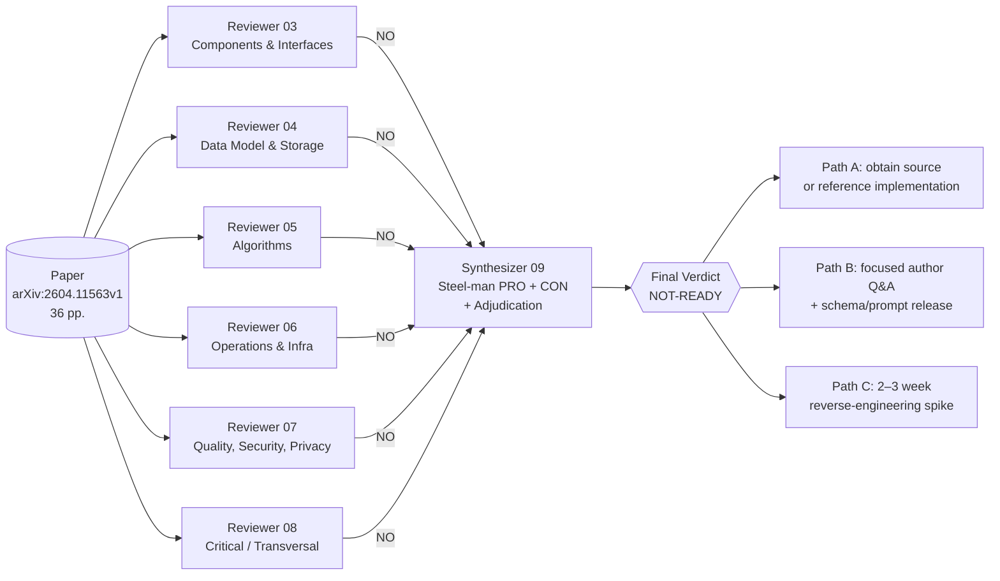
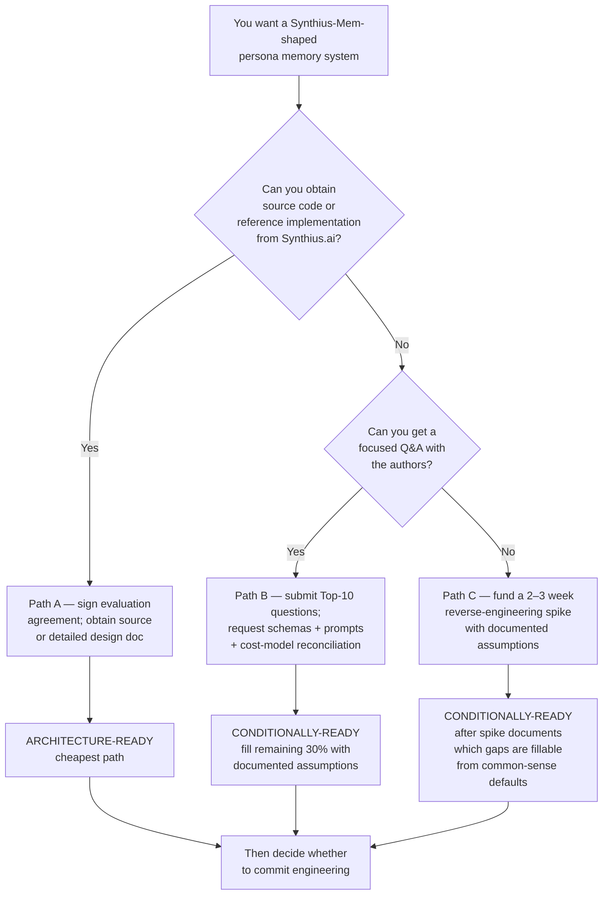

# Executive Summary — Synthius-Mem Architecture Readiness Review

> Multi-agent review of **arXiv:2604.11563v1** ("Synthius-Mem: Brain-Inspired Hallucination-Resistant Persona Memory", Gadzhiev & Kislov, Synthius.ai, April 2026, 36 pp.) for the question: **Is the paper clear and comprehensive enough to do technical architecture design for Synthius-Mem?**

---

## Verdict

# 🛑 NOT-READY

The paper is a credible **architectural sketch and benchmarking report** — not a **system specification**. Starting architecture design from this paper alone would force the architect to invent **~50% of the system**: every schema, every prompt, the storage substrate, the consolidation algorithm, the matching primitive, the integration contract, the privacy/security model, the failure semantics, the multi-tenancy boundary, the deployment topology, and the observability surface — while also navigating **documented internal numerical inconsistencies** that compromise the citable headline claims.

The architectural *pattern* is novel and worth pursuing. **This paper alone is not enough to commit engineering on.**

---

## How we reached the verdict

Six independent specialist reviewers and a synthesizer/devil's-advocate examined the paper through orthogonal lenses. **All six reached NO independently.** No reviewer found even a partial YES on any dimension. The synthesizer steel-manned both sides and confirmed the verdict against the source PDF.

---

## What the paper IS sufficient for

These are the architectural commitments the paper unambiguously makes — anchors for a **PRD or Phase-0 sketch**:

| Element | Source | Use |
|---|---|---|
| Six typed cognitive domains (Biography, Experiences, Preferences, Social Circle, Work, Psychometrics) + non-queryable Style | Table 1 / p. 11; Fig. 2 / p. 11 | Logical separation of concerns |
| Two-phase pipeline (offline ingest → cold store; online planner → CategoryRAG → answer) | Fig. 1 / p. 5 | Block diagram, latency budget envelope |
| Person-scoped isolation invariant | §4.1 / p. 16 | Persona-as-shard-key, multi-tenant sketch |
| Reversible-diff update semantics | §3.3 / p. 13 | Update primitive intent (mechanics still missing) |
| Performance targets: 21.79 ms retrieval, ~5,040 tok/msg @ N=500, 1K + 200 token system-prompt budget | §4.6 / Fig. 7 / App. A.1 | Testable design constraints |
| Refusal-via-empty-evidence pattern | §5.1 / p. 24 | Stated behavioral contract for hallucination resistance |
| 9 psychometric instruments (Big Five, Schwartz, PANAS, VIA, Cognitive Ability, IRI, Moral Foundations, Political Compass, Kohlberg) | §3.3 / p. 12 | Domain inventory for the Psychometrics module |

Net: enough for a **Product Requirements Document**, a competing-system inspiration exercise, or a Phase-0 architecture sketch. Not enough for a Phase-1 detailed design.

---

## Top 10 architecture-blocking gaps (cross-cutting, distilled from 38+38+50+23+30+18 individual gaps)

| # | Gap | Severity | Why it blocks design |
|---|---|---|---|
| 1 | **Six domain JSON schemas not published** — only "key features" bullets | BLOCKER | Keystone gap: storage, validators, prompts, retrieval queries, diff engine, migrations are all unbuildable |
| 2 | **Storage substrate + CategoryRAG matching primitive undefined** — "6 JSON files" admits ≥4 valid implementations | BLOCKER | 21.79 ms latency cannot be reproduced or projected; vendor & sizing decisions blocked |
| 3 | **Extraction LLM never named, six extraction prompts not published** | BLOCKER | Owns most of the system's accuracy budget; every headline number lives or dies on these artifacts |
| 4 | **Planner prompt + consolidator algorithm not published** (consolidator described in one paragraph) | BLOCKER | Misroute behavior is hidden in end-to-end accuracy; consolidator has no defined dedup/merge/conflict policy |
| 5 | **Integration contract with the host agent is undefined; paper offers three contradictory models** (Fig. 1 puts Answer LLM inside; §6 calls it a subsystem; §3.3 says Psychometrics is "embedded in the system prompt") | BLOCKER | Three mutually exclusive deployable shapes — architect would have to pick blind |
| 6 | **No threat model, no prompt-injection defense, no PII/GDPR posture** — persona contains category-9 special data (health, politics, morals, inferred IQ) | BLOCKER | Trust boundary crossed by an LLM with no sanitization; right-to-erasure collides with diff log |
| 7 | **Multi-tenant isolation is explicitly future work** (§6 / p. 26) | BLOCKER | System cannot be deployed for B2B / shared-deployment as architected; cross-persona contamination is a hope, not a control |
| 8 | **Cost model internally inconsistent by 2×** — App. A.1 says 5,040 tok/msg → 5,040 × 500 = 2.52M; App. A.2 says cumulative ≈ 4.7M | BLOCKER | The headline "5× cheaper than full context" is exposed; CFO presentations would not survive cross-check |
| 9 | **"Deterministic consolidation" claim contradicted by "summarization into biography narratives" sub-step** (§3.3 vs §4) | BLOCKER | Central methodological defense against overfitting is misstated; SLO/regression designs assuming determinism will fail |
| 10 | **No failure-mode catalog, no observability surface, no SLOs** | BLOCKER | Cannot design SLOs without knowing what counts as failure (malformed JSON, planner misroute, consolidator conflict, mid-write crash, false refusal) |

A second tier of significant but smaller gaps (judge prompt unpublished, knowledge-type re-tagging procedure undisclosed, chunking parameters unspecified, persona PK undefined, cross-domain FK model undefined, missing arXiv:2601.15313 placeholder citation, F1-vs-binary "exceeds human" comparison, prose-vs-table number mismatches in §4.2/§4.3) is enumerated in `09-debate-and-verdict.md`.

---

## Verified internal numerical issues (you can reproduce in 60 seconds)

| # | Inconsistency | Prose | Table / derivation |
|---|---|---|---|
| 1 | Adversarial score | "99.9%" (§4.2 / p. 16) | 99.55% (Table 3 / p. 17) |
| 2 | Temporal score | "94.2%" (§4.2 / p. 16; recurs §4.3 / p. 18) | 89.32% (Tables 3 & 5) |
| 3 | Multi-hop score | "85.7%" (§4.2 / p. 16) | 94.34% (Table 3 / p. 17) |
| 4 | Open-domain gap vs Embedding-RAG | "+39.1 pp" (§4.3 / p. 18) | 77.33 − 56.4 = 20.93 pp (Table 5 / p. 18) |
| 5 | Cumulative tokens @ N=500 | "≈ 4.7M tokens" (App. A.2 / p. 28) | 5,040 × 500 = 2.52M (Table 7 / p. 28) — **2× off** |
| 6 | Cumulative tokens @ N=1000 | "≈ 9.3M tokens" (App. A.2 / p. 28) | ~4.67M from Table 7 + amortized extraction — **2× off** |
| 7 | "<0.1% of total response time" claim | §4.6 / p. 23 implies total ≥ 21,790 ms; realistic GPT-4.1-mini is 1–3 s → 21.79 ms is 0.7–2.2% — **off by ≥ one order of magnitude** |

The cost-model 2× discrepancy is the most damaging: it's on the same page (28) and the headline efficiency claim depends on it.

---

## Where the paper deserves credit (for balance)

- **§4.4 / p. 20–21** — adversarial-as-load-bearing-metric framing. Synthius-Mem is, to its credit, the only system in its comparison set that publishes adversarial robustness, and the paper's argument for *why* this matters more than F1 for persona memory is sound.
- **§5.3 / p. 25** — honest critique of cross-paper LLM-as-judge heterogeneity. The paper acknowledges that direct cross-paper comparison is "approximate" because of differing setups.
- **§5.4 / p. 26** — proposes an "ideal benchmark" beyond LoCoMo, showing self-aware benchmarking literacy.
- **The architectural pattern itself** — typed-domain RAG + planner routing + refusal-via-empty-evidence is genuinely novel and a real contribution to the LLM-memory design space.

---

## Recommendation

**Do not** start architecture work straight from the paper. **Do not** wait for v2 — the paper's vendor co-purpose makes additional implementation detail unlikely. **Do** pursue the pattern — it is novel and validated qualitatively by the LoCoMo numbers (even discounted for narrowness).

### Top 10 questions for the authors (priority order)

1. Publish the six JSON Schemas (Draft 2020-12), including the 19 Biography categories and per-framework facets.
2. Name the **extraction** LLM, the **planner** LLM, the structured-output mechanism, and decoding params.
3. Publish the six extraction prompts, the planner prompt, the answer-LLM 1K-token system prompt, the judge prompt, and the knowledge-type re-tagging procedure (with IAA stats).
4. Reconcile the cost model — at N=500, is per-msg 5,040 tok or cumulative 4.7M? They differ by 2×.
5. Reconcile "deterministic" vs "summarization into biography narratives". Which stages are LLM-driven, which are rule-based?
6. Specify storage substrate, index design, concurrency model, per-persona partitioning, and the field-level matching primitive (exact / fuzzy / semantic, paraphrase handling without embeddings).
7. Describe the integration contract: does Synthius-Mem own the Answer LLM call, or return facts to a host agent? Function signature?
8. Multi-tenant isolation model, cross-persona reference policy when Alice's chat mentions Bob, GDPR Art. 17 hard-delete vs soft-delete distinction.
9. Consolidation conflict-resolution policy (latest-wins / confidence-weighted / source-recency / user-confirmed), diff-engine rollback granularity, partial-extraction failure semantics.
10. Reconcile the prose-vs-table number mismatches in §4.2 / §4.3 (adversarial 99.9 vs 99.55, temporal 94.2 vs 89.32, multi-hop 85.7 vs 94.34, open-domain gap 39.1 vs 20.93). Which numbers are canonical?

---

## Report index

All deeper detail lives in the sibling files:

| File | Purpose | Key finding |
|---|---|---|
| `01-paper-summary.md` | Neutral summary of the paper's claims, structure, and architecture. Reading this is enough to follow every other report. | Captures the six-domain model + pipeline + headline numbers + what the paper explicitly does not specify |
| `03-review-component-architecture.md` | Components, modules, control flow, external interfaces (C4-style review) | NO — 18 gaps (3 BLOCKER, 6 MAJOR, 7 MINOR, 2 NIT). Container diagram is undrawable; integration contract has 3 mutually exclusive models |
| `04-review-data-model.md` | Schemas, storage, identity, FK model, concurrency, evolution | NO — 27 gaps (8 BLOCKER, 10 MAJOR, 6 MINOR, 3 NIT). Zero concrete schemas published |
| `05-review-algorithms.md` | Chunking, extraction, consolidation, planner, CategoryRAG, answer, diff engine, psychometric profiling, eval | NO — 49 gaps (17 BLOCKER, 21 MAJOR, 11 MINOR). Every load-bearing algorithm omitted; "deterministic" claim contradicted internally |
| `06-review-operations.md` | Stack, topology, capacity, scaling, observability, failure, multi-tenancy, cost-model recompute | NO — 23 gaps (7 BLOCKER, 11 MAJOR, 3 MINOR, 2 NIT). Infra-only reproducibility impossible; user-facing latency 1–4.5 s, not 21.79 ms |
| `07-review-quality-and-risks.md` | Eval reproducibility, threat model, prompt injection, PII/GDPR, ethics, failure modes, test strategy | NO — 30 gaps. Zero threat model; persona is a category-9 special-data dossier with no documented controls; multi-tenancy is future work |
| `08-review-critical-gaps.md` | Vague language, internal inconsistencies, unsupported claims, definitional gaps, citation reality | NO — 38 gaps (13 BLOCKER, 17 MAJOR, 8 MINOR). Five verified prose↔table↔cost-model numerical inconsistencies; placeholder citation arXiv:2601.15313 |
| `09-debate-and-verdict.md` | Synthesizer + devil's-advocate cross-examination; steel-man PRO and CON; adjudicates 4 inter-reviewer disagreements; Top 10 cross-cutting gaps; remediation paths | NOT-READY — verdict and full reasoning |
| `00-EXECUTIVE-SUMMARY.md` (this file) | Front door / TL;DR for busy readers | NOT-READY — pursue the pattern, not this paper |

---

## One-line takeaway

> **The paper sells a result; it does not specify a system.** The architectural pattern (typed-domain memory + planner routing + refusal-via-empty-evidence) is real and worth pursuing, but the architect would invent more than half of the implementation, and the citable headline numbers do not survive a 60-second cross-check of the paper's own appendix. Get the source code, run a spike, or schedule the authors — *then* design.
