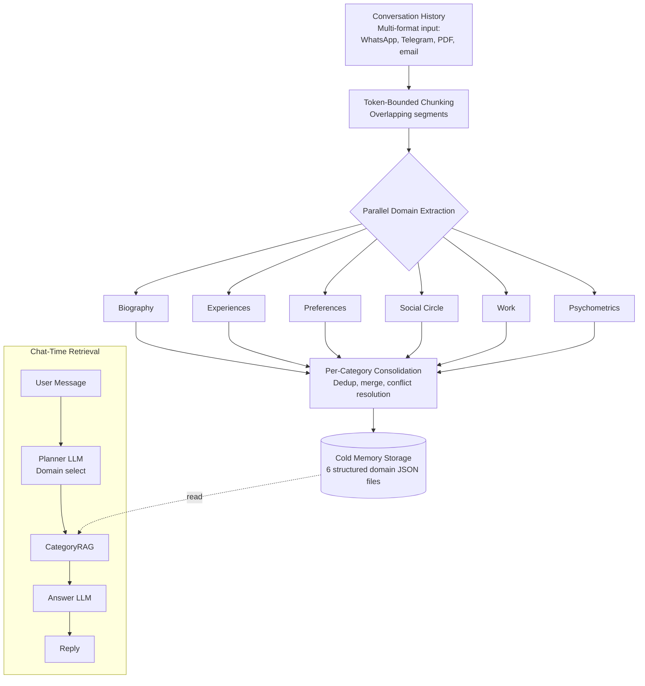

# Paper Summary — Synthius-Mem (arXiv:2604.11563v1)

> Neutral grounding doc for downstream reviewer agents. Captures what the paper claims, proposes, and reports — without judgement on architecture-readiness.

## Bibliographic

- **Title:** Synthius-Mem: Brain-Inspired Hallucination-Resistant Persona Memory Achieving 94.4% Memory Accuracy and 99.6% Adversarial Robustness on LoCoMo
- **Authors:** Artem Gadzhiev, Andrew Kislov (Synthius.ai)
- **Date:** April 2026
- **Length:** 36 pages
- **Source PDF:** `docs/externals/2604.11563v1.pdf`
- **Extracted text:** `docs/externals/2604.11563v1.txt`

## Thesis (one paragraph)

LLM agents need long-term persona memory that is accurate, cheap, and hallucination-resistant. Existing approaches (full-context, sliding window, summarization, embedding RAG, flat fact extraction, raw-episode retrieval) each fail on at least one of these three. The paper proposes **Synthius-Mem**, a structured persona-memory system organized around six neuroscience-inspired domains, each with its own JSON schema, extraction module, consolidation logic, and retrieval tool. A planner LLM routes queries to the relevant domain(s); domain tools perform field-level lookups against a structured store ("CategoryRAG"). On LoCoMo (1,813 questions, GPT-4.1-mini judge), it reports 94.37% overall accuracy, 99.55% adversarial robustness, 21.79 ms mean retrieval latency, and ~5× fewer tokens than full-context replay at N=500 messages.

## Section Map

| § | Title | What it covers |
|---|-------|----------------|
| 1 | Introduction | Motivation, brain-vs-LLM efficiency, cost of context, limits of existing approaches |
| 2 | Related Work | Context strategies, benchmarks (LoCoMo), memory systems landscape, neuroscience grounding |
| 3 | System Architecture | Design philosophy, six-domain model, pipeline + retrieval + updates + profiling |
| 4 | Experimental Evaluation | Protocol, comparison vs published, controlled baselines, per-category breakdown, latency |
| 5 | Discussion | Why structured retrieval wins, peripheral-detail tradeoff, limitations, ideal benchmark |
| 6 | Future Work and Vision | Streaming extraction, multi-agent shared memory, MCP service, decay, etc. |
| 7 | Conclusion | Summary of contributions |
| App. A | Cost Models | Per-message and cumulative token cost derivations; USD conversion |
| Refs | References | ~50 entries spanning neuroscience and LLM-memory literature |

## The Six Memory Domains (Table 1 / Figure 2)

| Domain | Neuroscience analog | Schema highlights |
|---|---|---|
| **Biography** | Semantic self-knowledge | 19 categories; atomic time-stamped facts; confidence 0–1; source dates |
| **Experiences** | Episodic memory | Hierarchical tree; emotions & affect; intensity; social context |
| **Preferences** | Evaluative memory | Entity + polarity; strength; temporal status; original phrasing |
| **Social Circle** | Social cognition | Person models; closeness & trust; relationship events; alias resolution |
| **Work** | Professional memory | Engagements; skills & tools; projects/tasks; outcomes |
| **Psychometrics** | Self-model / metacognition | 9 validated frameworks; scores 0–100; evidence quotes; confidence |
| (Style — non-queryable) | — | Writing fingerprint used for generation consistency |

The 9 psychometric frameworks listed: **Big Five (NEO-PI-R), Schwartz Values, PANAS, VIA Character Strengths, Cognitive Ability, IRI Empathy, Moral Foundations, Political Compass, Kohlberg Moral Development**.

## Architecture (Figure 1)

### Pipeline phases

1. **Input parsing** — multi-format (WhatsApp, Telegram, PDF, email).
2. **Token-bounded chunking** — overlapping windows; enables arbitrarily long histories within fixed budgets.
3. **Parallel domain extraction** — LLM calls into all six schemas in parallel; structured-output JSON per domain.
4. **Per-category consolidation** — dedup, merge, conflict resolution; consolidation runs *within* each upper category (e.g., education facts never deduplicate against health facts).
5. **Cold memory storage** — six structured JSON files per persona.
6. **Chat-time retrieval** — Planner LLM picks domains → CategoryRAG performs field-level matching → Answer LLM composes reply.

### Update model
Reversible diff engine: add / edit / delete with full rollback.

## Headline Claims

| Claim | Value | Source |
|---|---:|---|
| Overall LoCoMo accuracy | 94.37% | Table 2 |
| Adversarial robustness | 99.55% | Table 6 |
| Core fact accuracy | 98.64% | Table 6 |
| Temporal precision | 94.40% | Table 6 |
| Open inference | 78.26% | Table 6 |
| Peripheral detail (intentional tradeoff) | 57.66% | Table 6 |
| Mean retrieval latency | 21.79 ms | Figure 7 |
| Token cost @ N=500 vs full-context | 5,040 vs 26,200 (5.2×) | App. A.1 |
| Cumulative tokens @ N=1000 vs full-context | 9.3M vs 27M | App. A.2 |
| Beats human baseline | +6.47 pp over 87.9 F1 | Table 2 |
| Beats next-best system (MemMachine) | +2.68 pp over 91.69% | Table 2 |

## Evaluation Setup

- **Benchmark:** LoCoMo (Maharana et al., 2024) — 10 conversations, 20 participants, 1,813 questions
- **Question categories used (5):** single-hop, multi-hop, temporal, open-domain, adversarial
- **Authors' alternative taxonomy (5):** adversarial, core memory fact, temporal precision, open inference, peripheral detail
- **Answer LLM (Synthius-Mem):** GPT-4.1-mini
- **Judge LLM:** GPT-4.1-mini (binary scoring)
- **Baseline answer LLM (controlled comparison):** Gemini 3 Flash
- **Embedding model (RAG baseline):** OpenAI text-embedding-3-small (1,536d)
- **Person-scoped:** A separate persona per LoCoMo participant.

## Stated Design Principles (§3.1)

1. **Domain-Structured Storage** — partition memory into typed subsystems.
2. **Active Consolidation** — replay/integration/abstraction, not passive storage.
3. **Bounded Processing** — token-bounded extraction windows.

## Stated Contributions (§1, end)

1. Neuroscience-inspired six-domain architecture.
2. Complete extraction-consolidation-retrieval pipeline with bounded budgets.
3. Continuous memory evolution via incremental updates.
4. SOTA on LoCoMo (above human baseline) with 99.55% adversarial robustness.
5. ~5× token efficiency vs full-context.

## Stated Tradeoffs / Limitations

- **Peripheral detail** is intentionally suppressed by the extraction relevance threshold (57.66%).
- **Open inference** (78.26%) — multiple defensible answers; LLM-as-judge variance.
- LoCoMo limitations are noted; an "ideal benchmark" is sketched in §5.4.
- Relationship to LoCoMo: "evaluation, not training" — system has no learned parameters; schemas are fixed prompts; consolidation is deterministic; retrieval is rule-based.

## What the Paper Explicitly Does NOT Specify

(Compiled while extracting; reviewers should verify and add.)

- The actual **JSON schemas** for the six domains (only listed as "key features" in Table 1).
- The **extraction prompts** themselves.
- The **planner LLM prompt** / domain-selection criteria.
- The **consolidation algorithm** (dedup heuristic, conflict-resolution strategy, merge rules).
- The **storage layer** (file format mentioned as "JSON files" per domain — no DB, indexing, or concurrency model).
- **Multi-tenancy / access-control** mechanism.
- **Privacy / PII handling** beyond mentioning "federated extraction" as future work.
- The **chunking parameters** (window size, overlap).
- **LLM choice for extraction** (GPT-4.1-mini is named only for answer/judge; extraction model is unstated).
- **Embedding model** for any internal use within Synthius-Mem (none mentioned — the system appears to be embedding-free).
- **Failure modes** when extraction returns malformed JSON, when planner mis-routes, or when consolidation conflicts cannot be auto-resolved.
- **Update conflict handling** at the diff-engine level (CRDTs? optimistic locking?).
- **Hardware footprint / cost** of running the production system at scale.

## Pointers for downstream agents

- Full text: `docs/externals/2604.11563v1.txt` (~21K tokens, 36 pages, page markers `===== PAGE N =====`).
- For figures and tables, `Read` the PDF directly with `pages=` ranges. Architecture diagram = Figure 1 (page 5). Domain model = Figure 2 + Table 1 (page 11).
- Tables: 1 (domains), 2 (overall scores), 3 (per-category vs others), 4 (controlled baselines), 5 (per-category baselines), 6 (knowledge-type), 7 (token cost), 8 (USD).
- Figures: 1 (architecture), 2 (six-domain card view), 3 (controlled baseline bars), 4 (knowledge-type bars), 5 (token-cost vs accuracy scatter), 6 (cost scaling curve), 7 (latency log scale).
