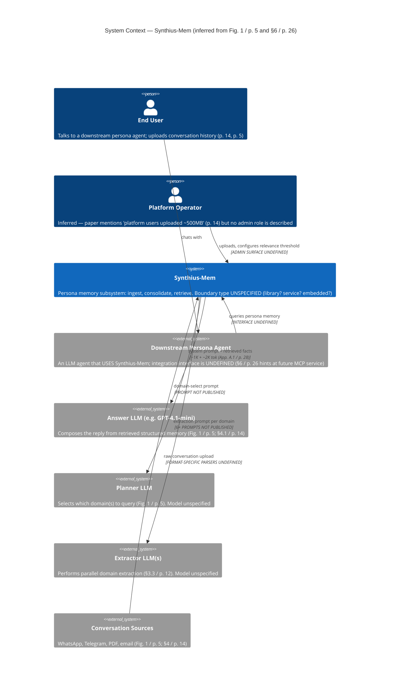
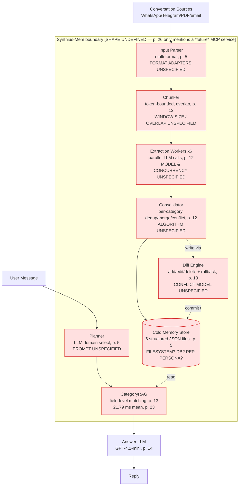
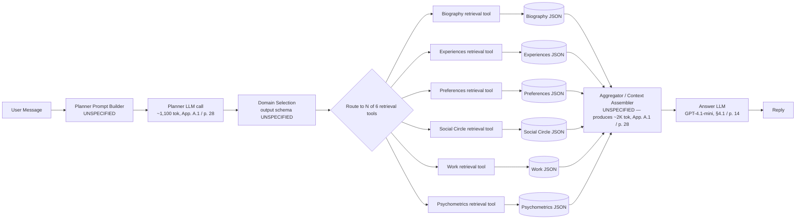
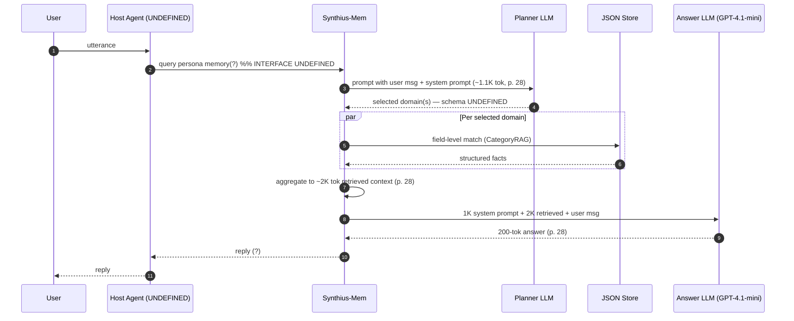
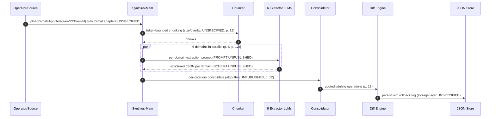

# Review — Component Architecture & External Interfaces

> Reviewer lens: software architect. Question: can a competent team begin technical architecture design from this paper alone?
> Source paper: Synthius-Mem (arXiv:2604.11563v1), April 2026.
> Companion summary: `01-paper-summary.md`.

**Architecture-readiness for components & interfaces: NO** — the paper presents a credible logical pipeline diagram (Fig. 1 / p. 5) and a clean domain partition (Fig. 2 + Table 1 / p. 11), but it specifies *zero* deployable boundaries: no process model, no API surface, no integration contract with the host agent, no concurrency or consistency model for the offline/online state split, and no formal description of the alleged future MCP service. A team can draw the C4 *Context* diagram with caveats, can sketch a *Component* diagram for the logical pipeline, but cannot draw a *Container* diagram that compiles to deployable units. This is a research paper that documents a system's *behavior and accuracy*, not its *deployable architecture*.

---

## 1. What the paper does specify (architecturally useful)

Before hunting gaps, credit where due. The following are unambiguous:

- **Six-domain partition is fully enumerated** (Table 1 / p. 11; Fig. 2 / p. 11). Biography, Experiences, Preferences, Social Circle, Work, Psychometrics, plus a non-queryable Style domain. Each is described as having "its own JSON schema, extraction module, consolidation logic, and retrieval tool" (§3.2 / p. 10) — that is the closest the paper comes to a component contract, and it is a real architectural commitment (separation of concerns by data type).
- **Two-phase logical pipeline is named and ordered** (Fig. 1 / p. 5):
  1. *Offline ingest:* Conversation History → Token-Bounded Chunking → Parallel Domain Extraction (×6) → Per-Category Consolidation → Cold Memory Storage.
  2. *Online retrieval:* User Message → Planner LLM (domain select) → CategoryRAG → Answer LLM → Reply.
- **State medium is named:** "structured JSON memory store" / "6 structured domain JSON files" (Fig. 1 / p. 5; §3.3 / p. 12–13). Whether this is literally six files on disk or a logical abstraction over a DB is left undefined — see gaps.
- **A rough latency budget** for the retrieval portion: 21.79 ms mean for CategoryRAG (Fig. 7 / p. 23), with the claim that "memory retrieval contributes less than 0.1% of total latency" (§4.6 / p. 23). This implies the retrieval container is in-process or low-latency local — but it is not stated.
- **Person-scoping is mandatory.** "It builds a separate persona for each participant … cross-person contamination would indicate a pipeline bug" (§4.1 / p. 16). This is an architectural invariant: the unit of state isolation is the persona.
- **Update semantics:** "reversible diff engine that supports add, edit, and delete operations with full rollback capability" (§3.3 / p. 13). This is the only constraint on the storage/update layer.
- **Multi-format input is in scope:** WhatsApp, Telegram, PDF, email (Fig. 1 / p. 5; §4 intro / p. 14 mentions "approximately 500 MB of real-world conversational and biographical data uploaded by platform users across diverse formats").

That is the entire architectural surface. Everything below is what is *missing*.

---

## 2. C4 — System Context (drawable, with assumptions)

A System Context can be drawn, but two of the four boundary participants (the calling LLM agent, the operations actor) are inferred rather than specified. Page references attached.

**What is concrete in the diagram:** end-user, conversation sources, the three LLM call sites, the per-message token budgets (App. A.1 / p. 28: ~1K system prompt + ~2K retrieved + 1.1K planner + 740 amortized extraction + 200 output ≈ 5,040 tok/msg).

**What is inferred / undefined:** the *Downstream Persona Agent* arrow — the paper is explicit that "the architecture extends naturally to a Model Context Protocol (MCP) service" (§6 / p. 26) but never defines the *current* integration. The user-facing "User Message" and "Reply" boxes in Fig. 1 leave open whether Synthius-Mem terminates the conversation or hands the rendered context to a host agent which then terminates it.

---

## 3. C4 — Container (NOT drawable from the paper)

This is the central failure. The paper makes zero claims about runtime processes. There is no statement of:

- whether ingest and chat-time retrieval run in the same OS process,
- how many deployable artifacts exist (one binary? six microservices, one per domain? a Python library?),
- whether the LLM extractors are co-located or remote,
- where the JSON files live (local filesystem? object store? key-value store?),
- whether multiple personas share a process or get their own.

What the paper *does* let us infer (with low confidence): the retrieval path is fast enough (21.79 ms / p. 23) that CategoryRAG plausibly reads JSON from local disk or an in-process structure. The ingest path is described as making LLM calls in parallel across six domains, then a consolidation step — that is a workflow, not a deployment. A Container diagram drawn from this material would be 90% guesswork.

The most a reviewer can produce honestly is a *speculative* container diagram annotated with every assumption:

Every red box represents an architectural commitment the paper declines to make.

---

## 4. C4 — Component (drawable for the logical CategoryRAG path)

The most architecturally specified part of the paper is the chat-time retrieval slice. A logical component diagram is defensible, though the *interfaces between components are not specified as signatures*.

What the paper supports: the existence of six retrieval tools, the planner's role, the ~2K-token retrieved-context budget, the answer LLM identity. What it does not support: the planner's output schema (does it emit `{domains: [...], queries: [...]}`? a function-call payload? free-text?), how multi-domain results are merged, how empty-result-from-all-domains becomes a refusal, what happens when the planner picks the wrong domain.

---

## 5. End-to-end control flow trace

### 5.1 One user message — what we can say

From Fig. 1 (p. 5) and App. A.1 (p. 28) the request flow is:

**What is unclear at every "(?)"**: is the host agent the originator, or is Synthius-Mem the agent? §3.2 / p. 10 says the six domains "constitute what we call a persona — a structured model of an individual sufficient to support personalized conversation, task assistance, and relationship continuity," which suggests Synthius-Mem owns the conversation. But §6 / p. 26 ("memory subsystem of a broader platform for persistent, personalized AI agents") suggests a subsystem role. The paper waffles.

### 5.2 One ingestion — what we can say

The control flow is *named* but not *specified*. There is no:

- success/failure signal for upload (sync HTTP 201? async job ID? webhook on completion?),
- behavior on partial extractor failure (5 of 6 succeed),
- behavior on malformed JSON output from an extractor,
- backpressure or rate-limiting model when a 500 MB corpus is uploaded (§4 intro / p. 14 cites this scale).

---

## 6. Integration with the calling agent (the most damaging gap)

The paper's positioning is that Synthius-Mem is "the memory subsystem of a broader platform for persistent, personalized AI agents" (§6 / p. 26), yet the interface to that broader platform is the most underspecified surface in the entire document. Concretely:

- No function signature for the retrieval call. Is it `retrieve(persona_id, user_message) -> structured_context`? `retrieve(persona_id, user_message) -> rendered_string`? `retrieve_and_answer(...) -> reply`? All three appear consistent with Fig. 1.
- No specification of who composes the final reply. The diagram shows "Answer LLM → Reply" *inside* the Synthius-Mem boundary (Fig. 1 chat-time strip / p. 5), implying Synthius-Mem owns generation. But §6 says Synthius-Mem is a *subsystem* of an agent platform — which would imply the host agent owns generation and Synthius-Mem just hands back facts. These are mutually exclusive integration models with completely different data flows, threat surfaces, and failure-isolation properties.
- No definition of "compose with downstream agentic systems." The phrase appears in §6 / p. 26 in the context of the future MCP service. There is no current contract.
- The Psychometrics output is described as "embedded in the system prompt for personality-consistent generation" (§3.3 / p. 13). This implies Synthius-Mem produces prompt fragments that the host agent injects into its own system prompt — which is *yet another* integration model (a context-provider, not a service) that conflicts with the in-boundary Answer LLM in Fig. 1.

A team starting architecture design today would have to pick one of three radically different integration shapes and would receive zero guidance from the paper.

---

## 7. Offline ingest vs. online retrieval — shared state and consistency

The two phases share state through the "Cold Memory Storage" block (Fig. 1 / p. 5). Critical questions left unanswered:

- **Concurrency model.** Can a chat-time CategoryRAG read while a consolidation write is in progress? The paper says nothing.
- **Atomicity.** The diff engine "supports add, edit, and delete with full rollback" (§3.3 / p. 13). Rollback over what scope — a single fact? a whole consolidation pass? a whole upload?
- **Visibility/freshness.** If a user uploads a new conversation, when does it become visible to chat? Is ingest synchronous (block the upload response until consolidation completes) or asynchronous (return 202, eventually consistent)?
- **Per-category isolation.** "Education facts are never conflated with health facts during deduplication" (§3.3 / p. 12). Good — but this is a logical guarantee of the consolidation algorithm, not a concurrency guarantee on the store.
- **Multi-tenancy / per-persona isolation.** §4.1 / p. 16 establishes that personas are independent. But: are they separate files? Separate directories? Separate databases? Is there a global index, or does every read scope to one persona?

The 500-MB-of-uploads scale (§4 intro / p. 14) is enough that "six JSON files" cannot literally mean six monolithic files at production scale — there must be per-persona partitioning, but the paper does not say so.

---

## 8. The MCP question — current vs. future boundary

The paper's only sentence on deployable shape is in §6 / p. 26: *"The architecture extends naturally to a Model Context Protocol (MCP) service for memory portability across platforms."*

That is a forward-looking research direction, not a current architecture statement. The *current* boundary is unspecified. From the language used elsewhere — "platform users uploaded data" (§4 / p. 14), "deployed persona agents" (§3.2 / p. 10), "production persona memory platform" (§4 intro / p. 14) — Synthius.ai presumably runs Synthius-Mem as a hosted service today. But the paper publishes neither:

- the API of that hosted service,
- nor a self-hostable library/binary,
- nor a planned MCP tool catalog.

A team deciding today between *embed the algorithms in our agent runtime* vs. *call a Synthius-Mem service over the network* vs. *wait for the MCP version* gets zero direction from the paper. This is the single highest-impact missing piece for an architect.

---

## 9. External API contracts — fully absent

For each interaction the paper implies, the contract is undefined:

| Surface | Inputs | Outputs | Errors | Idempotency | Sync/Async |
|---|---|---|---|---|---|
| Upload conversation | "WhatsApp, Telegram, PDF, email" (p. 5) — no schemas | Not described | Not described | Not described | Not described |
| Query memory | "user message" (p. 5) | "reply" or "structured context" — see §6 of this report, ambiguous | Not described — note §5.2 / p. 25 says the system can "refuse" adversarial queries (99.55% / Table 6), but this is a behavioral, not an API, claim | Not described | Implied sync (21.79 ms retrieval / p. 23) but not stated |
| Update memory (diff) | "add/edit/delete" operations (p. 13) | "rollback capability" (p. 13) | Not described | Not described | Not described |
| Configure relevance threshold | "configurable for applications that genuinely need exhaustive recall" (§5.2 / p. 25) | — | — | — | — |
| Admin / persona lifecycle (create, delete, export) | Not mentioned | — | — | — | — |
| Authn/authz | Not mentioned | — | — | — | — |

Every cell except a small minority is empty. There is no API contract in this paper.

---

## 10. Summary — what is and is not actionable

| Architecture artifact | Drawable from the paper? |
|---|---|
| C4 System Context | Yes, with two inferred actors (Section 2 above) |
| C4 Container | No — process model is entirely absent (Section 3) |
| C4 Component (retrieval) | Yes, logically; signatures unspecified (Section 4) |
| Sequence: chat | Partial — boundary roles ambiguous (§5.1 above) |
| Sequence: ingest | Partial — failure paths absent (§5.2 above) |
| External API spec | No (§9 above) |
| Concurrency / consistency model | No (§7 above) |
| Deployment topology | No (§§3, 8 above) |
| Integration with host agent | No (§6 above) |

**Verdict reaffirmed: NO.** The paper is a strong architecture *philosophy* document and a strong *evaluation* paper. It is not an architecture *specification*. A team would need a follow-up artifact (a design doc, a reference implementation, or an MCP server contract) before architectural work can start in earnest. What the paper *does* offer — the six-domain partition, the two-phase pipeline shape, the per-message token budget, the latency target, the person-scoped isolation invariant — is enough to write a solid PRD or start a *reverse-architecture* exercise. It is not enough to start an HLD.

---

## Gap Register (this dimension)

| # | Severity | Gap | Where in paper | Resolution needed |
|---|---|---|---|---|
| C-01 | **BLOCKER** | Deployable boundary undefined: library vs. embedded vs. service vs. future MCP | §6 / p. 26 (only a *future* MCP service is mentioned); Fig. 1 / p. 5 silent on process model | One sentence: "Synthius-Mem ships today as X (Python library / hosted REST / on-prem container)"; for each, name the artifact |
| C-02 | **BLOCKER** | Integration contract with the host agent unspecified — does Synthius-Mem own the Answer LLM call or hand back facts? | Fig. 1 chat-time strip / p. 5 places Answer LLM *inside* boundary; §6 / p. 26 calls it a "memory subsystem"; §3.3 / p. 13 says Psychometrics is "embedded in the system prompt" — three contradictory models | A function signature: `retrieve(persona_id, query) -> ?` with a defined return type; or a tool-catalog spec |
| C-03 | **BLOCKER** | No external API surface defined (upload, query, update, admin, auth) | Throughout — never specified | OpenAPI / IDL document, or at minimum a table of operation signatures with sync/async + error model |
| C-04 | **MAJOR** | Concurrency & consistency model for the shared JSON store is absent — read-during-write, atomicity scope, freshness after upload | §3.3 / p. 13 mentions diff/rollback but no concurrency primitive; §4 / p. 14 implies multi-tenant uploads | Statement of isolation level (e.g. per-persona single-writer, snapshot-read), and ingest commit semantics (sync vs eventual) |
| C-05 | **MAJOR** | Storage layer is named ("6 JSON files" / p. 5) but undefined at production scale (~500 MB corpus / p. 14) | Fig. 1 / p. 5; §4 / p. 14 | Choice of: filesystem layout per persona, or DB (which?), or KV store; indexing strategy |
| C-06 | **MAJOR** | Multi-tenancy / per-persona isolation model unspecified | §4.1 / p. 16 establishes person-scoping as a logical invariant; physical isolation undefined | Statement: namespace per persona, share-nothing or shared-store-with-tenant-key |
| C-07 | **MAJOR** | Failure modes undefined: malformed extractor JSON, partial extractor success, planner mis-routing, all-domains-empty | §3.3 / p. 12; §5.1 / p. 24 (mentions "absence of evidence becomes a reliable refusal signal" — behavioral only) | A failure-mode and effect table, or at minimum: degraded-mode policy and refusal API |
| C-08 | **MAJOR** | Authn/authz, PII handling, access control absent | §6 / p. 26 mentions "domain-level access control" only as future work | Per-operation auth requirements; per-persona ACL model; PII redaction at ingest |
| C-09 | **MAJOR** | Six domain JSON schemas not published — only "key features" listed | Table 1 / p. 11; Fig. 2 / p. 11 | Six published JSON Schemas (Draft 2020-12 or similar) |
| C-10 | **MAJOR** | Planner, extractor, consolidator prompts not published | §3.3 / p. 12 (named); never quoted | Prompt artifacts in an appendix or a code release |
| C-11 | **MINOR** | Extractor LLM identity not stated (only Answer/Judge are named as GPT-4.1-mini in §4.1 / p. 14) | §3.3 / p. 12 | Name the model and its parameters |
| C-12 | **MINOR** | Chunking parameters unspecified (window size, overlap) | §3.3 / p. 12 ("token-bounded chunking with overlap") | Numerical defaults |
| C-13 | **MINOR** | Diff-engine conflict-resolution model unspecified — last-writer-wins? CRDT? operator review? | §3.3 / p. 13 | Concrete merge policy |
| C-14 | **MINOR** | Aggregation/composition rule for multi-domain retrieval results unspecified — how are results from Biography + Social Circle merged into the ~2K-tok context? | App. A.1 / p. 28 names the budget; §3.3 / p. 13 mentions field-level matching but not aggregation | Specification of context-assembly algorithm |
| C-15 | **MINOR** | "Style" domain stated as "non-queryable" but its consumption surface is undefined — does it inject into the system prompt? when? | Fig. 2 footer / p. 11; §3.2 / p. 10 | Define how Style flows to generation |
| C-16 | **MINOR** | Input parser adapters (WhatsApp, Telegram, PDF, email) are listed but not specified — what's the canonical internal representation? | Fig. 1 / p. 5; §4 / p. 14 | Define the canonical chunker-input message schema and per-format adapter contracts |
| C-17 | **NIT** | "Configurable relevance threshold" is named as a tuning knob but its surface (config file? per-call parameter? per-persona setting?) is undefined | §5.2 / p. 25 | Specify the configuration surface |
| C-18 | **NIT** | Latency claim of 21.79 ms (Fig. 7 / p. 23) lacks a benchmark hardware footprint, persona size, and concurrency level | Fig. 7 / p. 23; §4.6 / p. 23 | Standard latency-benchmark disclosure |

