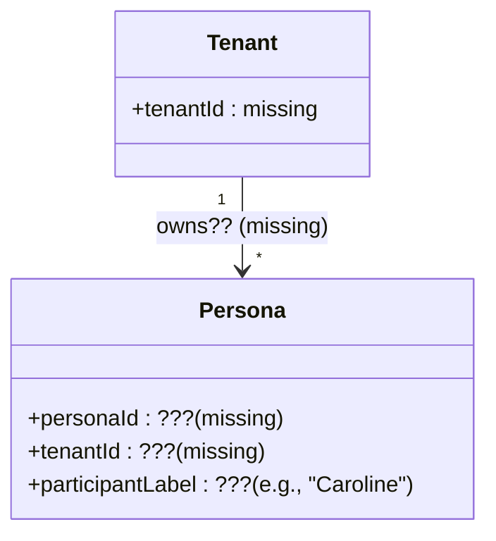
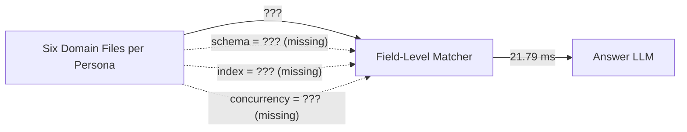
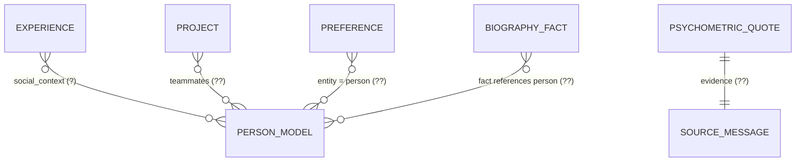

# Data Architect Review — Synthius-Mem (arXiv:2604.11563v1)

**Architecture-readiness for data model: NO** — the paper names domains, gives bullet-list "key features," and shows six sample value strings (Fig. 2, p. 11), but never publishes a single concrete schema, primary-key strategy, index definition, or storage-engine choice; a data architect cannot ship a JSON Schema, choose a DB, or design migrations from this text alone.

---

## 1. Verdict in one breath

The paper repeatedly asserts that "each domain has its own JSON schema, extraction module, consolidation logic, and retrieval tool" (§3.2, p. 10) and that storage is "6 structured domain JSON files" (Figure 1, p. 5). It then lists, per domain, between 3 and 5 bulleted "key features" (Table 1, p. 11; Figure 2, p. 11). That is the entire normative content of the data model. There are no field names with types, no cardinalities, no primary keys, no foreign keys, no nullability rules, no index definitions, no concurrency model, no migration story, no input-format contracts, and no quantitative size budgets. The 21.79 ms field-level retrieval claim (§3.3, p. 12; §4.6, p. 23) implies an index exists, but the paper does not say what it is.

What a data architect *can* do from this paper: sketch a domain partition and a vague entity inventory. What a data architect *cannot* do: persist a single record without inventing structure the paper does not specify.

---

## 2. Conceptual model the paper supports (at most)

```mermaid
erDiagram
    PERSONA ||--|| BIOGRAPHY : "has 1"
    PERSONA ||--|| EXPERIENCES : "has 1"
    PERSONA ||--|| PREFERENCES : "has 1"
    PERSONA ||--|| SOCIAL_CIRCLE : "has 1"
    PERSONA ||--|| WORK : "has 1"
    PERSONA ||--|| PSYCHOMETRICS : "has 1"
    PERSONA ||--|| STYLE : "has 1 (non-queryable)"

    BIOGRAPHY ||--o{ BIO_FACT : contains
    EXPERIENCES ||--o{ EXPERIENCE_NODE : "tree of"
    PREFERENCES ||--o{ PREFERENCE : contains
    SOCIAL_CIRCLE ||--o{ PERSON_MODEL : contains
    PERSON_MODEL ||--o{ RELATIONSHIP_EVENT : "history of"
    WORK ||--o{ ENGAGEMENT : contains
    ENGAGEMENT ||--o{ PROJECT : "comprises"
    PROJECT ||--o{ TASK : "comprises"
    PSYCHOMETRICS ||--o{ FRAMEWORK_SCORE : contains
    FRAMEWORK_SCORE ||--o{ EVIDENCE_QUOTE : "supported by"
```

Nothing about cardinality, key choice, or cross-domain references is stated; the diagram above is largely *inferred* from the bullets in Table 1 and Figure 2.

---

## 3. Per-domain schema sketches (stated vs inferred vs missing)

The convention below: `(stated)` = the field name appears verbatim in Table 1 / Figure 2 / §3.2–3.3 (pages 10–12); `(inferred)` = required by an obvious read of the bullets but not explicitly named; `(missing)` = a reasonable schema would need it but the paper is silent.

### 3.1 Biography

> Stated: "19 categories, atomic facts, confidence scores" (Table 1, p. 11) and "Confidence 0–1, Source dates" (Figure 2, p. 11). Example value: "PhD Neuroscience, UCL, 2019" (Figure 2). The paper later names sample categories: "education, employment, family, health, residence, etc." (§4, p. 13).

```jsonc
{
  "$id": "biography.fact",
  "type": "object",
  "properties": {
    "category":      { "type": "string", "enum": ["education", "employment", "family", "health", "residence", "..." /* 14 unspecified */] }, // (stated: 19 categories exist; the enumeration is missing)
    "atomic_fact":   { "type": "string" },                                                                                // (stated as "atomic facts")
    "confidence":    { "type": "number", "minimum": 0, "maximum": 1 },                                                    // (stated: "Confidence 0–1")
    "source_date":   { "type": "string", "format": "date" },                                                              // (stated: "Source dates")
    "fact_id":       { "type": "string" },                                                                                // (inferred — needed for diff/rollback)
    "occurred_at":   { "type": "string", "format": "date" },                                                              // (inferred — "atomic time-stamped facts" §3.2)
    "extracted_at":  { "type": "string", "format": "date-time" },                                                         // (missing)
    "extracted_from":{ "type": "string", "description": "chunk/turn pointer" },                                           // (missing)
    "evidence_span": { "type": "string" }                                                                                 // (missing — only Psychometrics is said to keep quotes)
  }
}
```

| Item | Status |
|---|---|
| The 19 categories themselves | **missing** (only ~5 illustrative ones given) |
| Whether `category` is hierarchical (e.g., `employment.role`) | missing |
| Multiplicity (one fact per category? many?) | missing |
| Datatype of `atomic_fact` (string? structured?) | missing |
| Whether confidence is per-fact or per-statement | inferred |
| Provenance pointer back to source message | missing |

### 3.2 Experiences

> Stated: "Hierarchical tree, emotions, intensity, social context" (Table 1) and "Hierarchical tree, Emotions & affect, Intensity levels, Social context" (Figure 2). Example: "First day at Google — excited, nervous." §2.4 also says experiences carry "temporal anchoring, emotional valence, and social context" (p. 7–8).

```jsonc
{
  "$id": "experience.node",
  "type": "object",
  "properties": {
    "experience_id":   { "type": "string" },                                              // (inferred)
    "parent_id":       { "type": ["string","null"] },                                     // (inferred — "Hierarchical tree")
    "title":           { "type": "string" },                                              // (inferred)
    "narrative":       { "type": "string" },                                              // (inferred)
    "emotions":        { "type": "array", "items": { "type": "string" } },                // (stated as "Emotions & affect")
    "affect_valence":  { "type": "number", "minimum": -1, "maximum": 1 },                 // (inferred)
    "intensity":       { "type": "number" },                                              // (stated as "Intensity levels"; scale unstated)
    "social_context":  { "type": "array", "items": { "type": "string", "format": "uri" } },// (stated; references to Social Circle inferred)
    "occurred_at":     { "type": "string", "format": "date" },                            // (inferred — "spatiotemporal binding" §2.4)
    "location":        { "type": "string" }                                               // (inferred — "spatiotemporal")
  }
}
```

| Item | Status |
|---|---|
| Tree shape (n-ary? max depth?) | missing |
| Intensity scale (0–1? 0–10? PANAS?) | missing |
| Emotion taxonomy (Plutchik? Ekman? PANAS items?) | missing |
| Whether `social_context` is a string or a foreign key into Social Circle | missing |
| How a single experience splits into child nodes | missing |

### 3.3 Preferences

> Stated: "Polarity, strength, temporal status, original phrasing" (Table 1) and "Entity + polarity, Strength levels, Temporal status, Original phrasing" (Figure 2). Example: "Loves Italian food — strong positive."

```jsonc
{
  "$id": "preference",
  "type": "object",
  "properties": {
    "preference_id":   { "type": "string" },                                              // (inferred)
    "entity":          { "type": "string" },                                              // (stated as "Entity + polarity"; entity-resolution unspecified)
    "polarity":        { "type": "string", "enum": ["positive","negative","neutral"] },   // (stated; values guessed)
    "strength":        { "type": "string", "enum": ["weak","moderate","strong"] },        // (stated as "Strength levels"; scale unstated)
    "temporal_status": { "type": "string", "enum": ["current","former","aspirational"] }, // (stated; values guessed)
    "valid_from":      { "type": "string", "format": "date" },                            // (inferred)
    "valid_to":        { "type": "string", "format": "date" },                            // (inferred — "former" status implies invalidation)
    "original_phrasing": { "type": "string" }                                             // (stated)
  }
}
```

| Item | Status |
|---|---|
| Whether `entity` is freeform or canonicalized | missing |
| Polarity enum vs scalar | missing |
| Strength scale | missing |
| `temporal_status` enum values | missing |
| Conflict resolution when polarity flips | missing |

### 3.4 Social Circle

> Stated: "Person models, closeness, trust, relationship events" (Table 1) and "Person models, Closeness & trust, Relationship events, Alias resolution" (Figure 2). Example: "Sarah — best friend, met at college."

```jsonc
{
  "$id": "social.person_model",
  "type": "object",
  "properties": {
    "person_id":       { "type": "string" },                                              // (inferred)
    "canonical_name":  { "type": "string" },                                              // (inferred — implied by "Alias resolution")
    "aliases":         { "type": "array", "items": { "type": "string" } },                // (stated as "Alias resolution"; mechanism unspecified)
    "role":            { "type": "string", "description": "best friend, sister, …" },     // (inferred from example)
    "closeness":       { "type": "number" },                                              // (stated; scale unstated)
    "trust":           { "type": "number" },                                              // (stated; scale unstated)
    "first_met":       { "type": "string", "format": "date" },                            // (inferred from example "met at college")
    "events":          { "type": "array", "items": { "$ref": "#/definitions/RelationshipEvent" } } // (stated as "Relationship events")
  }
}
```

| Item | Status |
|---|---|
| Closeness/trust scale (0–1? 0–10? Likert?) | missing |
| Alias-resolution algorithm (string match? embedding? LLM?) | missing |
| Whether persons live in a separate registry across personas | missing (see §7 below) |
| Cross-references from Work projects to Social Circle teammates | missing |
| Whether the assistant's own persona is itself a Person | missing |

### 3.5 Work

> Stated: "Engagements, skills, tools, projects, outcomes" (Table 1) and "Engagements, Skills & tools, Projects / tasks, Outcomes" (Figure 2). Example: "Sr. Engineer at Anthropic, 2023–."

```jsonc
{
  "$id": "work.engagement",
  "type": "object",
  "properties": {
    "engagement_id": { "type": "string" },                                                // (inferred)
    "role":          { "type": "string" },                                                // (inferred from example)
    "organization":  { "type": "string" },                                                // (inferred from example)
    "started_at":    { "type": "string", "format": "date" },                              // (inferred from "2023–")
    "ended_at":      { "type": ["string","null"], "format": "date" },                     // (inferred)
    "skills":        { "type": "array", "items": { "type": "string" } },                  // (stated)
    "tools":         { "type": "array", "items": { "type": "string" } },                  // (stated)
    "projects":      { "type": "array", "items": { "$ref": "#/definitions/Project" } },   // (stated)
    "outcomes":      { "type": "array", "items": { "type": "string" } }                   // (stated)
  }
}
```

| Item | Status |
|---|---|
| Project structure (`tasks` flat or hierarchical?) | missing |
| Skill taxonomy (free text? ESCO? O*NET?) | missing |
| Whether teammates link to Social Circle | missing |
| Outcome model (KPI? narrative? both?) | missing |

### 3.6 Psychometrics

> Stated: "9 validated frameworks, normalized scores, evidence quotes" (Table 1); "9 frameworks, Scores 0–100, Evidence quotes, Confidence" (Figure 2); §3.3 (p. 12) names the 9 frameworks. Example: "Openness: 85/100 high confidence."

```jsonc
{
  "$id": "psychometrics.score",
  "type": "object",
  "properties": {
    "framework":   { "type": "string", "enum": ["BigFive_NEO_PI_R", "SchwartzValues", "PANAS", "VIA", "CognitiveAbility", "IRI", "MoralFoundations", "PoliticalCompass", "Kohlberg"] }, // (stated)
    "facet":       { "type": "string", "description": "e.g., Openness, Conscientiousness" }, // (inferred from example)
    "score":       { "type": "number", "minimum": 0, "maximum": 100 },                       // (stated as "Scores 0–100" / "normalized")
    "confidence":  { "type": "string", "enum": ["low","medium","high"] },                    // (stated as "Confidence"; scale ambiguous)
    "evidence_quotes": {                                                                     // (stated)
      "type": "array",
      "items": {
        "type": "object",
        "properties": {
          "quote":       { "type": "string" },
          "source_ref":  { "type": "string" },                                               // (inferred)
          "extracted_at":{ "type": "string", "format": "date-time" }                         // (missing)
        }
      }
    }
  }
}
```

| Item | Status |
|---|---|
| Per-framework facet enumerations (Big Five = 5 factors, NEO-PI-R = 30 facets) | missing |
| Whether subscales (e.g., NEO facets, PANAS PA/NA) are persisted | missing |
| Confidence scale (categorical vs numeric) | inconsistent: Biography uses 0–1, Psychometrics uses "high confidence" categorical (Fig. 2) |
| Versioning of framework definitions (NEO-PI-R has revisions) | missing |
| Whether scores can be derived from raw item responses | missing |

### 3.7 Style (non-queryable)

> Stated only as: "+ Style Domain (non-queryable): writing fingerprint for persona-consistent generation" (Figure 2 footer). Never described elsewhere.

| Item | Status |
|---|---|
| Anything past the existence of this domain | **missing** (every field, type, and use is unspecified) |

---

## 4. Identity model

The paper's only stated identity claims are:

- "Synthius-Mem takes a fundamentally different approach: it builds a separate persona for each participant" (§4.1, p. 13).
- "Each participant gets a full pipeline run" (§4.1, p. 13).
- "Cross-person contamination would indicate a pipeline bug, not a feature" (§4.1, p. 14).



| Concern | Stated? |
|---|---|
| Stable persona identifier | not stated; implied by "person-scoped" |
| Tenant / user ownership of personas | not stated |
| How a persona is bootstrapped on first contact | not stated |
| Whether a persona can be merged or split | not stated |
| Whether the assistant's own identity is a persona | not stated |
| Alias resolution *across personas* (vs within Social Circle) | not stated |

The Social Circle bullet "Alias resolution" (Figure 2) refers to alias resolution **within** one persona's contact list, not to identity disambiguation across personas. The cross-persona case (e.g., Caroline's friend "Mel" is the same Melanie that owns another persona) is unaddressed.

---

## 5. Storage technology

The two literal claims:

1. Figure 1 (p. 5) labels the cold store as "**6 structured domain JSON files**."
2. §3.3 (p. 12): "domain-specific retrieval tools perform **field-level matching** against the structured JSON memory store—a mechanism we term **CategoryRAG**, achieving 21.79 ms mean latency."

The paper does not say whether "6 JSON files" is literal (six `.json` files per persona on disk) or a logical view of records living in some database. It does not name a database, an index type, an indexing library, or a query engine. It does not specify whether the field-level matcher is a simple linear scan over an in-memory parsed JSON, an inverted index, a B-tree, an SQLite query, or a column-store.

The 21.79 ms figure (§4.6, p. 23) is on a *single persona's* memory at LoCoMo scale (a single conversation, ~600 turns). The paper concedes "retrieval latency is not the user-facing bottleneck" (§4.6, p. 23) and benchmarks only against vector DBs (Pinecone/Weaviate). At any production multiplier — say, 10⁶ personas with 10⁴ Social Circle persons each — the load profile is undescribed. A linear scan of a JSON file is plausible at 1k facts; it is not plausible at 10⁷.



[BLOCKER] No storage technology is named, ruling out any vendor evaluation.

---

## 6. Concurrency, consistency, transactions

Three sentences in the entire paper bear on this:

- §3.3 (p. 12): "Memory evolves continuously through a **reversible diff engine** that supports add, edit, and delete operations with **full rollback capability**."
- §3.3 (p. 12): "Consolidation operates **per upper category within each domain**—preserving semantic integrity by ensuring, for example, that education facts are never conflated with health facts during deduplication."
- §3.1 (p. 10): "per-category deduplication, conflict resolution, and hierarchical restructuring."

What is *not* stated:

| Concern | Status |
|---|---|
| Concurrent-writer model (single-writer? optimistic? pessimistic? CRDT?) | **missing** ([BLOCKER]) |
| Transaction boundary (per fact? per category? per domain? per persona?) | **missing** |
| Whether "rollback" is per-operation, per-session, or to a named snapshot | **missing** |
| What happens when extraction returns a fact that contradicts an existing one (mentioned in summary p. 1 §"Does NOT Specify") | named but unspecified |
| Read-your-writes vs eventual consistency for the planner→retriever path | **missing** |
| Failure semantics when a chunk's domain extraction partially succeeds (5/6 domains return JSON, 1 fails) | **missing** |

The phrase "reversible diff engine" implies an event-sourced or operation-log substrate, but no log format, retention policy, or replay protocol is given.

---

## 7. Versioning, history, provenance

The paper says memory "evolves continuously" (§3.3, p. 12) and references "Source dates" for Biography (Figure 2) and "Evidence quotes" for Psychometrics (Figure 2 / §3.3). It does **not** describe:

- An audit trail of write operations.
- Time-travel queries ("what did the persona believe about X on date D?").
- Whether overwriting a fact erases the previous value or shadows it.
- How the diff engine's rollback interacts with provenance.
- How a fact's source message is referenced (no message-ID model is given).

§6 (Future Work, p. 26) mentions "temporal decay inspired by Ebbinghaus" — meaning the *architecture* explicitly punts on memory decay/expiry. This is a stated future-work item, not a current capability.

[MAJOR] Provenance is asserted in two domains (Biography source dates, Psychometrics evidence quotes) but the metadata model is **not normative across domains** — Experiences, Preferences, Social Circle, and Work do not list any provenance field in Table 1 / Figure 2.

---

## 8. Cardinality, sizing, growth bounds

Total quantitative storage statements in the paper:

- "approximately **500 MB** of real-world conversational and biographical data uploaded by platform users" (§4, p. 13) — this is **input** size, not persona size.
- "A single 200-message conversation might yield hundreds of peripheral facts" (§5.2, p. 25) — given as a reason to *filter*, not a budget.
- "Over months of use with regular uploads, the persona would balloon with noise" (§5.2, p. 25) — qualitative warning, no number.
- §3.2 (p. 10): "19 categories" for Biography, "9 frameworks" for Psychometrics.

Nothing on:

| Question | Stated? |
|---|---|
| Per-persona disk budget (MB? KB?) | no |
| Bound on Social Circle person count | no |
| Bound on Experience tree depth/breadth | no |
| Bound on Preferences count | no |
| When a persona is "too big" and what happens | no — only the qualitative argument that the relevance threshold prevents bloat |
| Per-persona token cost of representing memory | only the **retrieval** budget (~2,000 tok/query, App. A.1, p. 28); the **stored** size is not given |

[MAJOR] No sizing model means a data architect cannot pick a storage tier or choose between row-oriented / document / KV / columnar.

---

## 9. References & joins (the foreign-key problem)

Social Circle is described as "person-indexed" (§3.2, p. 10) and Work as "project-structured" (§3.2). The paper is silent on every cross-domain reference:

| Cross-domain link | Stated? |
|---|---|
| Experience → Person (who was there) | implied by "Social context" bullet, but no FK syntax |
| Work.Project.teammates → Social Circle | not mentioned |
| Preference about a person → Social Circle | not mentioned |
| Biography fact "married to X" → Social Circle | not mentioned |
| Psychometric evidence quote → source message → Experience | not mentioned |



The double-question-mark relationships are **all inferred**. The paper does not even confirm that referenced people are stored once and pointed to (a registry pattern) versus duplicated as strings inside each domain.

[BLOCKER] No reference model means no normalization design and no integrity rules.

---

## 10. Schema evolution / migrations

§4 (p. 13) defends the fixed schemas: "Synthius-Mem has no learned parameters that could overfit: the **extraction schemas are fixed prompts**, the consolidation logic is deterministic, and the retrieval tools are rule-based." §6 (p. 26) lists future directions including "active memory acquisition through gap-detection," but **does not** mention schema versioning or migration.

Implications:

- If the 19 Biography categories grow to 20, every persona needs to migrate.
- If Psychometrics adds (or removes) a framework, the score table changes shape.
- If "confidence" is reconciled to a single scale (currently 0–1 in Biography, "low/med/high" in Psychometrics), data must be transformed.

[MAJOR] No migration story; the paper treats schemas as eternal constants.

---

## 11. Multi-format ingest

§3.3 (p. 12) and §4 (p. 13) name the input formats: **WhatsApp, Telegram, PDF, email**. §3.3 also notes "input parsing (supporting multiple formats), token-bounded chunking with overlap" (p. 11–12). What is **not** specified:

| Concern | Status |
|---|---|
| Canonical post-parse representation (turns? messages? documents?) | missing |
| Per-format adapter contracts (WhatsApp export schema → canonical form) | missing |
| Whether ingest is a push API, a batch job, or a file upload | missing |
| Chunk window size and overlap (called out as missing in §"Does NOT Specify" of paper summary) | missing |
| Idempotency of re-ingest of the same source | missing |
| Schema for the source pointer that domains' provenance fields would reference | missing |
| Handling of attachments, voice notes, images in WhatsApp/Telegram | missing |

[MAJOR] Without canonical input contracts, the ingestion pipeline cannot be implemented.

---

## 12. Confidence & source metadata — normative or per-domain?

A normative cross-cutting metadata model would let an architect implement audit, decay, and conflict resolution uniformly. The paper instead places metadata **inconsistently**:

| Domain | Confidence stated? | Source/Evidence stated? | Scale |
|---|---|---|---|
| Biography | Yes ("Confidence 0–1", Fig. 2) | "Source dates" (Fig. 2) | numeric 0–1 |
| Experiences | No | No | n/a |
| Preferences | No | "Original phrasing" (Fig. 2) | n/a |
| Social Circle | No | No | n/a |
| Work | No | No | n/a |
| Psychometrics | Yes ("Confidence", Fig. 2) | "Evidence quotes" (Fig. 2) | categorical ("high") in example |
| Style | n/a (non-queryable) | n/a | n/a |

[MAJOR] Metadata is **not normative across domains**, and the two domains that have it use **different scales**. A general-purpose audit/decay subsystem cannot be built without harmonizing this.

---

## 13. The "field-level matcher" — what is actually claimed

The paper coins the term **CategoryRAG** (§3.3, p. 12) and asserts:

- A planner LLM picks domains.
- Per-domain retrieval tools "perform field-level matching against the structured JSON memory store" (§3.3).
- Mean latency 21.79 ms (§4.6, p. 23).

Nothing else. There is no API surface, no query language, no operator set (equality? prefix? range? fuzzy?), no result ranking model, no explanation of what "field-level matching" does when a value is a free-text narrative (e.g., Experience.narrative). For a vendor selection or a build-vs-buy call, this is far too thin.

[BLOCKER] CategoryRAG's query semantics are undefined.

---

## 14. What the paper does NOT preclude (so a builder could choose)

To be fair, the paper's silence is permissive. A data architect *could* implement Synthius-Mem as:

- Six JSON columns in one Postgres row per persona, with GIN indexes on JSONB paths.
- One document per persona in MongoDB / DynamoDB / Firestore, partition key = `persona_id`.
- Per-persona SQLite file containing six tables.
- Six per-persona JSON files on object storage with an in-memory LRU cache.

Each is consistent with "6 structured JSON files" read either literally or logically. The paper just gives no guidance on which to pick or how to evaluate the trade.

---

## 15. Recommended decisions a real spec would have to make (not in the paper)

To take this from concept to schema, an implementer would need to author:

1. A canonical JSON Schema document per domain with explicit field types, enums, nullability, and defaults.
2. A primary-key strategy (`persona_id`, `fact_id`, `person_id`) and uniqueness constraints.
3. An index plan (which fields are queried; which need full-text vs equality).
4. A reference model (FKs from Experience and Work to Social Circle).
5. A normative provenance schema (`source_message_id`, `source_chunk_id`, `extracted_at`, `extracted_by`, `confidence`) applied to every fact in every domain.
6. A schema-version field and a migration runbook for adding a 20th Biography category, a 10th psychometric framework, or a polarity-scale change.
7. A concurrency model (single-writer-per-persona is the simplest defensible choice; the paper neither confirms nor denies it).
8. A sizing model (expected facts per domain, max experience tree depth, max Social Circle size).
9. An ingest contract (canonical post-parse `Conversation → Session → Turn → Message` form, with per-source adapters).
10. A retention / decay policy (per the §6 future-work hint).

None of these is in the paper.

---

## 16. Verdict reiterated

The paper makes a **product** claim ("six domains organize persona memory") and a **performance** claim ("94.37%, 99.55%, 21.79 ms"). It does not make a **data-engineering** claim. The structural facts disclosed are sufficient to motivate a build, not to ship one. A data architect handed only this paper would be guessing at almost every binding decision: keys, types, indexes, transactions, references, migrations, scaling. The system description is at the level of a marketing diagram with example values, not a schema.

---

## Gap Register (this dimension)

| # | Severity | Gap | Where the paper falls short |
|---|---|---|---|
| D1 | BLOCKER | No concrete JSON Schema published for any domain | Table 1 (p. 11), Figure 2 (p. 11), §3.2 (p. 10) — only bullets and example values |
| D2 | BLOCKER | The 19 Biography categories are not enumerated | §4 (p. 13) names ~5 illustratively; the other ~14 are unstated |
| D3 | BLOCKER | Storage technology is not named ("6 structured JSON files" is ambiguous) | Figure 1 (p. 5), §3.3 (p. 12) |
| D4 | BLOCKER | "Field-level matching" / CategoryRAG query semantics undefined | §3.3 (p. 12), §4.6 (p. 23) |
| D5 | BLOCKER | Index strategy missing despite 21.79 ms claim | §4.6 (p. 23) |
| D6 | BLOCKER | Persona identity model (PK, tenant scope) not defined | §4.1 (p. 13–14) |
| D7 | BLOCKER | Cross-domain reference / FK model not defined | §3.2 (p. 10) — "person-indexed" and "project-structured" without FK syntax |
| D8 | BLOCKER | Concurrency model unspecified — "reversible diff engine" mentioned without semantics | §3.3 (p. 12) |
| D9 | MAJOR | Provenance metadata is not normative across domains; scales differ | Figure 2 (p. 11): Biography 0–1, Psychometrics "high" |
| D10 | MAJOR | Transaction boundary unspecified (per fact? per domain? per persona?) | §3.3 (p. 12) |
| D11 | MAJOR | No audit trail / time-travel / fact-history specification | §3.3 (p. 12) — "evolves continuously" only |
| D12 | MAJOR | No persona sizing model or storage budget | §5.2 (p. 24–25) only argues qualitatively for filtering |
| D13 | MAJOR | No schema-evolution / migration plan | §4 (p. 13) defends fixity; §6 (p. 26) silent on migrations |
| D14 | MAJOR | Ingest contracts (WhatsApp/Telegram/PDF/email → canonical form) undefined | §3.3 (p. 12), §4 (p. 13) name formats only |
| D15 | MAJOR | Style domain is named but otherwise totally undefined | Figure 2 (p. 11) footer |
| D16 | MAJOR | Alias resolution algorithm (in Social Circle) unspecified | Figure 2 (p. 11) |
| D17 | MAJOR | Confidence scale is inconsistent (0–1 in Biography, categorical in Psychometrics) | Figure 2 (p. 11) |
| D18 | MAJOR | Conflict-resolution rule for contradictory facts unstated | §3.1, §3.3 — "conflict resolution" named but not specified |
| D19 | MINOR | Intensity / strength / closeness / trust scales unspecified | Figure 2 (p. 11) |
| D20 | MINOR | Emotion taxonomy unspecified (Plutchik? PANAS items?) | Figure 2, §2.4 (p. 7–8) |
| D21 | MINOR | Per-framework facet enumeration missing (Big Five = 5? NEO-PI-R = 30?) | §3.3 (p. 12) names frameworks only |
| D22 | MINOR | Chunking parameters (window size, overlap) unspecified | §3.3 (p. 12) |
| D23 | MINOR | "PhD Neuroscience, UCL, 2019" — composite vs decomposed Biography fact representation undecided | Figure 2 (p. 11) |
| D24 | MINOR | Whether the assistant's persona is itself a Persona record | nowhere |
| D25 | NIT | Whether `personaId` is UUID, ULID, or a slug | nowhere |
| D26 | NIT | Date precision (year? day? minute?) inconsistent across examples | Figure 2 (p. 11) shows years only; "21.79 ms" has higher precision than any data field |
| D27 | NIT | Whether a `Style` fingerprint is a vector, an LLM prompt fragment, or a feature dict | Figure 2 (p. 11) footer |

**Bottom line for this dimension: NO.** The paper is a credible motivation for a six-domain persona store and a credible benchmark report. It is not a data-architecture spec, and a responsible architect could not commit to schemas, a storage engine, or a migration plan from its contents alone. Every BLOCKER gap above must be closed by separate engineering documentation before the data layer is buildable.
