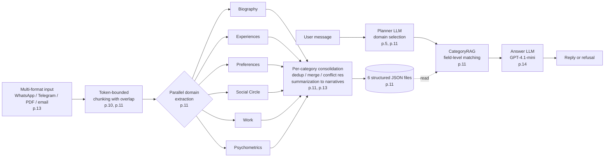
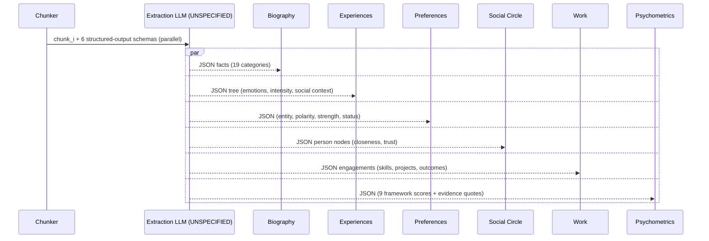
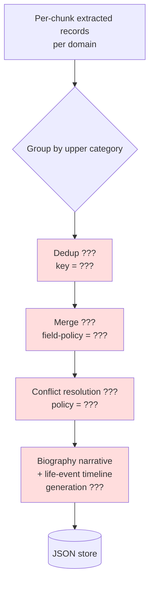
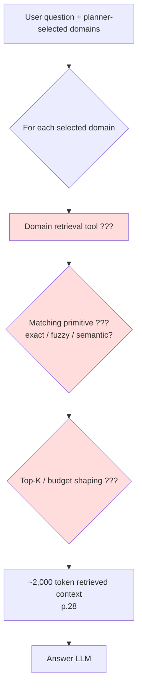
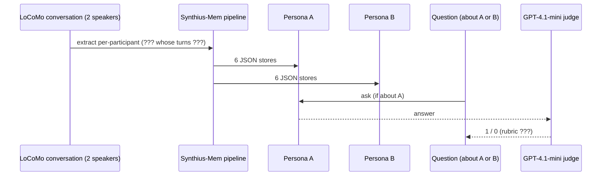

# Review — Algorithms (Synthius-Mem, arXiv:2604.11563v1)

**Architecture-readiness for algorithms: NO** — the paper specifies *what* each algorithmic stage should achieve (chunk → extract → consolidate → plan → CategoryRAG → answer) and reports headline numbers, but for every load-bearing stage it omits the prompts, the model assignments (apart from answer/judge), the structured-output mechanism, the deterministic rules driving consolidation, the matching predicate driving CategoryRAG, the refusal gate, and all failure handlers — i.e., precisely the artifacts a competent ML engineer would have to lift verbatim from the source to reproduce the 94.37% / 99.55% claims.

The remainder of this review walks subsystems A–I. For each I separate **what the paper tells me** from **what I'd have to invent**, then assign a verdict. All page citations refer to the extracted text at `/Volumes/Unitek-B/Projects/ai-memory/docs/externals/2604.11563v1.txt` (page markers `===== PAGE N =====`).

---

## End-to-end algorithmic flow (as stated in the paper)

The paper hands me five named LLM-touching stages (chunker, extractor, consolidator, planner, answer) and one rule-based stage (CategoryRAG). It names exactly **one** model: GPT-4.1-mini for answer + judge (p.14, p.19). Every other model identity, prompt, and parameter is absent.

---

## A. Token-bounded chunking — **CANNOT-IMPLEMENT**

**What the paper tells me to do.** "Token-bounded chunking with overlap" (p.11) and "Bounded Processing … enforces token-bounded extraction windows, enabling processing of arbitrarily long histories within fixed computational budgets" (p.10). Inputs span "WhatsApp, Telegram, PDF, email" (p.13). Cost-model row (App. A.1, p.28) says Synthius-Mem amortizes "740 tok extraction" per message, derived from "~370K extraction tokens divided across 500 messages" — the only numeric handle.

**What I'd have to invent.**

| Parameter | Paper says | Inferable? |
|---|---|---|
| Chunk size (tokens) | unspecified | No — 740 tok/msg is amortized **input** cost, not chunk size |
| Overlap (tokens or %) | "with overlap" | No |
| Boundary policy (turn / message / session / sentence / hard token) | unspecified | No |
| Speaker labelling preserved across chunks? | unspecified | No (and required for person-scoped extraction, p.13) |
| Per-format pre-processing branch (PDF text extraction, email header strip, signature strip, WhatsApp `[date] Speaker:` parser) | unspecified | No — there is no separate code path described |
| Format normalization / Unicode policy | unspecified | No |
| PII handling / anonymization | "federated extraction" appears only as future work (p.26) | No |
| Tokenizer (`cl100k_base`? Gemini's? a heuristic?) | unspecified | No |

The only concrete chunking number in the entire paper is the **embedding-RAG baseline** ("median ~620 tokens" per session, p.15 / Table 9, p.30) — which is explicitly *not* Synthius-Mem's chunker. A sensible default (e.g., 4K tokens / 256-token overlap, dialogue-turn-aligned) is a *guess*, and the 5× efficiency number is hostage to a parameter the paper never gives.

**Gaps:** `[BLOCKER]` no chunk size/overlap; `[BLOCKER]` no per-format pre-processing pipeline; `[MAJOR]` no speaker-preservation contract; `[MAJOR]` no PII handling; `[MINOR]` no tokenizer.

---

## B. Parallel domain extraction — **CANNOT-IMPLEMENT**

**What the paper tells me to do.** "Parallel LLM-based extraction into all six domains using structured output schemas" (p.11). Each domain has its own schema with the "key features" listed in Table 1 (p.11). Consolidation runs *within* each upper category — "education facts are never conflated with health facts" (p.11, p.13). A relevance threshold suppresses peripheral content (p.20, p.24).

**What I'd have to invent.**

1. **Extraction model.** GPT-4.1-mini is named for *answer* and *judge* only (p.14). The extraction model is **never named anywhere** — App. A.3 (p.28) prices everything in GPT-5.4 dollars without claiming GPT-5.4 was used to extract.
2. **The six JSON schemas.** Table 1 lists only "key features" ("19 categories, atomic facts, confidence scores", "hierarchical tree, emotions, intensity, social context", etc., p.11). No field-level definitions. The 19 biography categories are mentioned (p.13) but only five are exemplified ("education, employment, family, health, residence, etc.", p.13) — the other 14 are not enumerated.
3. **The 9 psychometric framework schemas.** Names listed (Big Five / Schwartz / PANAS / VIA / Cognitive Ability / IRI / Moral Foundations / Political Compass / Kohlberg, p.12) — no per-framework field structure, no scoring sub-scales, no evidence-quote format.
4. **Extraction prompts.** Entirely absent; no appendix shows a single one. The paper itself criticizes ENGRAM for not publishing its prompt (p.14, p.25).
5. **Structured-output mechanism.** OpenAI JSON-mode? `response_format: json_schema` strict? Function calling? Pydantic + retry? Grammar-constrained decoding? Unspecified — yet this is the lever that decides whether you get malformed JSON 1% or 0.01% of the time, which propagates straight to accuracy.
6. **Decoding params** — temperature, top-p, max output tokens, seed: none stated.
7. **Failure handling** — malformed JSON, content-policy refusals, timeouts, partial output, empty extraction: unspecified. The paper says "consolidation logic is deterministic" (p.13) but is silent on the *extraction* boundary, where the upstream chaos lives.
8. **Parallelism contract.** "Parallel" extraction across six domains: six independent LLM calls per chunk, one call with a six-part schema, or one call emitting a discriminated union? All three would explain the "740 tok/msg" amortized number.
9. **Relevance threshold.** Paper says the extraction pipeline "applies a relevance threshold that filters incidental mentions" (p.20, p.24/§5.2). Threshold value, scoring function, and location (per-fact LLM scoring? rule? heuristic?) are unspecified — yet this threshold *is* the explicit explanation for the 57.66% peripheral-detail score.

I cannot implement extraction at all from the paper. Every downstream number (94.37%, 99.55%, 98.64%) lives or dies on what comes out of this stage.

**Gaps:** `[BLOCKER]` extraction LLM unnamed; `[BLOCKER]` six JSON schemas absent; `[BLOCKER]` extraction prompts absent; `[BLOCKER]` 9 psychometric schemas absent; `[BLOCKER]` 19 biography categories not enumerated; `[BLOCKER]` relevance-threshold mechanism absent; `[MAJOR]` structured-output mechanism unspecified; `[MAJOR]` decoding params unspecified; `[MAJOR]` failure handling unspecified; `[MINOR]` parallelism semantics ambiguous.

---

## C. Per-category consolidation — **CANNOT-IMPLEMENT** (with a logical inconsistency)

**What the paper tells me to do.** "Per-category consolidation (deduplication, merging, conflict resolution), and summarization into biography narratives and life event timelines" (p.11). Consolidation runs per upper category, "preserving semantic integrity by ensuring … education facts are never conflated with health facts during deduplication" (p.11). And — critically — **"the consolidation logic is deterministic"** (p.13).

**What I'd have to invent.** Effectively the entire algorithm:

| Question | Paper |
|---|---|
| Single-pass or multi-pass? | unspecified |
| Dedup key (string match? canonical form? embedding NN? LLM equivalence judge?) | unspecified |
| Merge semantics for partially overlapping facts ("works at Acme since 2021" + "promoted to senior eng at Acme 2023") | unspecified |
| Conflict resolution policy (latest-wins? higher-confidence-wins? source-recency? user-confirmation?) | unspecified |
| What "deterministic" means when inputs are free-text LLM outputs | unreconciled |
| Biography-narrative + life-event-timeline summarization sub-step (p.11) — how is *that* deterministic? | unreconciled |

**Logical inconsistency `[MAJOR]`.** The paper insists consolidation is *deterministic* (§4, p.13) yet also says it performs "deduplication, merging, conflict resolution" and "summarization into biography narratives and life event timelines" (p.11). Free-text fact dedup is not deterministic in any standard sense unless every fact has been canonicalized into a closed-vocabulary key by the upstream extractor — and the paper does not specify any such canonicalization step. "Summarization into biography narratives" requires an LLM call by definition, which is not deterministic in any common provider configuration. The most charitable reconciliation is: extraction does massive semantic normalization (those prompts/schemas, not shown, are doing the real work), and consolidation is then a thin deterministic post-processor over a closed schema. The paper neither states nor refutes this.

**Gaps:** `[BLOCKER]` consolidation algorithm absent; `[BLOCKER]` conflict-resolution policy absent; `[MAJOR]` "deterministic" claim contradicts narrative summarization; `[MAJOR]` no field-level merge policy; `[MAJOR]` summarization sub-step undefined.

---

## D. Planner LLM (domain selection) — **CANNOT-IMPLEMENT**

**What the paper tells me to do.** "A planner LLM selects which domains to query" (p.11). Cost model: "1,100 tok planner LLM call" per query (App. A.1, p.28). Single-domain capability is implied by examples ("only Social Circle for a question about relationships, only Work for a question about career history", p.11), but Synthius-Mem's 94.34% multi-hop score (Table 3, p.16) means multi-domain routing must exist.

**What I'd have to invent.**

1. **Model identity** — never named.
2. **Prompt** — never shown.
3. **Output format** — list of domain IDs? Ranked list? Per-domain sub-queries? JSON? function-call?
4. **Multi-domain composition** — one merged retrieval, or one retrieval per domain that is then concatenated?
5. **Misroute fallback** — no "re-plan after empty retrieval" loop is described; no "always also query Biography" safety net. If the planner picks Work but the answer lives in Experiences, the architecture as described offers no recovery.
6. **Token-budget composition.** 1,100 tokens for the planner call (p.28) — does that include schema descriptions, few-shot examples, and the question, or just the prompt? The number is too small for elaborate few-shot but too large for a bare instruction.

The 1,100-token planner call is the second-largest fixed per-query cost (after the 1,000-token system prompt). It is load-bearing for both accuracy and cost — and the paper provides a budget but no spec.

**Gaps:** `[BLOCKER]` planner prompt absent; `[BLOCKER]` planner model unnamed; `[MAJOR]` multi-domain output format absent; `[MAJOR]` no misroute fallback; `[MINOR]` 1,100-token composition unclear.

---

## E. CategoryRAG retrieval — **CANNOT-IMPLEMENT** (largest single gap)

**What the paper tells me to do.** "Domain-specific retrieval tools perform field-level matching against the structured JSON memory store — a mechanism we term CategoryRAG, achieving 21.79 ms mean latency" (p.11). Retrieved-context budget ≈ 2,000 tokens (App. A.1, p.28; Table 11, p.32). Latency 21.79 ms (Figure 7, p.23). No embedding model is named *for Synthius-Mem itself* — the 1,536-d `text-embedding-3-small` named in the paper (p.15, p.30) is the *baseline RAG*'s.

**What I'd have to invent.**

| Property | Paper says | I'd need to know |
|---|---|---|
| Matching primitive | "field-level matching" (p.11) | exact? case-folded? normalized? fuzzy (Levenshtein/Jaro)? semantic (embeddings) ? LLM equivalence? |
| Index structure | "structured JSON memory store" / "6 structured JSON files per persona" (p.5/p.11) | 21.79 ms on a populated persona is **not** a linear scan; an in-memory hash, B-tree, or inverted index is implied but unspecified |
| Per-domain tool API | "domain-specific retrieval tools" (p.11) | function-calling tool schemas? plain Python functions invoked by orchestration code? |
| Ranking | unspecified | none, lexicographic, score-based? |
| Budget shaping | "~2,000 tok retrieved" (p.28) | when 100 records match, how is the 2K cap enforced — top-K? truncate-by-length? per-domain quota? summarize-and-flatten? |
| Paraphrase coverage | unspecified | "Where did Caroline grow up?" vs `place_of_birth` field — how does field-level matching cover this without embeddings? |

The 21.79 ms latency is consistent with an in-memory keyed lookup, **not** with an embedding nearest-neighbor query (typically 5–20 ms only after the embedding is computed; the embedding call itself is ~50–150 ms). It is also inconsistent with any per-query LLM call. So the architecture is implied to be: planner → in-memory deterministic field lookup → answer LLM. But that creates the trilemma:

- If matching is **exact-string on field values**, paraphrase coverage is poor → the system would fail on the first paraphrased question, contradicting 94% accuracy.
- If matching is **per-query LLM-driven**, latency cannot be 21.79 ms → contradicts Figure 7.
- If matching is **embedding-driven**, the paper's "no semantic drift" pitch (§5.1, p.24) weakens, and there should be an embedding model named — there isn't.

The most charitable reconciliation is that the planner LLM itself rewrites the question into a structured query (e.g., field name + canonical value), and CategoryRAG executes that structured query as a deterministic lookup. The paper does not say this, and this would shift more burden onto the planner prompt — which is also absent.

**Gaps:** `[BLOCKER]` matching primitive absent; `[BLOCKER]` index structure delivering 21.79 ms absent; `[BLOCKER]` per-domain tool API absent; `[BLOCKER]` budget-shaping rule absent; `[MAJOR]` paraphrase-handling story missing; `[MAJOR]` ranking absent.

---

## F. Answer generation — **PARTIAL**

**What the paper tells me to do.** Answer LLM is GPT-4.1-mini (p.14). System prompt is "approximately 1,000 input tokens" (App. A.1, p.28). Output is "approximately 200 tokens" (p.28). Retrieved context is ~2,000 tokens. Two example outputs are shown (the "I have a dog named Luna and two cats named Oliver and Bailey" example, and the Grand Canyon car-accident example, both p.14). The system must refuse on adversarial false-premise questions (99.55% = 440/442 correct refusals, p.20). Refusal mechanism is *explained* — "when the memory tools return nothing, the absence of evidence is itself a strong, machine-readable signal that the premise is unsupported" (p.20) — but not *operationalized*.

**What I'd have to invent.**

1. **The 1,000-token system prompt.** Never shown. This is the artifact most directly responsible for hitting 99.55% adversarial robustness because it must encode (or imply) the refusal policy.
2. **How retrieved context is fed in.** Flat JSON dump? Markdown table? Per-domain section with headers? Unspecified. Format choice strongly affects "lost in the middle" risk inside the 2K context.
3. **Refusal trigger.** Empty retrieval triggers either (a) a programmatic short-circuit ("if all tools returned [], emit the canned refusal") or (b) the LLM is left to decide. The 99.55% number is consistent with (a) but the paper doesn't say. If (a), the system has a hard programmatic gate that should be documented; if (b), the prompt wording is doing remarkable work.
4. **Psychometrics injection.** Paper says profile scores are "embedded in the system prompt for personality-consistent generation" (p.12) — so the 1,000-token system prompt presumably contains 9 framework score blocks plus the refusal policy plus general instructions. Format is unspecified.
5. **Decoding parameters** — temperature, top-p, seed: not stated. The "binary judge" eval (p.14, p.19) is sensitive to phrasing variance, so seed/temperature matters for reproducibility.

I could write a plausible answer prompt today ("Answer using only the JSON evidence below; if the question's premise is not supported, refuse politely; do not invent facts about the user"). But it would not be *the* prompt, and the load-bearing 99.55% lives or dies on its exact wording.

**Gaps:** `[MAJOR]` system prompt absent; `[MAJOR]` retrieved-context formatting absent; `[MAJOR]` refusal-gate location (prompt vs programmatic) ambiguous; `[MINOR]` psychometrics-injection format unspecified; `[MINOR]` decoding params unspecified.

---

## G. Reversible diff engine — **CANNOT-IMPLEMENT**

**What the paper tells me to do.** Exactly one sentence: "Memory evolves continuously through a reversible diff engine that supports add, edit, and delete operations with full rollback capability" (p.11).

**What I'd have to invent.**

| Question | Answer in paper |
|---|---|
| Diff granularity | unspecified — per-field? per-record? per-batch? |
| Edit semantics on multi-field structured records | unspecified — replace-record vs patch-fields? |
| Rollback granularity | "full rollback capability" — per-edit undo, per-batch undo, or full reset? |
| Diff-log storage | unspecified (six JSON files mentioned for persona; nothing for diff log) |
| Concurrency model on simultaneous updates | unspecified — no CRDT, OT, optimistic-lock, or single-writer assumption |
| Schema migration | unspecified |
| Interaction with consolidation (does an `edit` re-run consolidation? trigger re-summarization?) | unspecified |

A single sentence is not an algorithm. There is enough here to know the *intent* (versioned, undoable updates) but nothing to implement against.

**Gaps:** `[MAJOR]` diff primitives absent; `[MAJOR]` rollback granularity absent; `[MAJOR]` diff-log storage absent; `[MINOR]` concurrency model absent; `[MINOR]` consolidation re-run policy absent.

---

## H. Psychometric profiling — **CANNOT-IMPLEMENT**

**What the paper tells me to do.** "Nine validated psychological frameworks — Big Five (Costa & McCrae, 1992), Schwartz Values (1992), PANAS (Watson et al., 1988), VIA Character Strengths, Cognitive Ability, IRI Empathy (Davis, 1983), Moral Foundations (Graham et al., 2013), Political Compass, and Kohlberg Moral Development (1981) — producing normalized scores with confidence ratings and evidence quotes, embedded in the system prompt for personality-consistent generation" (p.12).

**What I'd have to invent.**

1. **Per-framework sub-scale list.** Each framework has a defined factor structure:
   - Big Five → 5 factors (NEO-PI-R has 30 facets)
   - Schwartz → 10 values + 4 higher-order types
   - PANAS → 20 items splitting into Positive Affect / Negative Affect
   - VIA → 24 strengths under 6 virtues
   - IRI → 4 sub-scales
   - MFT → 5 (or 6, with Liberty) foundations
   - Political Compass → 2 axes
   - Kohlberg → 6 stages (3 levels × 2 stages)
   - Cognitive Ability → which model? CHC's g + 9 broad abilities? CFIT?

   Which exact sub-structure does Synthius-Mem store for each? Unspecified.
2. **Scoring algorithm.** From raw text, three options exist:
   - (a) one LLM call per framework returning normalized 0–100 scores,
   - (b) feature extraction → deterministic scoring against a validated instrument,
   - (c) per-item LLM scoring (e.g., NEO-PI-R 240-item) then aggregation.

   The paper does not say. §5.3 (p.25) admits "the psychological profiling subsystem requires separate validation against ground-truth assessments from validated psychometric instruments" — i.e., the authors themselves treat scoring as unvalidated.
3. **Confidence-rating production** — score-based (variance), evidence-count-based, or LLM self-report?
4. **Evidence-quote selection** — top-N? all-supporting? deduplicated? per-sub-scale?
5. **Update dynamics.** When new conversation arrives, are scores re-derived from scratch, EWMA-blended, or appended? Unspecified.

This is one of the six core domains, so "I'd just call an LLM nine times and ask for scores" is the only honest implementation path — and it's a guess.

**Gaps:** `[BLOCKER]` per-framework field structure absent; `[BLOCKER]` scoring algorithm absent; `[MAJOR]` update dynamics absent; `[MINOR]` evidence-quote selection absent; `[MINOR]` confidence-derivation absent.

---

## I. Evaluation reproducibility from algo perspective — **CANNOT-IMPLEMENT**

**What the paper tells me to do.** Re-run on LoCoMo (10 conversations, 20 participants, 1,813 questions, p.13, p.19). Person-scoped persona (one persona per LoCoMo participant, p.13). GPT-4.1-mini for both answer and judge (p.14). Binary scoring 1/0 (p.14, p.19). Knowledge-type re-tagging into 5 categories (Adversarial / Core memory fact / Temporal precision / Open inference / Peripheral detail, p.15) in addition to the original 5 reasoning categories (p.13).

**What I'd have to invent.**

1. **Judge prompt.** The paper criticizes other systems for not publishing judge prompts ("ENGRAM's evaluation prompt is unpublished", p.14, p.25) — and does not publish its own. We know it is binary; nothing else.
2. **Knowledge-type re-tagging procedure.** The 5-category re-tag (p.15) is the basis for the headline knowledge-type table (Table 6, p.19, including the 99.55% adversarial number). Was tagging done by hand? By LLM? By question-prefix regex? By cross-walk from LoCoMo's own metadata? Unspecified. The per-category numbers depend entirely on the tagging.
3. **Random seed / determinism** for the LLM judge — none stated. With temperature > 0, repeated runs will give different binary verdicts on borderline answers.
4. **Pass@k or single-shot.** Unspecified.
5. **Per-participant persona construction inputs.** Each LoCoMo participant gets a "full pipeline run: corpus preparation, extraction across all modules, consolidation, summarization" (p.14). What does "corpus preparation" include for a LoCoMo conversation? Are both speakers' turns used for both personas, or only the focal speaker's? Unspecified, and accuracy will move depending on the answer.

Even with hypothetical access to a pre-built persona JSON store, I cannot reproduce 94.37% from algorithmic specs alone, because (a) extraction is undefined upstream, (b) the planner is undefined, (c) the answer prompt is undefined, (d) the judge prompt is undefined, and (e) the re-tagging that produces Table 6 is undefined.

**Gaps:** `[BLOCKER]` judge prompt absent; `[BLOCKER]` knowledge-type re-tagging method absent; `[MAJOR]` no determinism / seed; `[MAJOR]` per-participant corpus preparation undefined; `[MINOR]` pass@k policy.

---

## Cross-cutting observations

1. **Results paper, not methods paper.** Synthius-Mem calls out other systems for not publishing prompts (p.14, p.25) yet itself publishes none. The defense — "extraction schemas are fixed prompts, the consolidation logic is deterministic, and the retrieval tools are rule-based" (p.13) — is offered as proof of no overfitting, but it describes precisely the artifacts that should have appeared as appendices and didn't.

2. **Token budgets are the most concrete algorithmic spec.** App. A.1 / Table 11 (p.28, p.32) tell you what each call *costs*, not what each call *does*. An ML engineer can size the box but not build its contents.

3. **"Deterministic consolidation" is the biggest internal tension.** Either extraction does heavy semantic normalization (and those unshown prompts are doing the real algorithmic work), or consolidation is LLM-based (and not deterministic). The paper does not resolve this; the "biography narrative + life-event timeline" generators inside consolidation almost certainly require LLM calls, contradicting the determinism claim.

4. **CategoryRAG is the most exciting and least specified component.** A 21.79 ms field-level matcher that handles paraphrased natural-language questions against structured JSON, without embeddings, would be a genuine contribution if the algorithm were shown. The 21.79 ms is not consistent with per-query LLM matching, so the planner LLM must already be emitting structured queries — but the planner prompt is also absent.

5. **Adversarial robustness rests on two omitted artifacts** — the answer-LLM system prompt (which presumably encodes the refusal policy) and the relevance-threshold mechanism (which keeps unsupported facts out of the store at extraction time). Both are unstated, so 99.55% is a number the engineer can read but cannot reproduce.

6. **Two examples ≠ a prompt.** The "Luna / Oliver / Bailey" and Grand Canyon examples (p.14) are presented as evidence that the answer LLM produces detailed, first-person paraphrases. They are not enough to reverse-engineer a system prompt that also achieves 99.55% refusal.

---

## Verdict (algorithms dimension)

A competent ML engineer **cannot** rebuild Synthius-Mem from this paper. They could reconstruct the *vocabulary* and *block diagram* — six domains, planner + CategoryRAG + answer LLM, reversible diffs — but every algorithmic surface that determines whether the system actually scores 94.37% / 99.55% (extraction model and prompts and schemas, relevance threshold, consolidation rules, planner prompt and output format, CategoryRAG matcher, answer system prompt, refusal gate, judge prompt, re-tagging procedure) is omitted. The reproducibility ceiling without source code is *qualitative* (you can describe what each box does) — not *quantitative* (you cannot reproduce its numbers within meaningful tolerance).

The dimension verdict is **NO** for algorithms.

---

## Gap Register (this dimension)

| ID | Subsystem | Gap | Severity | Page |
|---|---|---|---|---|
| ALG-A1 | Chunking | Chunk size and overlap not specified | BLOCKER | p.11 |
| ALG-A2 | Chunking | Per-format pre-processing pipeline (PDF, email, WhatsApp, Telegram) not specified | BLOCKER | p.13 |
| ALG-A3 | Chunking | Speaker-preservation contract not specified | MAJOR | p.13 |
| ALG-A4 | Chunking | PII / anonymization handling absent (federated extraction is future work) | MAJOR | p.26 |
| ALG-A5 | Chunking | Tokenizer not named | MINOR | — |
| ALG-B1 | Extraction | Extraction LLM model not named (only answer/judge are) | BLOCKER | p.14 |
| ALG-B2 | Extraction | Six domain JSON schemas not provided | BLOCKER | p.11 |
| ALG-B3 | Extraction | Extraction prompts not provided | BLOCKER | — |
| ALG-B4 | Extraction | 19 biography categories not enumerated | BLOCKER | p.13 |
| ALG-B5 | Extraction | 9 psychometric framework schemas not provided | BLOCKER | p.12 |
| ALG-B6 | Extraction | Relevance-threshold mechanism (the 57.66% peripheral-detail lever) not specified | BLOCKER | p.20, p.24 |
| ALG-B7 | Extraction | Structured-output mechanism (JSON mode / function call / grammar) not specified | MAJOR | — |
| ALG-B8 | Extraction | Decoding params (temperature, top-p, seed) not specified | MAJOR | — |
| ALG-B9 | Extraction | Failure handling (malformed JSON, refusals, timeouts) not specified | MAJOR | — |
| ALG-B10 | Extraction | "Parallel" semantics (six calls vs one multi-schema call) ambiguous | MINOR | p.11 |
| ALG-C1 | Consolidation | Dedup algorithm and dedup key not specified | BLOCKER | p.11 |
| ALG-C2 | Consolidation | Conflict-resolution policy not specified | BLOCKER | p.11 |
| ALG-C3 | Consolidation | "Deterministic" claim contradicts free-text dedup + narrative summarization | MAJOR | p.13 vs p.11 |
| ALG-C4 | Consolidation | Field-level merge policy not specified | MAJOR | p.11 |
| ALG-C5 | Consolidation | Biography-narrative / life-event-timeline generators not specified | MAJOR | p.11 |
| ALG-D1 | Planner | Planner LLM not named | BLOCKER | p.11 |
| ALG-D2 | Planner | Planner prompt not provided | BLOCKER | — |
| ALG-D3 | Planner | Multi-domain output format not specified | MAJOR | p.11 |
| ALG-D4 | Planner | Misroute fallback / re-route policy absent | MAJOR | — |
| ALG-D5 | Planner | 1,100-token planner-call composition (system / few-shot / question) unclear | MINOR | p.28 |
| ALG-E1 | CategoryRAG | Matching primitive (exact / fuzzy / semantic) not specified | BLOCKER | p.11 |
| ALG-E2 | CategoryRAG | Index structure delivering 21.79 ms not specified | BLOCKER | p.11, p.23 |
| ALG-E3 | CategoryRAG | Per-domain retrieval-tool API not specified | BLOCKER | p.11 |
| ALG-E4 | CategoryRAG | Budget-shaping rule for the 2K-token cap absent | BLOCKER | p.28 |
| ALG-E5 | CategoryRAG | Paraphrase-handling story without embeddings missing | MAJOR | — |
| ALG-E6 | CategoryRAG | Ranking function not specified | MAJOR | — |
| ALG-F1 | Answer | 1,000-token system prompt not provided | MAJOR | p.28 |
| ALG-F2 | Answer | Retrieved-context formatting not specified | MAJOR | — |
| ALG-F3 | Answer | Refusal-gate mechanism (prompt vs programmatic on empty retrieval) ambiguous | MAJOR | p.20 |
| ALG-F4 | Answer | Psychometrics-injection format inside system prompt absent | MINOR | p.12 |
| ALG-F5 | Answer | Decoding params (temperature, seed) absent | MINOR | — |
| ALG-G1 | Diff engine | Diff primitives (granularity, schema) absent | MAJOR | p.11 |
| ALG-G2 | Diff engine | Rollback granularity absent | MAJOR | p.11 |
| ALG-G3 | Diff engine | Diff-log storage absent | MAJOR | p.11 |
| ALG-G4 | Diff engine | Concurrency / conflict model absent | MINOR | p.11 |
| ALG-G5 | Diff engine | Consolidation re-run policy on edits absent | MINOR | p.11 |
| ALG-H1 | Psychometrics | Per-framework sub-scale field list absent | BLOCKER | p.12 |
| ALG-H2 | Psychometrics | Scoring algorithm (one-shot LLM vs feature → score vs per-item LLM) absent | BLOCKER | p.12 |
| ALG-H3 | Psychometrics | Update dynamics across conversations absent | MAJOR | — |
| ALG-H4 | Psychometrics | Evidence-quote selection policy absent | MINOR | p.12 |
| ALG-H5 | Psychometrics | Confidence-derivation method absent | MINOR | p.12 |
| ALG-I1 | Eval | Judge prompt not provided | BLOCKER | p.14 |
| ALG-I2 | Eval | LoCoMo → knowledge-type re-tagging procedure not specified | BLOCKER | p.15, p.19 |
| ALG-I3 | Eval | No determinism / seed disclosure | MAJOR | — |
| ALG-I4 | Eval | Per-participant corpus preparation (whose turns feed which persona) ambiguous | MAJOR | p.13, p.14 |
| ALG-I5 | Eval | Pass@k policy absent | MINOR | — |

**Totals:** 17 BLOCKER, 21 MAJOR, 11 MINOR across 9 subsystems. No subsystem is gap-free; only F (Answer) reaches PARTIAL — every other subsystem is CANNOT-IMPLEMENT from the paper alone.
