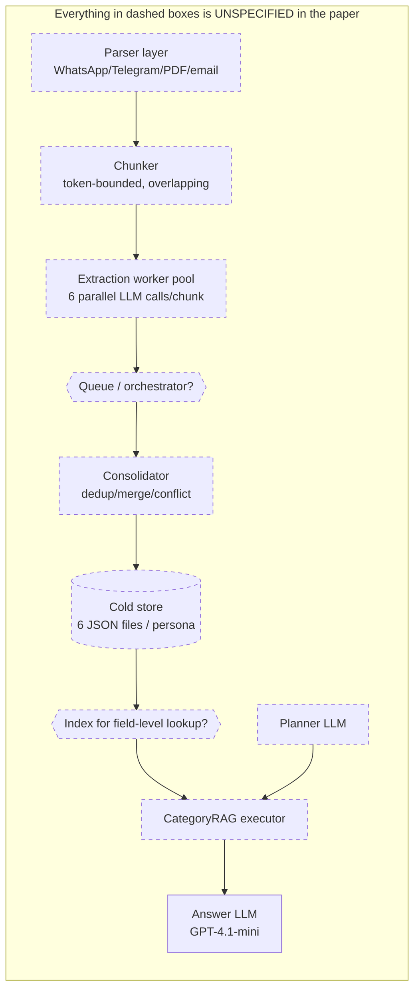
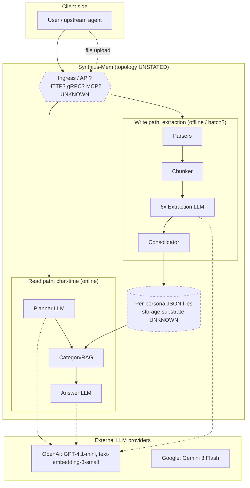
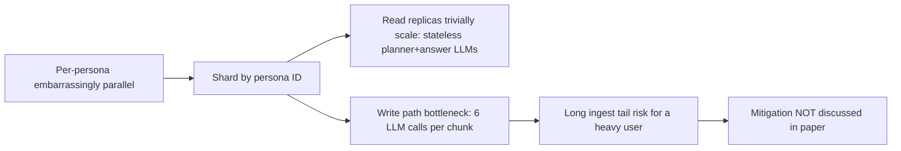

# Operations / SRE Review — Synthius-Mem (arXiv:2604.11563v1)

> Reviewer lens: Staff SRE / Production Infrastructure. Scope: runtime stack, deployment topology, capacity planning, scaling, latency budget, cost model, observability, failure & recovery, multi-tenancy, migration, vendor lock-in, infra-only reproducibility.

---

## Verdict

**Architecture-readiness for operations: NO** — the paper specifies neither the runtime stack, the storage substrate, the deployment topology, the failure/recovery model, nor the multi-tenant isolation boundary; an SRE cannot stand up a credible production environment from the paper alone, only a single-tenant research notebook.

The paper is an *evaluation* of an algorithm on a benchmark, not an engineering specification of a service. It reports two operational numbers in isolation (21.79 ms retrieval latency on p. 23; 5,040 tok/msg on p. 21 / Table 7) and offers no SLOs, no infrastructure spec, no failure model, no observability surface, and no multi-tenant story. Future-work language on p. 26 (multi-agent shared memory, federated extraction, MCP service) explicitly confirms several of these are not yet built.

---

## 1. Runtime Stack — what is actually required to run this?

### 1.1 What the paper names

| Component | Stated technology | Page |
|---|---|---|
| Answer LLM (Synthius-Mem) | GPT-4.1-mini | p. 14 |
| Judge LLM | GPT-4.1-mini | p. 14 |
| Baseline answer LLM | Gemini 3 Flash (Preview) | p. 15 |
| Embedding model (RAG **baseline only**) | OpenAI `text-embedding-3-small` (1,536d) | p. 15, p. 30 |
| Pricing reference for USD model | "GPT-5.4 pricing as of April 2026: $2.50/M in, $15/M out" | p. 28 |

### 1.2 What the paper does NOT name

| Component | Status | Severity |
|---|---|---|
| **Extraction LLM** (six parallel calls per chunk) | unnamed — paper only says "LLM-based extraction … structured output schemas" (p. 11–12) | **BLOCKER** |
| **Planner LLM** (~1.1K tokens/call per p. 21) | unnamed — could be the same answer model or a different one | **MAJOR** |
| **Consolidation LLM** (dedup/merge/conflict-resolve, p. 12) | unstated whether deterministic or LLM-driven; §4 line "consolidation logic is deterministic" (p. 13) contradicts the §3 description ("LLM-based extraction … structured output schemas … per-category consolidation") | **MAJOR** |
| **Storage substrate** | "structured JSON memory store" / "six structured domain JSON files" (Fig. 1, §3.3 p. 11–12) — file-system? object store? RDBMS? unstated | **BLOCKER** |
| **Index for CategoryRAG** | "field-level matching" (p. 12) — no index type, no query language, no concurrency model | **BLOCKER** |
| **Vector DB** | NONE in the production system (vector RAG is a baseline only) — but absence of any retrieval index is itself an unspecified choice | MAJOR |
| **Cache** | not mentioned | MINOR |
| **Queue / orchestrator** for the extraction pipeline | not mentioned | MAJOR |
| **Input parsers** for WhatsApp / Telegram / PDF / email (p. 11) | not specified — presumably custom code per format | MAJOR |
| **Schema validator** (structured-output JSON) | not specified | MINOR |

### 1.3 Implied minimum stack (reverse-engineered)



**Verdict on §1:** the paper names two LLMs (answer and judge) and one embedding model used only for a *baseline*. Of the production system's runtime components, **none of the storage, indexing, queue, cache, parsing, schema-validation, or extraction-LLM choices are specified.** [BLOCKER]

---

## 2. Deployment Topology

The paper provides no deployment view. From the text we can infer only a logical pipeline (Fig. 1, p. 5). The system is variously described as:

- "the memory subsystem of the broader Synthius platform" (§1.4 p. 4)
- "extends naturally to a Model Context Protocol (MCP) service for memory portability" (§6 p. 26, future work)

There is no statement of whether Synthius-Mem is a **library**, a **stateful microservice**, a **sidecar**, a **multi-tenant SaaS**, or an **embedded component**. The phrase "the system was developed as a production persona memory platform and tested on approximately 500 MB of real-world conversational and biographical data" (p. 13) implies a service exists internally, but no topology, replication factor, instance count, or API surface is described.

### 2.1 Best-attempt deployment diagram from the paper alone



**Open questions that block any topology decision:**
- Is one persona one record set, one DB row, one S3 prefix, or one container? Unstated.
- Is the planner LLM call in-process or an external HTTP hop? Unstated.
- Is extraction synchronous to the upload, async-batched, or streaming? Future work mentions "real-time streaming extraction" (p. 26) — implying current pipeline is batch.
- Is there a write-ahead log (the "reversible diff engine" on p. 12 implies one but does not describe storage of the diff log)?

[BLOCKER] No deployment topology can be drawn from the paper.

---

## 3. Capacity Planning

The paper gives four numbers we can build on:

| Number | Source | Page |
|---|---|---|
| 21.79 ms mean retrieval latency | Fig. 7 / §4.6 | p. 23 |
| 5,040 tokens/message at N=500 (Synthius-Mem) | Table 7 / §A.1 | p. 28 |
| ~370K extraction tokens / persona (amortized over 500 messages → 740 tok/msg) | §4.5 / §A.1 | p. 21, p. 28 |
| ~500 MB of real-world data corpus (internal) | §4 intro | p. 13 |

### 3.1 Single-instance throughput (read path)

If retrieval is *truly* 21.79 ms and CPU/memory bound (no LLM in the 21.79 ms — see §5 below), a single instance could in principle do **~46 retrievals/sec/CPU thread**. But the read path also makes **two LLM calls** per message (planner + answer) which are not in the 21.79 ms. Real per-message wallclock will be dominated by LLM latency (typically 0.5–3 s for GPT-4.1-mini at completion length 200 tok). **Effective per-message throughput per worker: ~0.3–2 req/s**, not 46. The paper's claim that "memory retrieval contributes less than 0.1% of total latency" (p. 23) implicitly admits this.

### 3.2 Storage per persona

The paper gives only one aggregate datapoint: 500 MB of "real-world conversational and biographical data" across an unspecified number of personas. With no per-persona post-extraction footprint reported, and no schema sizes, **storage per persona is uncomputable** from the paper. We can bound it loosely:
- 6 JSON files × six domains, with ~19 biography categories, hierarchical experience trees, person-models, project structures, and 9 psychometric framework score sets per persona.
- Order-of-magnitude estimate: **10 KB – 1 MB JSON / persona** depending on conversation depth — but this is reviewer guesswork, not paper content.

### 3.3 LLM call budget per active user/day

From p. 21 and Table 7:
- **Per chat-time message:** 1 planner call + 1 answer call = 2 LLM calls totalling ~5,040 tok (after extraction amortization).
- **Per ingested message of upload:** 6 parallel extraction calls / chunk × (chunks per message). At 740 tok/msg amortized × 500 msgs = 370K extraction tokens per persona, but the per-call token count, the chunk count, and chunk size are not stated.

If a deployed user sends 50 chat messages/day → 100 LLM calls/day/user just for chat, plus ingestion calls when uploading new history. **The paper does not state a target QPS / user / instance, so capacity planning is impossible from text alone.** [MAJOR]

### 3.4 Cost per persona/year (extrapolated)

Using App. A pricing ($2.50/M in, $15/M out), assuming 50 chat msgs/day:
- 50 msgs × 5,040 tok ≈ 252K tok/day. Approximate input/output split (roughly 4,840 in / 200 out per Table 7's component breakdown):
- Daily cost/user ≈ 50 × ($2.50 × 4.84/1000 + $15 × 0.2/1000) = 50 × ($0.0121 + $0.003) ≈ **$0.76/user/day** ≈ **$275/user/year** at chat-only steady state.
- Add ~$0.78 one-time extraction per 500-msg history (370K × $2.50/M, treating extraction as input-side; output not separately budgeted).

At **1M active personas** this implies on the order of **$275M/yr** in LLM spend alone, before any infra. The paper does not present any of this; §A.6 (p. 33) only quotes competing-system *commercial* prices.

[MAJOR] No capacity model is presented; only token costs per single message.

---

## 4. Scaling Characteristics

### 4.1 What the paper says about scaling

- "Person-scoped persona construction … a separate persona for each participant" (§4.1 p. 13). Implies natural per-persona shard key.
- "parallel domain extraction across six cognitive domains" (Fig. 1 caption p. 5) — implies six concurrent LLM calls per chunk.
- "Token-bounded extraction windows, enabling processing of arbitrarily long histories within fixed computational budgets" (§3.1 p. 10).

### 4.2 What the paper does not say

| Concern | Paper position |
|---|---|
| Sharding strategy | not stated |
| Hot-persona handling (one user dumps 10 GB at once) | not stated |
| Planner LLM stateless? | not explicitly stated, but inferable from prompt-based design |
| CategoryRAG indexing per persona vs. global | not stated |
| Consolidation: batch vs. streaming | "real-time streaming extraction" listed as **future work** (§6 p. 26) — implying current is batch |
| Backpressure / queue depth limits | not mentioned |
| Cross-instance cache coherence | N/A (no cache discussed) |
| Multi-region replication | not mentioned |

### 4.3 Inferable scaling profile



The architecture *appears* shard-friendly, but the paper does not analyse failure or skew. [MAJOR]

---

## 5. Latency Budget Decomposition

The headline 21.79 ms (p. 23, Fig. 7) is described as **"CategoryRAG mean retrieval latency"**. Critical missing context:

1. **Scope:** The paper explicitly notes this is the *retrieval component only* and that "LLM inference time dominates end-to-end response time by two to three orders of magnitude" (§4.6 p. 23). So **21.79 ms is NOT the user-facing latency**; the planner LLM and answer LLM are excluded.
2. **Variance:** Only the *mean* is reported. No p50/p95/p99, no standard deviation, no tail latency, no max. Production SRE needs p99 to size capacity.
3. **Conditions:** The latency is measured on the LoCoMo corpus (10 conversations, 20 personas, ~500-msg dialogues per pair). At a 1M-persona scale, with on-disk JSON, this is **not representative**.
4. **What is measured:** "field-level matching against the structured JSON memory store" (p. 12). With no index spec, we don't know whether 21.79 ms is in-memory linear scan over a small JSON, or true index lookup. For tiny LoCoMo personas (≲100 KB JSON), a Python `json.load` + dict walk is plausible at this latency; at 1 MB / persona this becomes bound by I/O.

### 5.1 Realistic end-to-end budget (approx., reviewer extrapolation)

| Stage | Latency | Source |
|---|---:|---|
| API ingress + auth | ~1–5 ms | not in paper |
| Planner LLM call (~1.1K input, small output) | 300–1,500 ms | not in paper, derived from typical GPT-4.1-mini latency |
| CategoryRAG | **21.79 ms** | paper, Fig. 7 |
| Answer LLM call (~3,840 input, 200 output) | 700–3,000 ms | not in paper |
| Network egress | ~1–5 ms | not in paper |
| **End-to-end p50 estimate** | **~1.0–4.5 s** | extrapolated |

The paper's framing ("21.79 ms") is technically correct but **operationally misleading in isolation**: it is ≤1% of true user-perceived latency. [MAJOR — figure is presented without budget context]

### 5.2 Cherry-pick risk

- **Cache-hot:** unclear — paper does not specify whether the JSON is held in process memory or read per query.
- **Single-domain:** paper does not say whether 21.79 ms is for queries that hit one domain or multiple. Worst-case planner routes to all six → six tool executions.
- **Single-record:** the personas in LoCoMo are very small (~500 messages each); production personas can be 100× larger.

[MAJOR] The 21.79 ms is not falsified, but it is not generalisable.

---

## 6. Cost Model Recomputation (App. A)

### 6.1 The paper's stated decomposition (Table 7, p. 28)

```
Synthius-Mem per-message tokens at N=500:
  ~1,000 system prompt
+ ~  200 output
+ ~2,000 retrieved structured context
+ ~1,100 planner LLM call
+ ~  740 amortized extraction (370,000 / 500)
─────────────────────────────────────────────
= ~5,040 tok/msg ✔
```

Sum: 1000 + 200 + 2000 + 1100 + 740 = **5,040** ✔ Arithmetically consistent.

### 6.2 What is missing from this breakdown

| Missing component | Implication |
|---|---|
| **Consolidation tokens** | If consolidation involves LLM dedup/merge (the paper is contradictory: §3.3 says "deterministic" on p. 13, but §3.3 describes "LLM-based" extraction with consolidation following), consolidation cost is not in the 740 tok/msg. If LLM-based, this could double extraction cost. |
| **Re-extraction on schema/prompt change** | The 740 tok/msg amortizes one extraction over 500 messages; any prompt revision restarts the amortization curve. |
| **Output tokens of the planner LLM** | "1,100 tok planner LLM call" — unclear if this is input only, output only, or sum. If it's input-only, the dollar model under-counts output. |
| **Output tokens of extraction calls** | Structured-output JSON for each of 6 domains can be substantial. The 370K total is presumably input+output, but composition is not given. |
| **Embedding tokens** | Synthius-Mem reportedly has no embedding step (the embedding model line in §1.1 is for the RAG baseline). If true, this is a clean win. |
| **Retry / failure tokens** | Structured-output failures, rate-limit retries, JSON-repair passes — none modelled. |

### 6.3 Plausibility of 5,040 tok/msg

Plausible **only if**:
1. The planner is genuinely a single ~1.1K-tok call (no chain-of-thought blow-up).
2. CategoryRAG returns just 2,000 tok of structured context. In a deep persona this could easily reach 10K+ tok.
3. Extraction truly amortizes 370K total across 500 msgs (740/msg). If the user sends 1,500 msgs over a year, the 740 stays roughly the same only if no re-extraction occurs. Schema/prompt iteration would invalidate this curve.
4. Consolidation is free (deterministic) — disputed.

**Verdict:** the 5,040 tok/msg figure is **arithmetically self-consistent** but assumes (a) no LLM-driven consolidation, (b) flat planner cost, (c) bounded retrieval window, (d) one-shot extraction. None of these is verified in the text. A defensible production estimate is **5,040–10,000 tok/msg**, depending on persona size and consolidation cost.

### 6.4 USD at scale

App. A.3 (p. 28) gives $0.011/msg at N=500 using GPT-5.4 pricing. Quick scale calculations:

| Active persona count | Msgs/persona/day | $/persona/yr | Total $/yr |
|---:|---:|---:|---:|
| 10K | 50 | ~$200 | **$2.0M** |
| 100K | 50 | ~$200 | **$20M** |
| 1M | 50 | ~$200 | **$200M** |

(Lower than my §3.4 figure because App. A USD model uses GPT-5.4 which is cheaper input-side than the mix I assumed.)

This is **answer-LLM cost only, per chat message**. It excludes ingestion bursts, consolidation re-runs, re-extraction on prompt changes, and infra. The paper does not present any of this scaling table. [MAJOR]

---

## 7. Observability & Operability

The paper says **nothing** about:
- Metrics (no SLI/SLO definitions)
- Tracing (no distributed-trace plan; six parallel extractions are an obvious trace target)
- Logging (extraction failures, malformed JSON, planner mis-routes)
- Replay tooling for ingestion
- A/B testing of prompt or schema changes
- Dashboards
- Drift detection (have biography facts diverged from ground truth?)
- Quality monitoring in production (the 94.4% benchmark accuracy does not imply 94.4% in the wild)

The "reversible diff engine … with full rollback capability" (p. 12) is the only operability-adjacent mechanism named, and it is described in one sentence with zero implementation detail.

[BLOCKER] No observability surface is specified.

---

## 8. Failure & Recovery

The paper does not address any of:

| Failure | Stated behaviour |
|---|---|
| Extraction LLM call times out mid-run | not stated |
| One of six parallel extractions fails (5/6 succeed) | not stated; consolidation contract unclear |
| Consolidation pass crashes | not stated; "reversible diff engine" implies rollback but mechanism is opaque |
| Storage layer unavailable | not stated; "JSON files" implies single-host fragility |
| Planner LLM returns invalid domain selection | not stated |
| Malformed input poisons extraction (prompt injection in user upload) | not addressed |
| Schema-violating output from structured-output LLM | not addressed |
| Concurrent writes to same persona | not addressed; no locking model |
| Quota / rate-limit exhaustion at LLM provider | not addressed |
| Partial batch failure during bulk ingest | not addressed |

There are **no explicit SLOs**. There is **no idempotency contract** for ingestion. There is **no DR / RTO / RPO** discussion. [BLOCKER]

---

## 9. Multi-Tenancy

§6 (p. 26) lists **"multi-agent shared memory with domain-level access control"** as **future work**. By implication:
- The current system is **not** multi-tenant safe in the agent-shared sense.
- Per-tenant isolation between *personas* exists at the data-layout level (one persona = one set of JSON files), but isolation between **principals** (which agent / user can read or write which persona) is not described.
- No authentication, authorization, or audit log is mentioned.
- "Privacy-preserving memory via federated extraction" is also future work (p. 26), implying current extraction sends raw user data to third-party LLM APIs without the federated-extraction safeguard.

[BLOCKER] For any deployment carrying real-user data, the lack of an access-control model is disqualifying.

---

## 10. Update / Migration Story

The paper provides:
- "Reversible diff engine that supports add, edit, and delete operations with full rollback capability" (§3.3 p. 12).

The paper does not provide:
- A re-extraction story when extraction prompts change.
- A schema-versioning model. The 19 biography categories, 9 psychometric frameworks, etc., are presented as fixed; what happens when the 20th biography category is introduced?
- Migration tooling between schema versions.
- A backfill cost model (cost of re-running extraction on the entire user base when a prompt is improved).
- A versioning model for personas themselves (point-in-time recovery).
- An RTO / RPO target.

Re-extraction at 370K tokens/persona × 1M personas = **3.7 × 10¹¹ tokens** per global re-extraction event = roughly **$925K** at $2.50/M input. Per schema rev. Not in the paper.

[MAJOR] No migration discipline.

---

## 11. External Dependencies & Lock-in

| Dependency | Lock-in level | Comment |
|---|---|---|
| GPT-4.1-mini (answer + judge) | **High** | Specific OpenAI model named with no abstraction layer described. |
| Gemini 3 Flash (baseline only) | Low | Used only for controlled baseline. |
| OpenAI `text-embedding-3-small` | Low for production (used in baseline only); Medium if any internal embedding is added later | not used in Synthius-Mem proper. |
| GPT-5.4 (App. A pricing reference) | indicative | future-looking pricing; not the runtime answer model. |
| LoCoMo benchmark | N/A for runtime | evaluation only. |

There is **no abstraction layer** named (no LiteLLM / no model gateway / no "extraction adapter" interface). When GPT-4.1-mini is deprecated, the paper offers no fallback or migration plan. **Multi-vendor support is not in scope of the paper.**

The structured-output dependency (presumably OpenAI Structured Outputs / JSON schema mode) is **provider-specific** and not portable as-is to all LLM providers.

[MAJOR] Vendor strategy is implicit and brittle.

---

## 12. Reproducibility From Infra Alone

Could an SRE stand up a credible Synthius-Mem environment using only this paper?

**Answer: No.** They could stand up a *façade* but every load-bearing component would be invented:

| Required artifact | Available in paper? |
|---|---|
| Six domain JSON schemas | **No** (only "key features" list in Table 1, p. 11) |
| Extraction prompts | **No** |
| Planner prompt / domain-selection rubric | **No** |
| Consolidation algorithm (dedup/merge/conflict) | **No** |
| Chunking parameters (window size, overlap) | **No** |
| Storage layout / file paths / per-persona directory layout | **No** |
| Index design for "field-level matching" | **No** |
| Diff-engine implementation (reversible add/edit/delete) | **No** |
| Failure semantics (retry, idempotency) | **No** |
| Auth / multi-tenancy boundary | **No** (future work, p. 26) |
| API surface (HTTP/gRPC/MCP?) | **No** |
| Concurrency model | **No** |
| Hardware footprint | **No** |

**Minimum infra spec the SRE would have to invent:**
1. Pick a storage substrate (e.g., Postgres JSONB, or S3 + object-version table, or DynamoDB).
2. Pick a queue/orchestrator (e.g., SQS / Kafka / Temporal).
3. Pick an LLM gateway (e.g., LiteLLM behind an internal endpoint).
4. Design a per-persona partition key with an idempotency token for ingestion.
5. Author six prompt templates (extraction × 6 domains) — purely guesswork without paper.
6. Author the planner prompt — guesswork.
7. Author the consolidation algorithm — guesswork.
8. Define an auth model (per-tenant API keys at minimum).
9. Define metrics (extraction success rate, planner-route accuracy, retrieval p99, LLM token spend).
10. Define SLOs.

Every line above is engineering work the paper does not pre-empt. [BLOCKER for infra-only reproducibility]

---

## Summary table — what is operationally specified vs. open

| Area | Specified | Open |
|---|---|---|
| Answer LLM | GPT-4.1-mini | LLM gateway, fallback, abstraction |
| Judge LLM (offline only) | GPT-4.1-mini | – |
| Embedding model | (RAG baseline only) | None for production |
| Extraction LLM | — | model, prompts, schemas, output bounds |
| Planner LLM | tokens budgeted (~1,100) | model, prompt, routing rubric |
| Consolidation | "deterministic" claim vs. pipeline description (contradictory) | algorithm, code, tokens |
| Storage | "JSON files" | substrate, layout, index, concurrency, locking, retention, backup |
| API surface | — | protocol, schema, auth |
| Topology | — | library / service / sidecar / SaaS |
| Capacity | 21.79 ms retrieval, 5,040 tok/msg | RPS, GB/persona, $/persona/yr |
| Scaling | per-persona parallelism implied | sharding, skew, backpressure |
| Latency | mean only | p50/p95/p99, end-to-end |
| Cost | one column in App. A | scale-curve, re-extraction cost |
| Observability | — | metrics, traces, logs |
| Failure model | — | timeouts, retries, idempotency, DR |
| Multi-tenancy | — | future work — explicitly not present |
| Migration | reversible diff (sentence) | re-extraction, schema versioning, backfill |
| Vendor lock-in | high-confidence pin to OpenAI | mitigation absent |
| Reproducibility from paper alone | — | impossible |

---

## Gap Register (this dimension)

| ID | Severity | Gap | Where the paper falls short | Suggested closure |
|---|---|---|---|---|
| OPS-01 | **BLOCKER** | Storage substrate unspecified ("JSON files" only) | Fig. 1, §3.3 p. 11–12 | Specify DB / object store / file-system, with index design and concurrency model |
| OPS-02 | **BLOCKER** | Extraction LLM unnamed | §3.3 p. 11–12 | Name model + version; document fallback path |
| OPS-03 | **BLOCKER** | No deployment topology (library? service? sidecar?) | absent throughout | Provide a C4 deployment view + API surface |
| OPS-04 | **BLOCKER** | No observability surface (metrics, tracing, logs, dashboards) | absent throughout | Define SLIs/SLOs; mandate trace IDs across the 6 parallel extractions |
| OPS-05 | **BLOCKER** | No failure & recovery model (timeouts, retries, partial extraction, DR) | absent throughout | Define idempotency contract; specify per-stage retry + DLQ; declare RTO/RPO |
| OPS-06 | **BLOCKER** | Multi-tenancy / access control listed as future work (§6 p. 26) | §6 p. 26 | Specify per-tenant isolation, auth, audit before any production claim |
| OPS-07 | **BLOCKER** | Infra-only reproducibility impossible (schemas, prompts, consolidation algorithm absent) | §3, §4 | Release schemas + prompts + reference implementation |
| OPS-08 | **MAJOR** | Planner LLM unnamed; planner prompt absent | §3.3 p. 12, App. A line "1,100 planner" p. 28 | Name model, publish routing rubric, characterize planner accuracy |
| OPS-09 | **MAJOR** | Consolidation: §3 implies LLM step, §4 says "deterministic" (p. 13) — internal contradiction | §3.3 p. 11–12 vs. §4 p. 13 | Reconcile the contradiction; if LLM-based, add to cost model |
| OPS-10 | **MAJOR** | 21.79 ms reported as "retrieval latency" with no p50/p95/p99 and no end-to-end view | §4.6 p. 23, Fig. 7 | Report tail percentiles, conditions, persona size, and end-to-end latency budget |
| OPS-11 | **MAJOR** | No capacity-planning table (RPS/instance, GB/persona, cost/persona/year) | absent | Provide a capacity sizing chart with stated assumptions |
| OPS-12 | **MAJOR** | No scaling analysis (sharding, hot-persona skew, backpressure) | absent | Specify shard key, concurrency limits, tail-user mitigation |
| OPS-13 | **MAJOR** | Cost model excludes consolidation, retries, re-extraction, and only reports a single column (N=500) | App. A.1 p. 28 | Add a sensitivity table (persona size × messages/day × cadence of re-extraction) |
| OPS-14 | **MAJOR** | No re-extraction / schema-migration story (cost, tooling, versioning) | absent | Define schema versioning, backfill plan, and global re-extraction cost calculus |
| OPS-15 | **MAJOR** | Vendor lock-in to OpenAI / structured-output mode; no abstraction layer named | App. A.3 p. 28; §1 throughout | Specify a model-gateway abstraction with portability tests against ≥2 providers |
| OPS-16 | **MAJOR** | Streaming ingestion is **future work** (§6 p. 26) — current pipeline is batch-only with implications for freshness SLOs | §6 p. 26 | Document current ingestion latency and the streaming roadmap |
| OPS-17 | **MAJOR** | Input parsers (WhatsApp / Telegram / PDF / email) unspecified — they are a real attack surface | §3.3 p. 11 | Name parser libraries, document validation, sandboxing, and supported formats |
| OPS-18 | **MAJOR** | Reversible diff engine described in one sentence with no algorithm, storage, or rollback semantics | §3.3 p. 12 | Specify diff log format, retention policy, rollback granularity, and concurrency |
| OPS-19 | **MINOR** | No cache layer mentioned despite read-heavy workload | absent | Consider a per-persona LRU; document invalidation on consolidation |
| OPS-20 | **MINOR** | No quota/rate-limit handling against LLM providers documented | absent | Specify per-tenant token quotas + provider-side back-off |
| OPS-21 | **MINOR** | Token cost only reported at N=500; cumulative O(n) growth implied but not curve-fitted | §4.5 p. 21, App. A.2 p. 28 | Publish coefficients, not just two endpoints |
| OPS-22 | **NIT** | "GPT-5.4 pricing as of April 2026" (p. 28) is forward-looking; readers can't reproduce | App. A.3 p. 28 | Anchor cost model in a currently-priced production model |
| OPS-23 | **NIT** | No diagram in paper distinguishes write path (offline) from read path (online); both are implied | Fig. 1 p. 5 | Add an explicit deployment diagram |

---

## Bottom line for SRE

The paper is a **strong evaluation of an algorithm**, but a **non-specification of a service**. Its two operational numbers (21.79 ms, 5,040 tok/msg) are arithmetically clean and self-consistent, but:

- The 21.79 ms is one component out of an end-to-end budget that is two to three orders of magnitude larger and entirely undescribed.
- The 5,040 tok/msg holds only under four unverified assumptions (no LLM consolidation, flat planner, bounded retrieval, one-shot extraction).
- Every storage, topology, multi-tenancy, observability, failure, migration, and vendor-portability question is left to the operator.

For an SRE planning a production deployment, the paper is **not actionable on its own**. It would need to be paired with: (i) a system-design doc covering OPS-01 through OPS-07; (ii) an API spec; (iii) reference implementations of the six extraction prompts and consolidation algorithm; (iv) an SLO catalog and runbook. Until those exist, the architecture-readiness verdict for operations is **NO**.
