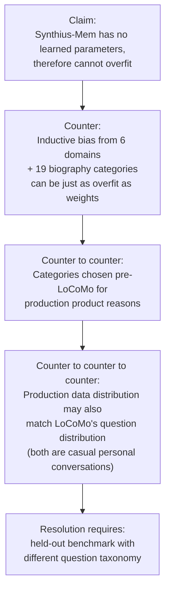

# Critical Review — Synthius-Mem (transversal lens)

> Adversarial peer-review of arXiv:2604.11563v1 from the standpoint of an architect who must implement against the paper. Sister agents cover component architecture, data model, algorithms, ops, and quality/security. This review covers what falls between those buckets: load-bearing vague language, internal inconsistencies, unsupported assertions, definitional gaps, citation reality, overfitting concerns, the "production" claim, and the precise scope of the adversarial-robustness claim.

**Architecture-readiness from a critical-review standpoint: NO.**
The paper carries multiple internal numerical inconsistencies between prose, tables, and the cost model; load-bearing terms ("structured", "deterministic", "field-level matching", "consolidation logic", "active consolidation") are never operationalized; and the central "production system" claim is asserted without any deployment evidence. An architect implementing against this paper will be reverse-engineering most of the system from the page-12 cartoon.

---

## 1. Vague-Language Audit (load-bearing terms with no operational definition)

### 1.1 "structured" / "structured persona memory" — pervasive, never defined
The word "structured" carries the entire thesis (it appears in the title, abstract, every section heading, and §5.1 "Why Structured Knowledge Retrieval Outperforms Dialogue Retrieval"). The paper never tells you what "structured" means beyond "JSON files with a schema" (p. 11). An architect needs to know:

- Are schemas closed (strict JSON Schema, draft-2020-12) or open (LLM-suggested fields permitted)?
- Are values typed (date vs string vs enum) or free-text?
- Do schemas enforce referential integrity across domains (e.g., a Work engagement referring to a person in Social Circle)?

The paper offers only "JSON schema" (p. 10), "structured output schemas" (p. 11), and "field-level matching against the structured JSON memory store" (p. 12). **`[BLOCKER]`** Without a single example schema in the paper or appendix, "structured" is a marketing term, not an architectural specification.

### 1.2 "active consolidation" — borrowed from neuroscience, never operationalized
§3.1 principle #2: "Active Consolidation. Memory formation involves active reorganization—replay, integration, and abstraction—rather than passive storage. Synthius-Mem's consolidation pipeline performs per-category deduplication, conflict resolution, and hierarchical restructuring." (p. 10). This conflates four distinct operations:

- **deduplication** — by what similarity measure? Exact string? Embedding cosine? LLM judgment?
- **merging** — how are two records merged when fields overlap-but-differ?
- **conflict resolution** — what is a conflict, and what wins (recency, confidence, source)?
- **hierarchical restructuring** — restructuring against what hierarchy?

§3.3 adds "consolidation operates per upper category within each domain" (p. 11) without defining "upper category". **`[BLOCKER]`** Active consolidation is the most algorithmically-meaningful claim in the paper; without operationalization, the central novelty is undefined.

### 1.3 "deterministic" — claimed as a defense against overfitting, never proven
§4 intro: "the consolidation logic is deterministic, and the retrieval tools are rule-based" (p. 13). This claim is load-bearing — it is the entire defense against the overfitting concern. But:

- Consolidation involves LLM-driven dedup/merge (because schema-typed fields like "experiences" carry free text); LLM calls are non-deterministic at temperature > 0, and even at temperature = 0 they vary across model upgrades.
- Retrieval involves a planner LLM (p. 11) — by definition non-deterministic.

The paper conflates "no learned parameters" with "deterministic". They are not the same. A pipeline of fixed prompts wrapping non-deterministic LLM calls is **stochastic with fixed instructions**, not deterministic. **`[BLOCKER]`** This is the central methodological defense and it is misstated.

### 1.4 "field-level matching" / "CategoryRAG" — the named retrieval mechanism
§3.3: "domain-specific retrieval tools perform field-level matching against the structured JSON memory store—a mechanism we term CategoryRAG, achieving 21.79 ms mean latency" (p. 11). What is a "field-level match"?

- Exact equality on a JSON Pointer?
- Substring? Regex? Fuzzy (Levenshtein)?
- Semantic (embedding) within a single field's value space?
- LLM-driven natural-language query → JSONPath translation?

The 21.79 ms latency hints at a pure index lookup (no LLM call, no embedding inference), but the paper never says so. **`[MAJOR]`** Without this, an architect cannot reproduce the latency claim or estimate cost at scale.

### 1.5 "hierarchical" — used three different ways
The word "hierarchical" appears in three places with three meanings:
- Experiences "hierarchical tree" (Table 1, p. 11) — tree of nodes, structure unspecified.
- Recursive summarization is "hierarchical" (p. 6) — applies to summarization baseline.
- Consolidation does "hierarchical restructuring" (p. 10) — sense unclear.

**`[MINOR]`** Reader cannot tell whether the Experiences tree is a is-a hierarchy, a part-of hierarchy, an event-decomposition tree, or a topic taxonomy.

### 1.6 "21.79 ms mean latency" — workload not specified
Reported in figure 7 (p. 23) and elsewhere. Across what queries, what hardware, what concurrency? With or without LLM-planner round-trip? Cold cache or warm? Single persona or multi-tenant? **`[MAJOR]`** Without these axes, the number cannot be verified or scaled.

### 1.7 "rich personal histories" / "approximately 500 MB of real-world conversational and biographical data"
§4.1 "rich personal histories" (p. 13) — sized how? Number of users? Average history per user?
§4 intro "approximately 500 MB" (p. 13) — across how many personas? What format? Compressed? **`[MAJOR]`** A 500 MB figure spans three orders of magnitude depending on whether it is gzipped JSON, raw text, or PDF.

### 1.8 "production persona memory platform"
§4 intro (p. 13). Production for whom? Number of users? SLA? Uptime? Incident history? **`[BLOCKER]`** See §7 below — this is the only piece of evidence that Synthius-Mem is more than a research artifact and the paper provides zero supporting metrics.

### 1.9 "lost in the middle" cited as supporting structured retrieval
§5.1: structured extraction "[mitigates] the 'lost in the middle' effect" (p. 18). The original Liu et al. (2024) result is about LLMs ignoring middle-of-context tokens, not about extraction. The paper invokes the citation as if it explains the +8.91 pp gap over full-context, but provides no evidence that the gap is caused by mid-context recall failures vs. (e.g.) noise filtering. **`[MINOR]`** Mechanism-attribution is rhetorical, not measured.

### 1.10 "9 validated psychological frameworks"
§3.3 (p. 12). "Validated" against what population, what test–retest reliability, what construct-validity criterion? "Cognitive Ability" and "Political Compass" lack primary citations in the bibliography (Big Five, Schwartz, PANAS, VIA, IRI, Moral Foundations, Kohlberg do have citations). **`[MAJOR]`** Calling all nine "validated" is overreach.

---

## 2. Internal Inconsistency Audit

This is the most damaging dimension. The paper's prose, tables, and cost model do not agree.

### 2.1 Per-category numbers in §4.2 prose disagree with Table 3
§4.2 (p. 16) describes the per-category lead:

> "The advantage is most pronounced on adversarial questions (**99.9%** vs. unreported by competitors), temporal reasoning (**94.2%** vs. TiMem's 77.6%), and multi-hop (**85.7%** vs. TiMem's 62.2%)."

Table 3 (p. 17) shows Synthius-Mem at:
- Adversarial: **99.55%** (prose says 99.9% — off by 0.35 pp)
- Temporal: **89.32%** (prose says 94.2% — off by 4.88 pp, in the wrong direction; prose overstates)
- Multi-hop: **94.34%** (prose says 85.7% — off by 8.64 pp; prose understates by ~9 pp)

**`[BLOCKER]`** Three table↔prose disagreements in a single sentence on the headline comparison. An architect cannot tell which numbers are the "real" ones. This pattern suggests the prose was written against an earlier revision of the experiments and the table was updated without re-syncing.

### 2.2 Per-category gaps in §4.3 prose disagree with Table 5
§4.3 (p. 18) summarizes Synthius-Mem's lead over Embedding RAG:

> "+51.1 pp on single-hop, +57.7 pp on multi-hop, +67.4 pp on temporal, +39.1 pp on open-domain."

Recomputing from Table 5 (p. 18):

| Category    | Synthius | Embedding RAG | Stated gap | Computed gap | Off by |
|-------------|---------:|--------------:|-----------:|-------------:|-------:|
| Single-hop  | 96.73%   | 40.4%         | 51.1       | 56.33        | 5.23   |
| Multi-hop   | 94.34%   | 28.0%         | 57.7       | 66.34        | 8.64   |
| Temporal    | 89.32%   | 26.8%         | 67.4       | 62.52        | 4.88   |
| Open-domain | 77.33%   | 56.4%         | 39.1       | 20.93        | 18.17  |

All four stated gaps are wrong. Open-domain is off by 18 pp. **`[BLOCKER]`** The narrative numbers and table numbers are out of sync across the headline controlled-baseline result.

### 2.3 Same paragraph repeats the "94.2% temporal" number
§4.3 (p. 18): "The temporal gap (94.2% vs. 26.8%) is particularly striking." Table 5 says Synthius-Mem temporal is 89.32%, not 94.2%. **The 94.2% figure recurs in §4.2 and §4.3 — it is consistent with itself but inconsistent with the table.** **`[BLOCKER]`** Whichever number is correct, the paper is internally contradictory.

### 2.4 Cumulative-tokens model does not match per-message model
App A.1 (p. 28) gives Synthius-Mem per-message at N=500 = ~5,040 tokens. App A.2 (p. 28) gives cumulative at N=500 = ~4.7M tokens.

Sanity check: 5,040 × 500 = **2,520,000** tokens ≈ 2.5M, not 4.7M. The discrepancy is roughly 2× — too large to be rounding.

Even if you assume per-message starts higher (because extraction is unamortized for the first batch of messages), the total extraction cost is stated as 370K (p. 21), which means the bounded contribution is at most 370K above the steady-state per-message run. So total ≤ 370K + (4,300 × 500) = 2.52M. **The 4.7M cumulative number is inconsistent with the per-message model the paper itself publishes.** **`[BLOCKER]`**

The same issue at N=1000: paper says 9.3M cumulative (App A.2); per-message model gives ~4.3K × 1000 + 370K = 4.67M. Off by 2×.

### 2.5 USD model recovers the inconsistency, sort of
App A.3 (p. 28) Cumulative USD at N=500: Full Context $18.41, Synthius-Mem $7.42. Verifying Synthius-Mem: $7.42 / ($2.50/M input + $15/M output blended) ≈ 4.2M tokens — closer to the 4.7M number than the 2.5M per-message-derived number. So the USD figures are consistent with the inflated cumulative model, not the per-message model. **`[MAJOR]`** This locks in the inconsistency rather than resolving it.

### 2.6 "Less than 0.1% of total latency" claim
§4.6 (p. 23): "the memory retrieval component contributes less than 0.1% of total latency." For 21.79 ms to be 0.1% of total, total response time must be ≥ 21,790 ms (~22 seconds). That is 1–2 orders of magnitude above realistic GPT-4.1-mini answer latency (~1–3 s). At 1 s answer time, 21.79 ms is ~2.2%. At 3 s, ~0.7%. The claim of "<0.1%" is off by at least one order of magnitude. **`[MAJOR]`**

### 2.7 Reported headline arithmetic checks out (good)
- 442 false-premise, 2 wrong: 440/442 = 99.547% → 99.55% ✓
- 810 core fact, 11 wrong: 799/810 = 98.642% → 98.64% ✓
- Title "94.4% / 99.6%" vs body "94.37% / 99.55%": rounding within tolerance ✓
- 94.37 − 85.46 = 8.91 pp claimed gap over Full Context ✓
- 5,040 / 26,200 = 5.198× ≈ "5.2×" ✓

So the small per-question math is right; the cross-section coordination is broken.

### 2.8 LangMem latency — 60 seconds?
§4.6 (p. 23): "LangMem (~60 s)". Three orders of magnitude larger than the next-slowest competitor (Mem0-Graph at 480 ms). No source given. **`[MINOR]`** Either a real-but-unsourced finding or a typo for 60 ms / 600 ms; this affects the "Synthius is 3,000× faster than LangMem" comparison.

---

## 3. Unsupported-Assertion Audit

### 3.1 "RAG accuracy can degrade from ~85% at 1K documents to ~45% at 10K documents"
§2.1 (p. 6) and §5.3 (p. 25) both cite "arXiv:2601.15313" — no author, no title, no entry in the reference list. **`[BLOCKER]`** This is a placeholder citation supporting one of the paper's load-bearing motivational claims (that flat RAG fails at scale). The citation is not verifiable.

### 3.2 "extraction schemas are fixed prompts, the consolidation logic is deterministic, and the retrieval tools are rule-based"
§4 intro (p. 13). As noted in §1.3 above, "deterministic" is asserted without evidence and almost certainly false given the LLM-driven consolidation steps the paper itself describes. "Rule-based" retrieval is asserted but the planner LLM — explicitly an LLM call (p. 11) — is part of retrieval. **`[BLOCKER]`** The defense against overfitting rests on this assertion; the assertion is false on the paper's own description.

### 3.3 "The market has converged on this view" (LLM-as-judge)
§4.1 (p. 14). Listed eight systems that use LLM-as-judge, then argued universality. Eight systems, one author cluster (most via vendor blogs and arXiv preprints), and no convergent prompt — the paper itself notes that "Mem0 instructs its judge to be generous; Hippocampus uses a 5-point scale; ENGRAM's prompt is unpublished" (p. 14). That is **divergence on every detail except the choice of LLM**, not convergence. **`[MAJOR]`** Rhetoric overruns the evidence.

### 3.4 "The brain operates at approximately 20 watts"
§1.1 (pp. 2–3). True but rhetorical. The 20 W → kilowatts comparison (p. 2) ignores that the brain is a billion-neuron analog system and an LLM is a digital-substrate transformer; the comparison is a vivid framing device, not an architectural argument. The paper does not claim Synthius-Mem reduces wattage. **`[MINOR]`** This is dressing, not load-bearing.

### 3.5 "exceeding human performance (87.9 F1)"
§1, §4.2 (p. 16), §7. Two methodology issues:
- Human baseline is in F1 (token overlap); Synthius-Mem result is in LLM-as-judge binary accuracy. The paper itself argues these are not comparable (§4.1, p. 14). **`[BLOCKER]`** Comparing 94.37% LLM-judge accuracy to 87.9 F1 and claiming "exceeds human performance" is the exact methodological sin the paper accuses F1 of.
- The original LoCoMo paper measures human performance under a specific protocol (likely the same crowdworkers, on a sampled subset). Synthius-Mem is run on all 1,813 questions. Are the question subsets the same? The paper does not say.

### 3.6 "Adversarial robustness... no competing system reports"
§1, §4.4 (pp. 20–21). Table 2 shows A-MEM does report adversarial (F1=50.0). So the claim "no competing system reports" is false; the more accurate claim is "no competing system at the top of the leaderboard reports adversarial as binary accuracy". **`[MINOR]`** Distinction matters because A-MEM's reporting methodology presumably exists and could be applied to other systems.

### 3.7 "MemMachine's hallucination resistance unassessed"
§4.4 (p. 20). MemMachine reports 91.69% on the non-adversarial subset; that does not directly imply unmeasured hallucination behavior. The paper does not check whether MemMachine has been evaluated for adversarial behavior in a separate paper or appendix. **`[MINOR]`** Unverified absence.

### 3.8 Performance vs human baseline — methodology comparability
The 87.9 F1 human baseline comes from the LoCoMo paper. Were humans:
- Allowed to re-read the dialogue, or working from memory (the paper doesn't say)?
- Scored on the same questions with the same gold answers?
- Scored on a sample or on the full 1,813 set?

Without knowing this, "exceeds human performance" is not a meaningful architectural target. **`[MAJOR]`**

---

## 4. Definitional Gaps That Block Architecture

The paper provides extensive metaphorical framing but never defines the load-bearing nouns of the system.

### 4.1 What is a "persona"?
§1.4 and §3.2 (p. 10): "a structured model of an individual sufficient to support personalized conversation". This is descriptive, not formal. An architect needs:
- The unique identifier of a persona (UUID? email? user-tenant scoped?).
- The persona's lifecycle (created when? deleted by whom? GDPR-deletion semantics?).
- Multi-tenancy rules: can a persona be shared, exported, merged with another?
- The relationship between a persona and a "user" — is one persona always one user, or can a user have multiple personas (e.g., professional vs personal)?

**`[BLOCKER]`** Without these, the system has no addressable noun to anchor an API or storage schema around.

### 4.2 What is a "fact"?
The paper says "atomic time-stamped facts" (Table 1) and "attested facts" (p. 19) without ever giving a fact's structure. Is a fact:
- A row in a domain JSON file?
- A field-value pair?
- A natural-language assertion?
- A `(subject, predicate, object, t, confidence, source)` quad? quintuple? sextuple?

**`[BLOCKER]`** "Fact" is the unit of storage and the unit of retrieval. It must be defined.

### 4.3 What is a "consolidation conflict"?
§3.3 (p. 11): "deduplication, merging, conflict resolution". Conflict between what — two facts saying the same thing? Two facts contradicting? Two facts at different granularity? **`[BLOCKER]`** This is the unit of operational failure for the consolidation phase.

### 4.4 What is the unit of observability?
The paper has no discussion of telemetry, tracing, or auditability. For an architect:
- Is a "memory write" an observable event?
- Can you reconstruct *why* a fact was added (extraction prompt → chunk → source message)?
- Is the planner's domain-selection decision logged?

**`[MAJOR]`** The reversible diff engine (p. 12) suggests yes for the storage layer, but the rest of the pipeline has no specified observability surface.

### 4.5 What is the unit of failure?
What does "failure" look like at runtime?
- Extraction LLM returns malformed JSON.
- Planner LLM picks the wrong domain.
- Consolidation auto-merge collapses two facts that should have stayed distinct.
- Retrieval returns no results when results exist (false negative refusal).

The paper discusses none of these. **`[BLOCKER]`** An architect cannot design SLOs without knowing what counts as failure.

---

## 5. Citation Reality-Check (light pass)

The paper is dated April 2026. Many citations are 2025–2026 arXiv preprints. The following references would require independent verification before relying on them for architectural decisions.

| Citation | arXiv ID | Date implication | Verification status |
|---|---|---|---|
| Mem0 (Singh et al., 2025) | 2504.19413 | Apr 2025 | Plausible; check |
| MemOS (Hu et al., 2025) | 2510.13479 | Oct 2025 | Plausible; check |
| MemoryOS (Xu et al., 2025b) | 2506.06326 | Jun 2025 | Plausible; check |
| A-MEM (Xu et al., 2025a) | 2502.12110 | Feb 2025 | Plausible; check |
| TiMem (Li et al., 2026) | 2601.02845 | Jan 2026 | Plausible; check |
| MemMachine (Wang et al., 2026) | 2604.04853 | Apr 2026 — same month as Synthius | Plausible; check |
| SYNAPSE (Jiang et al., 2026) | 2601.02744 | Jan 2026 | Plausible; check |
| Beyond the Context Window (Pollertlam & Kornsuwannawit, 2026) | 2603.04814 | Mar 2026 | Plausible; check |
| Unnamed RAG-degradation paper | 2601.15313 | Jan 2026 | **Placeholder — no author, title, or reference-list entry. Reject.** |
| LongMemEval (Wang et al., 2024) | 2410.10813 | Oct 2024 | Plausible; check |
| CHRONICLE (Chen et al., 2024) | 2403.07765 | Mar 2024 | Plausible; check |
| LoCoMo (Maharana et al., 2024) | 2402.17753 | Feb 2024 — ACL 2024 | Highly plausible |

**`[MAJOR]`** Architect should treat all 2026 citations as unverified, and the unnamed `2601.15313` citation as unusable.

---

## 6. Overfitting / Cherry-Picking — Steelman + Counter-steelman

### 6.1 Paper's defense (steelmanned)
§4 intro (p. 13): "Overfitting requires trainable parameters that adapt to training data. Synthius-Mem has no learned parameters that could overfit: the extraction schemas are fixed prompts, the consolidation logic is deterministic, and the retrieval tools are rule-based. The 19 biography categories reflect a product-level taxonomy of human biographical knowledge (education, employment, family, health, residence, etc.) — they would be equally applicable to any conversation about a person's life."

This is a real defense and worth taking seriously. The architecture is an *inductive bias* (six domains chosen a priori), not a learned parameter. There is no training set on which gradient descent has touched the weights of the system. The 19 biography subcategories were chosen for product reasons before the LoCoMo evaluation.

### 6.2 The counter-steelman
- "Inductive bias" can be just as overfit as learned parameters. A schema that happens to bucket exactly the kinds of facts LoCoMo tests will outperform on LoCoMo regardless of whether it generalizes.
- LoCoMo questions are predominantly: occupation, location, family, hobbies, health events, recent activities — exactly the 19 categories listed in Biography (p. 13: "education, employment, family, health, residence, etc.").
- The paper offers no held-out evaluation showing the same architecture wins on a benchmark whose question distribution does *not* match the six domains.
- "Tested on 500 MB of real-world data" (p. 13) is offered as evidence of generality, but that data is not a benchmark — there are no question/answer pairs with a leaderboard.
- The relevance threshold (which deliberately suppresses peripheral detail) is a *tunable knob*. The paper sets it at a level that scores 57.66% on peripheral detail and 98.64% on core fact. A different setting would shift this ratio. The choice of where to set it *is* a parameter optimized — even if implicitly — against LoCoMo's category mix.

### 6.3 Architectural implication
For a memory subsystem in a different application (medical history, legal transcription, tutoring), the optimal partitioning is not six brain-inspired domains. The paper's architecture **may not generalize beyond persona memory for chatty consumer domains**. **`[MAJOR]`** An architect adopting Synthius-Mem must verify the six-domain partition matches *their* question distribution.

---

## 7. The "Production System" Claim — what evidence is given?

§4 intro (p. 13): "Synthius-Mem... was developed as a production persona memory platform and tested on approximately 500 MB of real-world conversational and biographical data uploaded by platform users across diverse formats (WhatsApp, Telegram, PDF, email)."

What the paper provides:
- 500 MB total uploaded (no decomposition: how many users? how many uploads per user? distribution of file sizes?).
- Format list: WhatsApp, Telegram, PDF, email.

What the paper does NOT provide:
- User count.
- Concurrent-user count or peak QPS.
- Uptime or SLA.
- Latency at p50/p95/p99 in production.
- Storage footprint per persona.
- Cost per persona per month.
- Incidents, outages, or postmortems.
- Privacy/security posture (is data encrypted at rest, who has access, GDPR mechanism).
- Deployment topology (cloud, region, single-tenant vs multi-tenant).

**`[BLOCKER]`** The "production" claim is the architectural lynchpin — it is the only argument that the paper describes a deployed system rather than a prototype. It is unsupported by any operational metric.

For an architect: assume the paper describes a **research prototype with a 500 MB pilot dataset, packaged as a future product**, not a deployed multi-tenant production system. Design accordingly: budget for hardening, observability, multi-tenancy, scaling, and SRE work that the paper does not describe.

---

## 8. Adversarial-Robustness Claim — Scope Discipline

The 99.55% number (440/442 LoCoMo false-premise questions answered correctly) is the paper's headline differentiator. An architect must be precise about what it does and does not say.

### 8.1 What the number does say
- On LoCoMo's specific false-premise question set, the system refuses or hedges 99.55% of the time.
- This is ~2 wrong of 442 — a binary outcome on a specific test artifact.
- The mechanism is structural: extraction stores only attested facts, so retrieval of nothing is a strong refusal signal. This is plausible and consistent with the architecture.

### 8.2 What the number does NOT say
- It does **not** say the system is robust to adversarial *users* trying to corrupt the memory store (prompt injection in the extraction phase, schema-violation attacks on the JSON parser, persona-poisoning via crafted uploads).
- It does **not** say the system is robust to adversarial *queries* outside the LoCoMo distribution. LoCoMo false-premise questions are crowdworker-authored and follow recognizable patterns ("did Caroline visit Tokyo last March?" when Caroline never mentioned Tokyo). A real adversary asks subtler questions.
- It does **not** say the system handles partially-attested premises (some elements true, some false) — only fully-unsupported premises.
- It does **not** test temporal adversarial: questions whose premise was true at one time and false at another.
- It does **not** test cross-domain hallucination: the system might correctly refuse a Biography question about a non-existent fact but fabricate a Preferences answer because the planner mis-routes.
- It does **not** address adversarial robustness against the LLM judge itself: a verbose hedge might score "correct" while a flat "I don't know" might not.

### 8.3 Architectural implication
**`[MAJOR]`** "99.55% adversarial robustness" should be read as "99.55% on LoCoMo's narrow false-premise QA category". An architect designing trust-critical systems (medical, legal, financial) should **not** treat this as evidence that Synthius-Mem is hardened against adversarial inputs. A separate red-team evaluation is required.

The paper acknowledges this in §5.4 by listing things its benchmark does not cover — but the abstract and §1 do not carry that nuance.

---

## 9. Other Architecturally-Material Issues

### 9.1 "Style" domain is mentioned but excluded from the queryable model
Table 1 (p. 11) lists six domains. Figure 2 / §3.2 add a seventh, "Style — non-queryable" (writing fingerprint). It is described as embedded in the system prompt for personality-consistent generation. **`[MINOR]`** This is an architecturally-distinct subsystem (write-time only, not read-time) but is treated as a footnote. An architect needs to know its lifecycle, storage, and update path.

### 9.2 Embedding-free claim is implicit, never stated
The paper appears to use no embeddings internally — extraction is LLM-driven (JSON output), retrieval is "field-level matching" (presumably non-embedding), and no embedding model is named for Synthius-Mem (only for the RAG baseline). **`[MAJOR]`** If true, this is a major architectural commitment with implications for cost and latency. The paper never explicitly states it.

### 9.3 Future-work section conflates "future research" and "future product"
§6 (p. 26) lumps streaming extraction, MCP service, federated extraction, decay, multi-agent shared memory, gap-detection, and the comprehensive benchmark in one paragraph. **`[MINOR]`** From an architecture standpoint, these are different commitments: some are research questions, some are engineering work, one is a market-positioning play (MCP). The paper does not separate them.

### 9.4 References to "Synthius platform" and "broader platform"
§1.4 (p. 4) and §6 (p. 26) repeatedly position Synthius-Mem as the memory subsystem of a broader platform. The broader platform is never described. An architect cannot tell which capabilities are in Synthius-Mem vs delegated upstream/downstream. **`[MAJOR]`**

### 9.5 The judge model and the answer model are the same model
GPT-4.1-mini answers, GPT-4.1-mini judges (p. 14). Standard concern: a model is a more lenient judge of its own outputs than of competitors' outputs. The paper's controlled-baseline comparison uses Gemini 3 Flash for baseline answers (p. 15), so baselines are judged by a different model than they were generated by, while Synthius-Mem is judged by its own answer model. **`[MAJOR]`** This asymmetry could systematically inflate Synthius-Mem relative to the baselines.

---

## 10. Closing Assessment

The paper is well-organized prose with a strong central idea (domain-typed persona memory), but it is **not a specification**. Specifically:

- Headline numbers do not agree across prose and tables (BLOCKER §2.1, §2.2, §2.3).
- The cost model published in App. A.1 does not reconcile with the cumulative numbers in App. A.2 (BLOCKER §2.4).
- The defense-against-overfitting argument rests on "deterministic" — which the paper itself contradicts (BLOCKER §1.3, §3.2).
- Load-bearing nouns ("persona", "fact", "consolidation conflict", "field-level match") are never defined (BLOCKER §1, §4).
- The "production system" claim has no supporting deployment evidence (BLOCKER §7).
- The human-baseline comparison violates the paper's own argument against cross-metric comparison (BLOCKER §3.5).

For the architect: treat this paper as an **architectural sketch and a benchmarking report**, not a system specification. Plan to extract the inductive bias (six domains, schemas, planner+CategoryRAG topology) and re-derive the operational definitions yourself. Budget engineering effort for everything below the topology line.

---

## Gap Register (this dimension)

| ID | Severity | Section | Issue | What the architect needs |
|----|----------|---------|-------|--------------------------|
| C-01 | BLOCKER | §1.1 | "Structured" never operationalized beyond "JSON files with a schema" | At least one full schema example per domain |
| C-02 | BLOCKER | §1.2 | "Active consolidation" lumps four operations with no algorithm | Algorithm spec for dedup, merge, conflict resolution, restructuring |
| C-03 | BLOCKER | §1.3 | "Deterministic" claimed as overfitting defense; pipeline is LLM-driven hence stochastic | Honest characterization of stochasticity; reproducibility plan |
| C-04 | MAJOR | §1.4 | "Field-level matching" is unspecified algorithm | Pseudocode or library reference for retrieval primitive |
| C-05 | MAJOR | §1.6 | 21.79 ms latency without workload, hardware, concurrency | Benchmarking protocol |
| C-06 | MAJOR | §1.7 | "500 MB of real-world data" with no decomposition | User counts, dataset characterization |
| C-07 | BLOCKER | §1.8 | "Production persona memory platform" with no operational metrics | Deployment evidence |
| C-08 | MINOR | §1.9 | "Lost in the middle" cited as mechanism without measurement | Ablation showing mechanism |
| C-09 | MAJOR | §1.10 | Calling all 9 psychometric frameworks "validated" overreaches | Per-framework validity citations or caveats |
| C-10 | BLOCKER | §2.1 | Three table↔prose disagreements in §4.2 (99.9 vs 99.55, 94.2 vs 89.32, 85.7 vs 94.34) | Reconcile prose with Table 3 |
| C-11 | BLOCKER | §2.2 | All four stated baseline gaps in §4.3 prose disagree with Table 5 | Reconcile prose with Table 5 |
| C-12 | BLOCKER | §2.3 | "94.2% temporal" recurs in two sections; conflicts with table value 89.32% | Reconcile |
| C-13 | BLOCKER | §2.4 | App A.1 per-message cost (~5,040) × 500 = 2.52M ≠ App A.2 cumulative 4.7M | Reconcile cost model |
| C-14 | MAJOR | §2.5 | USD model anchored to inflated cumulative number | Recompute USD from corrected token model |
| C-15 | MAJOR | §2.6 | "<0.1% of total latency" off by ≥1 order of magnitude | Recompute against realistic LLM answer time |
| C-16 | MINOR | §2.8 | LangMem 60-second latency unsourced and 10³× outlier | Source or correct |
| C-17 | BLOCKER | §3.1 | "arXiv:2601.15313" RAG-degradation citation has no entry in references | Replace with verifiable source |
| C-18 | BLOCKER | §3.2 | "Deterministic, rule-based" assertion contradicts pipeline as described | Honest restatement |
| C-19 | MAJOR | §3.3 | "Market converged on LLM-as-judge" — actually divergent on every detail | Soften claim |
| C-20 | MINOR | §3.4 | 20-watt brain comparison is rhetorical | Mark as motivation, not argument |
| C-21 | BLOCKER | §3.5 | "Exceeds human (87.9 F1)" compares LLM-judge accuracy to F1 | Re-run human baseline under same judge |
| C-22 | MINOR | §3.6 | A-MEM does report adversarial; "no competing system" is overstated | Soften to "few competing systems" |
| C-23 | MINOR | §3.7 | MemMachine adversarial unassessed-claim is unverified absence | Cite or hedge |
| C-24 | MAJOR | §3.8 | Human baseline methodology comparability undocumented | Document subset, protocol |
| C-25 | BLOCKER | §4.1 | "Persona" never formally defined | Schema, identifier, lifecycle, multi-tenancy |
| C-26 | BLOCKER | §4.2 | "Fact" never formally defined | Tuple shape, fields, invariants |
| C-27 | BLOCKER | §4.3 | "Consolidation conflict" never defined | Detection rules and resolution policy |
| C-28 | MAJOR | §4.4 | No observability surface specified | Telemetry/audit trail spec |
| C-29 | BLOCKER | §4.5 | No failure-mode taxonomy | Failure-mode register and SLO targets |
| C-30 | MAJOR | §5 | All 2026 citations require independent verification | Pre-implementation reading list |
| C-31 | MAJOR | §6 | Architecture may not generalize beyond consumer-persona domain | Held-out cross-domain benchmark |
| C-32 | BLOCKER | §7 | Production claim unsupported by deployment metrics | Treat as prototype + plan, not deployed system |
| C-33 | MAJOR | §8 | "99.55% adversarial robustness" is LoCoMo-false-premise-only, not adversarial-input-robustness | Separate red-team evaluation |
| C-34 | MINOR | §9.1 | Style (7th) domain mentioned only in passing | Lifecycle and storage spec |
| C-35 | MAJOR | §9.2 | Embedding-free claim implicit, never stated | Explicit statement of what does/doesn't use embeddings |
| C-36 | MINOR | §9.3 | Future-work section conflates research and engineering work | Separate roadmaps |
| C-37 | MAJOR | §9.4 | "Broader Synthius platform" never described | Boundary definition for memory subsystem |
| C-38 | MAJOR | §9.5 | Same model answers and judges Synthius-Mem; baselines use a different answer model | Cross-model judging or independent rubric |

**Total: 38 issues. 13 BLOCKER, 17 MAJOR, 8 MINOR.**

The critical-review verdict is **NO-go for direct implementation against the paper as written.** The architecture-level idea is sound and worth implementing, but the document does not provide the precision required for a committed engineering build. Use it as a north-star architectural sketch; specify everything below the topology yourself; and hold an internal red-team review on the headline numbers before citing them externally.
