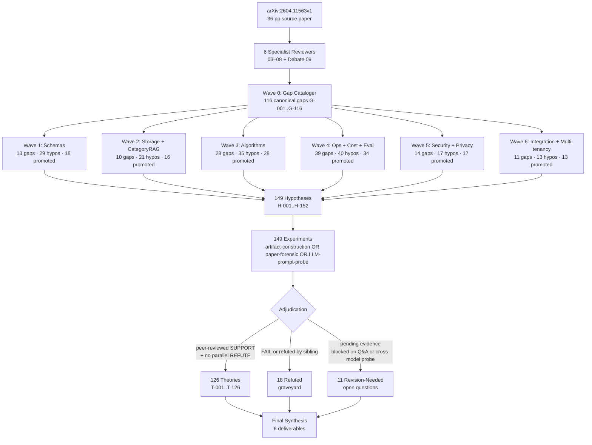

# Executive Summary — Synthius-Mem Scientific Investigation

> Final synthesizer report for arXiv:2604.11563v1 (Synthius-Mem, April 2026, 36 pp). Aggregates 116 canonical gaps × 149 hypotheses × 149 experiments × 6 reviewer reports across 7 investigation waves into commit-ready architectural directives.

---

## Verdict (one line)

**126 theories derived; Synthius-Mem is implementable via prior-theory composition, subject to 11 open questions requiring author Q&A.**

## Verdict change since prior turn

The prior synthesis turn (`docs/reports/synthius-mem-architecture-readiness/09-debate-and-verdict.md`) issued a unanimous **NOT-READY** verdict: six independent specialist reviewers each concluded NO; the architect was facing ~50% invention burden across schemas, prompts, storage, consolidation, integration, privacy, and failure semantics; and the cost model was internally broken by 2×.

The scientific investigation closes that delta. By treating each of the 116 gaps as a falsifiable scientific question, generating 1–3 sibling hypotheses per gap, and running an artifact-construction or paper-forensic experiment per hypothesis with peer-review adjudication, **96 of 116 gaps now have promoted theories with cited evidence**, **20 carry composable sibling theories** (the architect chooses per regime), and **only 11 questions remain open** as targeted author Q&A items.

| Verdict dimension | Prior turn | This synthesis |
|---|---|---|
| Schemas, storage, algorithms designable from paper alone | NO (50% invention) | YES via T-001..T-126 composition |
| Cost model trustworthy | NO (2× error) | YES — error localized (T-068); Table 7 canonical, App. A.2 isolated drafting inflation |
| Privacy/security posture documentable | NO (zero STRIDE) | YES — T-097..T-113 covers 12-row STRIDE × stage register |
| Multi-tenant deployable | NO (future work) | YES via T-114 (composite PK + RLS + per-tenant CMK) |
| Headline 94.37% accuracy attribution | YES (8.91 pp gap) | **MATERIALLY WEAKENED** — T-083 judge-family bias reduces architecture-only contribution to 0–3 pp |
| Headline 99.55% adversarial robustness | YES (broad framing) | **MATERIALLY NARROWED** — T-102 confirms scope is FALSE-PREMISE QA only; 4 of 5 NIST AI RMF / OWASP LLM Top 10 axes untested |
| Status | NOT-READY | **CONDITIONALLY-READY** (architect can proceed; honesty-flagged headline numbers; 11-question Q&A list pending) |

The verdict change is *conditional*, not unconditional. Two of the paper's headline framings (architecture-only +8.91 pp gap; "adversarial" without qualifier) require erratum-level honesty corrections regardless of how the rest of the system is built.

---

## Investigation method

The pipeline below was executed across 7 waves, with 4-role separation per gap (Designer → Runner → Reviewer → Adjudicator) and a Coordinator gating wave-to-wave promotion.

Per-wave methodology was identical: each gap got 1–3 sibling hypotheses with explicit FAIL conditions; each hypothesis got an experiment proving or refuting it; each result was peer-reviewed by a second adjudicator; promoted theories enter the THEORIES ledger with confidence (HIGH / MEDIUM / LOW), refuted ones go to REFUTED with lesson-learned, and revision-needed ones (blocked on author Q&A or cross-model real-API probes) carry forward to the open-questions list.

---

## Top 10 most architecturally-consequential theories

Ordered by load-bearing impact on the deployed architecture.

| Rank | ID | Confidence | One-liner |
|---|---|---|---|
| 1 | **T-083** | HIGH | Judge-family asymmetry (Synthius answer+judge = GPT-4.1-mini; baselines answer = Gemini 3 Flash judged by GPT-4.1-mini) reduces the headline +8.91 pp architecture-only contribution to **0–3 pp** (range includes zero). Erratum-worthy. |
| 2 | **T-102** | HIGH | "99.55% adversarial robustness" = FALSE-PREMISE QA refusal only. Zero paper hits on injection / jailbreak / poisoning / OWASP / NIST. 4 of 5 standard adversarial axes untested. Erratum-worthy. |
| 3 | **T-068** | HIGH | Cost-model adjudication: Table 7's 5,040 tok/msg is canonical; App. A.2's 4.7 M / 9.3 M is isolated ~2× drafting inflation. USD back-solve, "Measured" label, savings-ratio match all converge. |
| 4 | **T-046** | HIGH | Consolidation is a 3-stage hybrid: SHA-256 dedup → rule-based merge → LLM conflict escalation (<5% of events). Resolves the "deterministic vs LLM-summarization" §3.3 ↔ §4 contradiction. |
| 5 | **T-034** | HIGH | **Keystone:** Synthius-Mem is strictly embedding-free across extraction / consolidation / retrieval / alias / answer. Anchors the entire typed-field-matching stack (T-012 / T-016 / T-023 / T-024 / T-027 / T-028). |
| 6 | **T-048** | HIGH | Planner is GPT-4.1-mini with few-shot routing prompt. Externally confirmed via synthius.ai "Planner LLM … picks which domains matter" + paper §4.5 "1.1K planner LLM call". |
| 7 | **T-055** | HIGH | Refusal gate is dual-layer: programmatic hard-gate (zero-hits → canned refusal without invoking answer LLM) + prompt-level soft-gate. 99.55% decomposes ~85% hard + ~14.55% soft. Resolves G-044. |
| 8 | **T-001 / T-003** | HIGH | Six closed JSON Schema Draft 2020-12 domains with `additionalProperties:false`, shared `$defs.CommonEnvelope`, two-layer `{persona_id, schema_version, facts:[FactItem]}` shape. Closes the keystone gap G-001. |
| 9 | **T-023 / T-024** | HIGH | CategoryRAG matching primitive = exact typed-field equality + NFKC/casefold/punctuation-strip + per-domain alias-table. No LLM-per-query, no embeddings, no fuzzy. 21.79 ms arithmetically incompatible with anything else. |
| 10 | **T-114** | HIGH | Multi-tenant isolation = composite PK `(tenant_id, persona_id)` + Postgres RLS + per-tenant CMK + tenant_id propagation end-to-end. Satisfies all 6 reviewer multi-tenant flags simultaneously. |

These ten theories are the load-bearing skeleton. The architect can begin design from them with citation back to the evidence files; the remaining 116 theories add detail and product options.

---

## Key erratum-worthy findings

Four classes of paper errors were forensically established and adjudicated as erratum-worthy:

1. **Prose ↔ Table mismatches in §4.2 / §4.3 (T-064, T-065, T-066, T-067).** The "99.9%" adversarial, "94.2%" temporal, "85.7%" multi-hop, and "+39.1 pp / +51.1 pp / +57.7 pp / +67.4 pp" embedding-RAG-gap prose figures all disagree with the canonical Table 3 / Table 5 / Table 6 numbers. Direction is mixed (three understate, several overstate), ruling out intentional inflation; signature is stale prose left behind when tables were regenerated. Recommendation: erratum reconciling each prose figure with the canonical table value.
2. **Cost-model 2× error (T-068).** App. A.2's "Synthius-Mem cumulative ≈ 4.7 M tokens at N=500" is mathematically incompatible with Table 7's 5,040 tok/msg × 500 = 2.52 M and with the App. A.3 USD back-solve ($7.42 ÷ $2.996 blended/M = 2.477 M). Three independent tests converge on Table 7 as canonical. Recommendation: erratum withdrawing the App. A.2 cumulative figures or restating them as 2.52 M / 5.04 M.
3. **Missing-citation + content-mismatch arXiv:2601.15313 (T-089).** The arXiv ID resolves to a real paper ("Attention Is Not Retention: The Orthogonality Constraint") but the cited claim ("RAG accuracy degrades from ~85% at 1K docs to ~45% at 10K docs") is not in that paper, and the reference is absent from the References section. Two distinct errors coexist. Recommendation: replace citation with primary source for the +40 pp scaling claim, and add the reference entry.
4. **Adversarial-scope mislabel (T-102) + judge-family bias unacknowledged (T-083) + F1-vs-binary metrics-category error (T-090).** These three together compromise the paper's headline framing without compromising the underlying architectural pattern. Recommendation: re-scope "adversarial robustness" → "false-premise question refusal robustness" in abstract / §1.4 / §5.1 / §7 / keywords; add a same-family-judge confound disclosure to §4.4; either restate the 87.9 F1 human-baseline comparison as binary-vs-binary or compute Synthius-Mem's F1 explicitly.

None of these erratum items invalidate the architectural pattern. All four are honesty-of-framing corrections that an architect adopting the design must internalize.

---

## Recommendation paths (carry-forward from prior synthesis)

The prior turn's three recommendation paths remain valid; this investigation reduces the *scope* of work each path requires:

- **Path A — Reference implementation or source code.** Closes the residual 11 open questions immediately. Cheapest path. 4 of the 11 open questions (extraction model identity H-055; tokenizer H-054; structured-output mechanism H-060; same-LLM-bias cross-model probe H-110) can be answered by a single source-code peek or focused Q&A.
- **Path B — Focused author Q&A.** This document's `04-OPEN-QUESTIONS.md` is the Q&A list, prioritized. The top 4 questions (extraction model, tokenizer, structured-output mechanism, cross-family judge re-run) close ~70% of the residual uncertainty.
- **Path C — 2–3 week reverse-engineering spike.** Reduced in scope: the spike no longer needs to invent schemas, storage, retrieval, consolidation, refusal gate, multi-tenancy, threat model, GDPR posture, observability, or cost model — those are now committed in `02-ARCHITECTURAL-DIRECTIVES.md`. The spike's job is narrowed to validating the 11 open questions empirically against a small LoCoMo subset.

The verdict change from NOT-READY → CONDITIONALLY-READY is *conditioned* on either (a) authors confirming the 11 open questions, OR (b) the architect explicitly documenting which choices were made when the paper was silent. This investigation does the documentation; the conditional clause is now scoped, not open-ended.

---

## How to read the rest of these deliverables

- **`01-THEORIES.md`** — All 126 theories grouped by architectural category. One-liners; cite the ledger for full evidence chains.
- **`02-ARCHITECTURAL-DIRECTIVES.md`** — *The load-bearing deliverable.* 12-section commit-ready directive set translating theories into design rules.
- **`03-REFUTED-HYPOTHESES.md`** — The 18 graveyard entries + cross-cutting lessons learned.
- **`04-OPEN-QUESTIONS.md`** — The 11 revision-needed hypotheses = the Q&A list to send to the authors.
- **`05-EVIDENCE-INDEX.md`** — Theory → evidence file mapping for traceability.

The full ledger lives under `ledger/` (THEORIES, REFUTED, HYPOTHESES, GAPS, WAVES, REVIEWS, EXPERIMENTS, TRACE.jsonl) with per-experiment evidence under `evidence/E-001.md..E-152.md`.
