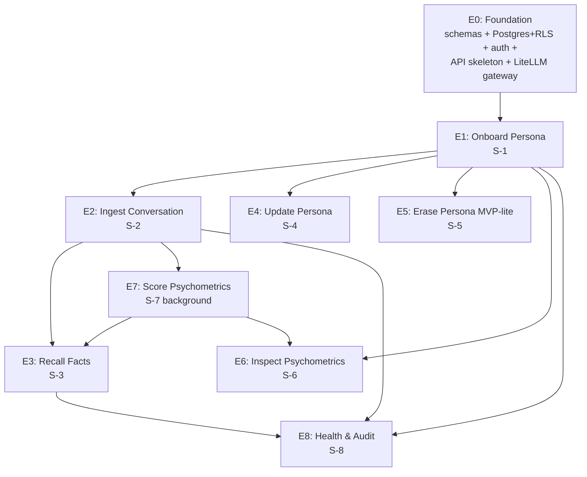

# Synthius-Mem Implementation Backlog (SCRUM-Style Master Plan)

> **For agentic workers:** REQUIRED SUB-SKILL: Use superpowers:subagent-driven-development (recommended) or superpowers:executing-plans to implement detailed epic plans task-by-task. This file is the **backlog index** — it lists all Epics + User Stories + Spikes but defers engineering-task detail to per-epic plan files in this directory.

**Goal:** Ship a production-grade per-persona structured memory service implementing `docs/architecture/ARCHITECTURE.md` v1.2 — embedding-free, multi-tenant, GDPR-ready (deferred to Phase 7), with z.ai GLM as the LLM substrate.

**Architecture:** Postgres-JSONB single substrate with RLS multi-tenancy and per-persona WAL; 6 closed JSON Schemas with shared envelope feed 6× parallel extraction LLMs; CategoryRAG retrieval with planner-routed typed-field exact match; host owns Answer LLM. See `docs/architecture/ARCHITECTURE.md` for full design.

**Tech Stack:**
- **Language**: Python 3.12+ (LiteLLM-native, Presidio-native, mature Postgres ecosystem)
- **API**: FastAPI (OpenAPI 3.1, async, Pydantic-integrated)
- **Validation**: Pydantic v2 (matches DIR-1.1 closed-schema requirement; runtime + type-check)
- **DB**: PostgreSQL 15+ via `psycopg[binary]` 3.x driver; `SQLAlchemy 2.x` core (no ORM); `Alembic` migrations
- **LLM gateway**: `LiteLLM` (z.ai GLM-4.7-FlashX primary, GLM-4.6 quality tier, Anthropic Claude Haiku fallback)
- **Tests**: `pytest` + `pytest-asyncio` + `pytest-postgresql` (real DB, not mocks)
- **Tooling**: `uv` (deps), `ruff` (lint+format), `mypy` (strict types)
- **Observability**: `opentelemetry-sdk` + `opentelemetry-exporter-otlp` → Prometheus/Tempo
- **Container/deploy**: Docker + Docker Compose (single region, single replica at MVP)

---

## SCRUM hierarchy

```
Project (ARCHITECTURE.md v1.2)
├── Epic 0: Foundation                     (was Phase 1)
├── Epic 1: S-1 Onboard Persona            (vertical slice S-1)
├── Epic 2: S-2 Ingest Conversation        (vertical slice S-2)
├── Epic 3: S-3 Recall Facts (Query)       (vertical slice S-3)
├── Epic 4: S-4 Update Persona             (vertical slice S-4)
├── Epic 5: S-5 Erase Persona              (vertical slice S-5; MVP-lite per Decision 12)
├── Epic 6: S-6 Inspect Psychometrics      (vertical slice S-6)
├── Epic 7: S-7 Score Psychometrics        (vertical slice S-7; opt-in only at MVP)
└── Epic 8: S-8 Health & Audit             (vertical slice S-8; reduced to 4 SLIs at MVP)

Each Epic decomposes into:
  └── User Story (component or sub-area)
      └── Engineering Task (TDD step group: write test → fail → impl → pass → commit)
      └── Spike (research / verification of an open question)
```

---

## Backlog overview

| Epic | Slice | User Stories | Engineering Tasks (est) | Spikes | Depends on | Detail file |
|------|-------|--------------|-------------------------|--------|------------|-------------|
| **E0** | Foundation | 6 | 28 | 2 | — | `2026-04-21-epic-0-foundation.md` |
| **E1** | S-1 Onboard | 4 | 18 | 1 | E0 | `2026-04-21-epic-1-onboard.md` (TBD) |
| **E2** | S-2 Ingest | 8 | 38 | 3 | E0, E1 | `2026-04-21-epic-2-ingest.md` (TBD) |
| **E3** | S-3 Recall | 7 | 32 | 2 | E0, E1, E2 (data) | `2026-04-21-epic-3-recall.md` (TBD) |
| **E4** | S-4 Update | 3 | 12 | 0 | E0, E1, E2 | `2026-04-21-epic-4-update.md` (TBD) |
| **E5** | S-5 Erase (lite) | 3 | 10 | 0 | E0, E1 | `2026-04-21-epic-5-erase.md` (TBD) |
| **E6** | S-6 Inspect Psyche | 2 | 8 | 0 | E0, E1, E7 | `2026-04-21-epic-6-inspect-psyche.md` (TBD) |
| **E7** | S-7 Score Psyche | 4 | 18 | 1 | E0, E2 | `2026-04-21-epic-7-score-psyche.md` (TBD) |
| **E8** | S-8 Health | 3 | 12 | 0 | E0–E7 (signals) | `2026-04-21-epic-8-health.md` (TBD) |
| **Totals** | — | **40 stories** | **~176 tasks** | **9 spikes** | — | 9 files |

---

## Dependency graph



**Critical path**: E0 → E1 → E2 → E3 (data plane). E5/E6/E7/E8 are parallel-ready once their inputs exist.

---

## Sprint sequencing (suggested 2-week cadence)

| Sprint | Weeks | Epics | Why this order |
|--------|-------|-------|----------------|
| Sprint 1 | 1–2 | E0 | Foundation must exist before anything reads/writes data |
| Sprint 2 | 3–4 | E1 + start E2 | Onboarding gates all other slices; ingest is the longest critical-path epic |
| Sprint 3 | 5–6 | E2 finish + E5 (parallel) | Erase slice is small + parallel-ready (no ingest dependency on storage) |
| Sprint 4 | 7–8 | E3 + E4 (parallel) | Recall + Update can proceed once stores have data |
| Sprint 5 | 9–10 | E7 + E6 + E8 (all parallel) | Background psyche scorer + inspect + health round out the surface |
| Sprint 6 | 11–12 | Hardening + chaos test + ship-ready | Phase 6 from architecture |

**Total runway: ~12 weeks to MVP** (Phase 5+6 of architecture, ending at week 16 was 4-week buffer for unknowns; a 12-week sprint plan absorbs that buffer).

---

# Epic 0: Foundation

**Slice**: N/A (cross-cutting prerequisite)
**Architecture refs**: §8 Phase 1 + Decisions 1, 2, 3, 6, 7, 11
**Detail file**: `docs/superpowers/plans/2026-04-21-epic-0-foundation.md`
**Goal**: A running FastAPI service that can authenticate a request, propagate `tenant_id` through Postgres RLS to a 6-domain schema, and round-trip an LLM call through LiteLLM to GLM-4.7-FlashX.

### User Stories

| ID | Story | DIR refs |
|----|-------|----------|
| US-0.1 | As a developer, I can stand up the project skeleton (uv + ruff + pytest + Docker Compose) and run `pytest` green | — |
| US-0.2 | As a developer, I can author the 6 closed-schema Pydantic v2 models + shared `CommonEnvelope` and validate them round-trip via JSON Schema export | DIR-1.1, DIR-1.3 |
| US-0.3 | As a developer, I can run Postgres 15 with the 6 domain tables + WAL table + GIN/B-tree indexes + RLS policies via Alembic migrations | DIR-2.1, DIR-2.2, DIR-2.3, DIR-11.1 |
| US-0.4 | As an API client, I can hit `POST /auth/token` with a tenant-scoped bearer credential and receive a JWT carrying `tenant_id` | DIR-7.3 |
| US-0.5 | As an API client, I can hit `GET /health` and `GET /openapi.json` with traces flowing to OpenTelemetry | DIR-7.2, DIR-8.1 |
| US-0.6 | As a developer, I can call any of the 3 GLM tiers (FlashX / 4.6 / 4.5-Flash) through a unified `LLMGateway` with structured-output JSON-object mode and per-call fallback to Anthropic Claude Haiku | Decision 11, DIR-12.5 |

### Spikes

| ID | Spike | What it answers |
|----|-------|-----------------|
| SP-0.1 | Verify GLM-4.7-FlashX `response_format: {"type":"json_object"}` round-trips a complex closed schema with `additionalProperties:false` enforced application-side | Validates Decision 11 + Q3/H-060 default; gate before E2 |
| SP-0.2 | Benchmark Postgres GIN + functional B-tree on a 200K-row synthetic persona; confirm 750 µs hot-path budget | Validates DIR-2.2 numerical claim + DIR-2.9 21.79 ms target headroom |

---

# Epic 1: S-1 Onboard Persona

**Slice**: S-1
**Architecture refs**: §3 S-1 + Decisions 6, 12
**Goal**: An authenticated tenant can create a persona, get a ULID, and have an empty 6-domain row set provisioned under RLS.

### User Stories

| ID | Story | DIR refs |
|----|-------|----------|
| US-1.1 | As a tenant, I can call `POST /personas` and receive a new `persona_id` (ULID) | DIR-2.1 |
| US-1.2 | As a tenant, I can call `GET /personas` and see only my tenant's personas (RLS-enforced) | DIR-11.1 |
| US-1.3 | As a tenant on signup, I can attest scope-exclusion checkboxes (no PHI / no payment / 18+ / no EU/UK) and have them recorded | Decision 12 |
| US-1.4 | As a developer, I can verify cross-tenant isolation via an integration test that proves tenant-A cannot read tenant-B's persona under any code path | DIR-11.1 (load-bearing) |

### Spikes

| ID | Spike | What it answers |
|----|-------|-----------------|
| SP-1.1 | Confirm IP geo-block library choice (MaxMind GeoLite2-Country free tier vs commercial) and add to signup flow | Validates Decision 12 EU/UK exclusion mechanism |

---

# Epic 2: S-2 Ingest Conversation

**Slice**: S-2 (longest epic)
**Architecture refs**: §3 S-2, §4.2 ingest tree, §6.5 security plane, §8 Phase 2 + Decisions 11, 12
**Goal**: A tenant can POST a conversation in any of 5 supported formats and have it normalized → PII-scrubbed → chunked → 6-way extracted → ready for consolidation.

### User Stories

| ID | Story | DIR refs |
|----|-------|----------|
| US-2.1 | As a tenant, I can `POST /personas/{id}/conversations` with a WhatsApp export and have it normalized to canonical `Message[]` | DIR-3.1 |
| US-2.2 | Same for Telegram, PDF, email/MIME, and voice (with transcription pre-adapter) | DIR-3.1 |
| US-2.3 | Re-uploading the same conversation produces zero new facts (idempotency via SHA-256) | DIR-3.1 |
| US-2.4 | Lite PII regex (SSN + credit-card patterns) redacts before extraction (full Presidio deferred per Decision 12) | DIR-3.5 + Decision 12 |
| US-2.5 | Chunker produces 2K-token windows with 200-token overlap, never splits mid-message, inlines `[Speaker:Timestamp]` markers | DIR-3.2, DIR-3.3 |
| US-2.6 | Extraction fanout: 6 concurrent GLM-4.7-FlashX calls per chunk return Pydantic-validated FactItems against closed schemas | DIR-3.6, DIR-3.7, DIR-3.8 + Decision 11 |
| US-2.7 | Extraction failures: exp-backoff (3, base 500 ms, ×2) → DLQ; 5/6 partial-accept | DIR-3.9 |
| US-2.8 | Async job tracking: `POST` returns `job_id`; `GET /jobs/{id}` shows progress + per-domain extraction status | DIR-7.2 op #1 |

### Spikes

| ID | Spike | What it answers |
|----|-------|-----------------|
| SP-2.1 | Verify z.ai tokenizer (vs cl100k_base assumption) — measure actual chunk token count drift | Q2/H-054 |
| SP-2.2 | Profile Layer A injection guardrail effectiveness on OWASP LLM01 prompt-injection corpus | Decision 12 + DIR-9.2 Layer A load-bearing claim |
| SP-2.3 | Validate WhatsApp / Telegram export format parsers against ≥3 real-world export samples each | DIR-3.1 |

---

# Epic 3: S-3 Recall Facts (Query)

**Slice**: S-3 (headline read-path; owns 21.79 ms target)
**Architecture refs**: §3 S-3, §4.2 retrieval tree, §8 Phase 4 + Decisions 1, 11
**Goal**: Host calls `POST /personas/{id}/query` with a natural-language question; planner routes to ≤6 domain retrievers; typed-field exact-match returns FactItems; response packs into 2K-token quota.

### User Stories

| ID | Story | DIR refs |
|----|-------|----------|
| US-3.1 | Planner LLM (GLM-4.7-FlashX, few-shot prompt) emits `{domains:[name], per_domain_query:{...}}` as function-call payload | DIR-5.2, DIR-5.3 + Decision 11 |
| US-3.2 | 6 domain retriever tools registered; each accepts `(persona_id, field, value, op, limit)` and returns `list[FactItem]` | DIR-5.1 |
| US-3.3 | Match engine: NFKC + casefold + whitespace-collapse + punctuation-strip + alias-table expansion; equality / range / `in` only | DIR-2.10, DIR-2.9 |
| US-3.4 | Per-persona LRU cache built lazily at session load; cache-epoch invalidation on WAL seq advance | DIR-2.5 |
| US-3.5 | Misroute fallback: zero primary hits → broaden across all 6 domains; still empty → return empty | DIR-5.6 |
| US-3.6 | Context packer: `2000/k` tokens per selected domain; sort `(recency DESC, confidence DESC, fact_id ASC)`; atomic pack-until-quota with no mid-item truncation | DIR-5.5 |
| US-3.7 | Response formatter: per-domain JSON sections returned to host; host owns Answer LLM (we do NOT call it from server) | DIR-6.2, DIR-7.1 |

### Spikes

| ID | Spike | What it answers |
|----|-------|-----------------|
| SP-3.1 | Load-test 21.79 ms mean retrieval on a 200K-row synthetic persona with warm cache | DIR-2.9 + DIR-8.2 SLI 7 |
| SP-3.2 | Confirm result ranking order (Q7/H-044 + H-045 default) against hand-crafted recency-vs-confidence test cases | DIR-5.5 default validation |

---

# Epic 4: S-4 Update Persona (Fact Edit)

**Slice**: S-4
**Architecture refs**: §3 S-4 + Decision 8 (WAL serves DSAR Art. 16)
**Goal**: Tenant or DSAR-Art-16 client can rectify a fact; change atomically commits across 6 domains + WAL.

### User Stories

| ID | Story | DIR refs |
|----|-------|----------|
| US-4.1 | `PATCH /personas/{id}/facts/{fact_id}` validates delta against domain schema | DIR-1.1 |
| US-4.2 | Update writes a WAL `op=edit` entry with `user_initiated=true` and 6-domain atomic txn | DIR-2.6, DIR-2.7 |
| US-4.3 | Cache-epoch bumped; subsequent recall reflects the edit | DIR-2.5 |

---

# Epic 5: S-5 Erase Persona (MVP-lite per Decision 12)

**Slice**: S-5
**Architecture refs**: §3 S-5 + Decision 12 + DIR-10.3 (tombstone-and-purge sibling)
**Goal**: Tenant can delete a persona; T1 soft-delete tombstones in 30-day window, T2 (or user-invoked) does `DELETE + VACUUM FULL + WAL truncate` (no crypto-shred at MVP — deferred to Phase 7).

### User Stories

| ID | Story | DIR refs |
|----|-------|----------|
| US-5.1 | `DELETE /personas/{id}?scope=soft` tombstones across 6 domains in single txn + WAL `op=tombstone`; reads filter `tombstoned_at IS NULL` | DIR-10.2 T1 |
| US-5.2 | `DELETE /personas/{id}?scope=hard` (or 30-day cron) does `DELETE FROM ... WHERE persona_id=?` + `VACUUM FULL` + WAL truncate; returns deletion receipt | DIR-10.3 + Decision 12 |
| US-5.3 | Soft-delete is reversible within 30 days via `POST /personas/{id}/restore` | DIR-10.2 T1 reversibility |

---

# Epic 6: S-6 Inspect / Suppress Psychometrics

**Slice**: S-6 (Cambridge-Analytica-pattern defuse)
**Architecture refs**: §3 S-6 + DIR-9.7
**Goal**: User can see what psychometric inferences exist about them, with evidence quotes; can suppress / freeze / delete them with immediate effect on Answer-LLM injection.

### User Stories

| ID | Story | DIR refs |
|----|-------|----------|
| US-6.1 | `GET /personas/{id}/psychometrics` returns scores + confidence + top-3 evidence quotes + policy class | DIR-6.5, DIR-9.7 |
| US-6.2 | `POST /personas/{id}/psychometrics/{op}` (op = suppress / freeze / delete) sets flag; PolicyGate blocks DIR-6.1 injection at every Answer-context build | DIR-9.7 |

---

# Epic 7: S-7 Score Psychometrics (Background)

**Slice**: S-7 (opt-in only per Decision 12; off-by-default at MVP)
**Architecture refs**: §3 S-7, §4.2 psyche tree, §8 + Decisions 11, 12 + DIR-6.5, DIR-6.6
**Goal**: On consolidation batch completion (when opt-in enabled), score the persona across 9 frameworks via single-shot GLM-4.6 call per framework; store versioned by `consolidation_seq`.

### User Stories

| ID | Story | DIR refs |
|----|-------|----------|
| US-7.1 | Consolidation completion event (≥5 new facts in a category) triggers psyche scoring **only if persona has psychometrics opt-in flag set** | DIR-4.2 + Decision 12 |
| US-7.2 | 9 framework runners (Big Five / HEXACO / Schwartz / MBTI / Enneagram / Maslow / MFT / Kohlberg / Plutchik) each emit trait+facet output via GLM-4.6 with top-3 evidence quotes | DIR-6.5, DIR-1.7 + Decision 11 |
| US-7.3 | `confidence = min(1.0, evidence_count / 5)`; NO EWMA — fresh re-derivation each cycle | DIR-6.6 |
| US-7.4 | PolicyGate enforces no-act-on allowlist (only Style is ALLOW; 7 DENY-ALL fields incl. Political Compass / Moral Foundations / IQ / health / biometric) | DIR-9.7 |

### Spikes

| ID | Spike | What it answers |
|----|-------|-----------------|
| SP-7.1 | Cost-validate 9× GLM-4.6 calls per consolidation cycle on a real LoCoMo-sized persona; confirm ~$10K/year extrapolation | Decision 11 cost claim |

---

# Epic 8: S-8 Health & Audit

**Slice**: S-8 (reduced to 4 SLIs at MVP per Decision 12)
**Architecture refs**: §3 S-8, §6.4 observability + Decision 12
**Goal**: `GET /health` returns aggregate status; 4 SLIs flow to Prometheus; per-persona circuit breaker bounds blast-radius.

### User Stories

| ID | Story | DIR refs |
|----|-------|----------|
| US-8.1 | `GET /health` returns `{status, db, llm_gateway, breaker_state}` aggregate | DIR-7.2 op #8 |
| US-8.2 | 4 MVP SLIs emitted (extraction-latency-p95, retrieval-latency-p95, error-rate, storage-WAL-lag) and visible in Prometheus + Grafana | Decision 12 (vs 12 in DIR-8.2) |
| US-8.3 | Per-persona circuit breaker: 5% error / 60s window opens breaker; subsequent calls for that persona return `503` until window expires | DIR-8.3 |

---

# Cross-cutting Spike Backlog (the 11 open questions from ARCHITECTURE.md §11)

These spikes resolve the explicit-assumption register. Run when convenient or when the affected DIR becomes load-bearing:

| Spike | Question | Triggers re-validation of |
|-------|----------|---------------------------|
| SP-G.1 | Q1 / H-055: confirm extraction LLM identity (paper-Q&A) | DIR-3.6 if author confirms ≠ GLM family — gateway swap |
| SP-G.2 | Q2 / H-054: confirm tokenizer | DIR-3.2 chunk boundaries |
| SP-G.3 | Q3 / H-060: confirm structured-output mechanism | DIR-3.8 |
| SP-G.4 | Q4 / H-110: cross-family judge re-run | DIR-9.4 framing — accuracy claim re-scope |
| SP-G.5 | Q5 / H-113: T=0 variance bands | DIR-8.2 SLI thresholds |
| SP-G.6 | Q6 / H-017: intensity scale per domain | DIR-1.7 |
| SP-G.7 | Q7 / H-044+H-045: ranking order | DIR-5.5 |
| SP-G.8 | Q8 / H-022: persona_id format | DIR-2.1 |
| SP-G.9 | Q9 / H-023: Style form (feature dict vs prose) | DIR-1.10, DIR-6.1 |
| SP-G.10 | Q10 / H-027: `additionalProperties` strict? | DIR-1.1, DIR-9.2 |

Note: SP-2.1 (z.ai tokenizer) and SP-3.2 (ranking order) overlap with these — they are the *implementation-side* checks that establish the local default; SP-G.x are the *paper-side* checks that would force a swap.

---

# File organization (per-epic plan files)

Each epic's detail plan lives in `docs/superpowers/plans/2026-04-21-epic-N-<name>.md` and follows the writing-plans skill's task structure:

```
### Task N: [Component Name]
**Files:** Create / Modify / Test paths

- [ ] Step 1: Write failing test (with code)
- [ ] Step 2: Run test, verify FAIL with specific message
- [ ] Step 3: Implement minimal code (with code)
- [ ] Step 4: Run test, verify PASS
- [ ] Step 5: Commit (with exact `git commit` message)
```

**Currently written**: `2026-04-21-epic-0-foundation.md` (full TDD detail). Other epic plans are TBD — write on demand as each becomes the next sprint's focus.

---

# Execution sequencing

**Sprint 1 (weeks 1–2): Epic 0 — Foundation**
- All 6 user stories + both spikes
- Exit criteria: `pytest` green; `docker-compose up` runs FastAPI + Postgres; can authenticate, propagate `tenant_id`, hit GLM-4.7-FlashX through gateway
- Hand off: detailed plan in `2026-04-21-epic-0-foundation.md`

**Sprint 2 (weeks 3–4): Epic 1 (Onboard) + start Epic 2 (Ingest)**
- E1: 4 user stories + 1 spike
- E2: start US-2.1 / US-2.5 (adapters + chunker — non-LLM, can build in parallel with sprint 1's LLM work)
- Detailed plans written at start of sprint

**Sprint 3 (weeks 5–6): Epic 2 finish + Epic 5 (Erase, parallel)**
- E2 completes (extraction + DLQ + job tracking)
- E5: 3 user stories — parallel because storage-only, doesn't need extraction working

**Sprint 4 (weeks 7–8): Epic 3 (Recall) + Epic 4 (Update) parallel**

**Sprint 5 (weeks 9–10): Epic 7 (Psyche) + Epic 6 (Inspect) + Epic 8 (Health) all parallel**

**Sprint 6 (weeks 11–12): Phase 6 ship-ready + chaos test + production cutover**

---

# Backlog management

- **All Engineering Tasks live in their per-epic plan file** (this file is the index; do NOT duplicate task detail here)
- **Spikes** have their own backlog section per epic; run when load-bearing or when convenient
- **The 11 open questions (SP-G.x)** live in this file as cross-cutting; assign to a sprint when the affected DIR comes up for implementation
- **Phase 7 (compliance)** is intentionally NOT in this backlog — see ARCHITECTURE.md §8 Phase 7 trigger conditions
- **No new epics** without an architecture-doc change (which bumps ARCHITECTURE.md version + change-log)

---

# References

- **Source architecture**: `docs/architecture/ARCHITECTURE.md` (v1.2)
- **Architectural directives** (DIR-x.y citations): `docs/reports/synthius-mem-scientific-investigation/02-ARCHITECTURAL-DIRECTIVES.md`
- **Open questions**: `docs/reports/synthius-mem-scientific-investigation/04-OPEN-QUESTIONS.md`
- **First detailed epic plan**: `docs/superpowers/plans/2026-04-21-epic-0-foundation.md`
- **Skill used**: `superpowers:writing-plans`
